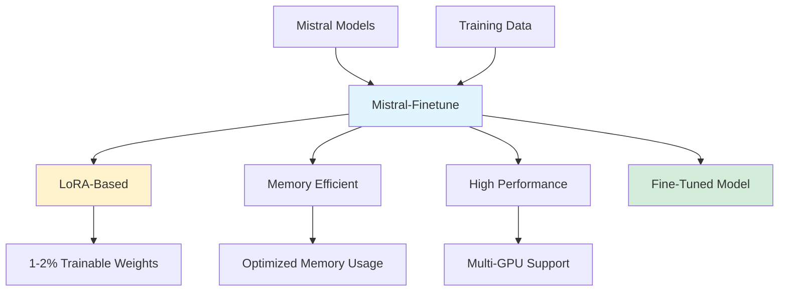
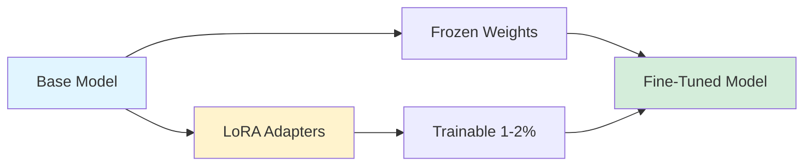
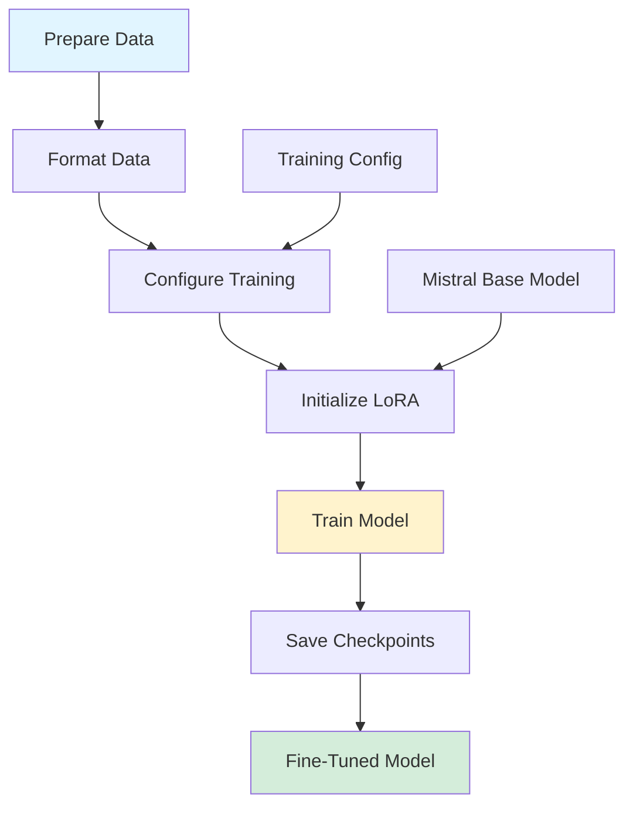

## Mistral-Finetune: Official Fine-Tuning Framework for Mistral Models

*Curiosity:* How can we efficiently fine-tune Mistral's open-source models? What makes this official framework different from other fine-tuning tools?

**Mistral-finetune** is the official repository and guide for fine-tuning Mistral's open-source models. This lightweight codebase enables memory-efficient and performant fine-tuning using LoRA (Low-Rank Adaptation).

> **Official Repository**: <https://github.com/mistralai/mistral-finetune>
{: .prompt-info }

### Framework Overview


```mermaid
graph TB
    A[Mistral-Finetune] --> B[LoRA-Based]
    A --> C[Memory Efficient]
    A --> D[High Performance]
    
    B --> B1[1-2% Trainable Weights]
    C --> C1[Optimized Memory Usage]
    D --> D1[Multi-GPU Support]
    
    E[Mistral Models] --> A
    F[Training Data] --> A
    A --> G[Fine-Tuned Model]
    
    style A fill:#e1f5ff
    style B fill:#fff3cd
    style G fill:#d4edda
```

### Key Features

| Feature | Description | Benefit |
|:--------|:------------|:--------|
| **LoRA-Based** | Low-rank matrix perturbations | ⬇️ Memory efficient |
| **Memory Efficient** | Only 1-2% trainable weights | ⬇️ Resource usage |
| **High Performance** | Optimized training | ⬆️ Speed |
| **Multi-GPU Support** | Single-node multi-GPU | ⬆️ Scalability |
| **Simple Interface** | Guided entrypoint | ⬆️ Ease of use |

### LoRA Architecture

*Retrieve:* LoRA enables efficient fine-tuning by training only a small fraction of model weights.

**How LoRA Works**:
- Most weights are frozen
- Only 1-2% additional weights trained
- Low-rank matrix perturbations
- Maintains model performance

**Architecture**:


```mermaid
graph LR
    A[Base Model] --> B[Frozen Weights]
    A --> C[LoRA Adapters]
    C --> D[Trainable 1-2%]
    B --> E[Fine-Tuned Model]
    D --> E
    
    style A fill:#e1f5ff
    style C fill:#fff3cd
    style E fill:#d4edda
```

### Hardware Requirements

| Model Size | GPU Recommendation | Setup |
|:-----------|:-------------------|:------|
| **7B Models** | Single GPU (A100/H100) | ✅ Sufficient |
| **Larger Models** | Multi-GPU (A100/H100) | ✅ Optimized |
| **Maximum Efficiency** | A100 or H100 | ⚡ Recommended |

**Optimization**:
- Multi-GPU-single-node training
- Memory-efficient implementation
- Optimized for A100/H100 GPUs

### Codebase Philosophy

> **Goal**: Provide a simple, guided entrypoint to fine-tune Mistral models.
{: .prompt-tip }

**Design Principles**:
- ✅ Simple and guided
- ✅ Opinionated (especially data formatting)
- ✅ Focused on Mistral models
- ⚠️ Not exhaustive across architectures

**For Generic Approaches**: Check out projects like [torchtune](https://github.com/pytorch/torchtune) for more generic fine-tuning solutions.

### Fine-Tuning Process


```mermaid
graph TB
    A[Prepare Data] --> B[Format Data]
    B --> C[Configure Training]
    C --> D[Initialize LoRA]
    D --> E[Train Model]
    E --> F[Save Checkpoints]
    F --> G[Fine-Tuned Model]
    
    H[Mistral Base Model] --> D
    I[Training Config] --> C
    
    style A fill:#e1f5ff
    style E fill:#fff3cd
    style G fill:#d4edda
```

### Example Usage

```python
# Mistral-finetune example workflow
from mistral_finetune import MistralFinetune

# Initialize fine-tuner
finetuner = MistralFinetune(
    model_name="mistral-7b",
    lora_rank=8,
    lora_alpha=16
)

# Prepare data (opinionated format)
training_data = prepare_mistral_data("data.jsonl")

# Fine-tune
finetuner.train(
    data=training_data,
    num_epochs=3,
    batch_size=4,
    learning_rate=2e-4
)

# Save model
finetuner.save("fine-tuned-mistral-7b")
```

### Advantages

*Retrieve:* Mistral-finetune offers several advantages for fine-tuning Mistral models.

| Advantage | Description | Impact |
|:----------|:------------|:-------|
| **Official Support** | Maintained by Mistral AI | ⬆️ Reliability |
| **Optimized** | Specifically for Mistral | ⬆️ Performance |
| **Simple** | Guided entrypoint | ⬆️ Accessibility |
| **Efficient** | LoRA-based approach | ⬇️ Resource usage |

### Use Cases

*Innovate:* Fine-tune Mistral models for specific applications.

**Common Use Cases**:
- Domain-specific adaptation
- Task-specific fine-tuning
- Instruction following
- Custom applications

### Key Takeaways

*Retrieve:* Mistral-finetune is the official, lightweight framework for efficiently fine-tuning Mistral models using LoRA, requiring only 1-2% trainable weights.

*Innovate:* By leveraging Mistral-finetune's optimized approach, you can fine-tune Mistral models efficiently on single or multi-GPU setups, making it accessible for various use cases.

*Curiosity → Retrieve → Innovation:* Start with curiosity about fine-tuning Mistral models, retrieve knowledge from the official framework, and innovate by applying fine-tuned models to your specific applications.

**Next Steps**:
- Explore the GitHub repository
- Prepare your training data
- Configure fine-tuning parameters
- Train and deploy your model


<details markdown="1">
<summary style= "font-size:24px; line-height:24px; font-weight:bold; cursor:pointer;" > Translate to Korean </summary>

* * * 

## Announcing mistral-finetune

Official repository and guide on how to fine-tune Mistral open-source models.
> Mistral open-source models : <https://github.com/mistralai/mistral-finetune>
{: .prompt-info }

mistral-finetune is a lightweight codebase that enables memory-efficient, high-performance fine-tuning of Mistral models. It is based on a training paradigm called LoRA, which keeps most weights frozen and trains only 1–2% of additional weights in the form of low-rank matrix modifications.

For maximum efficiency, using A100 or H100 GPUs is recommended. While the codebase is optimized for multi-GPU single-node training setups, a single GPU is sufficient for smaller models like 7B.

> Note
The goal of this repository is to provide a simple, guided entry point for fine-tuning Mistral models. As such, it is fairly opinionated regarding data formatting and does not aim to be comprehensive across multiple model architectures or hardware types. For a more general approach, you can check out other great projects like torchtune.
{: .prompt-tip }

</details>
