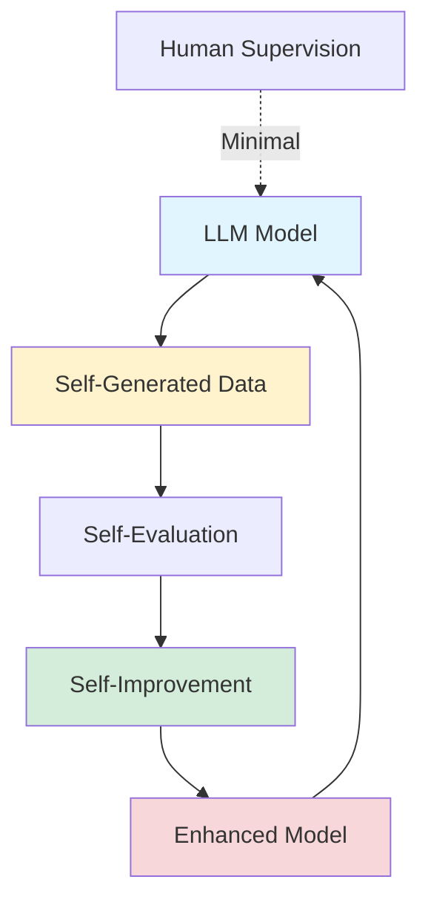
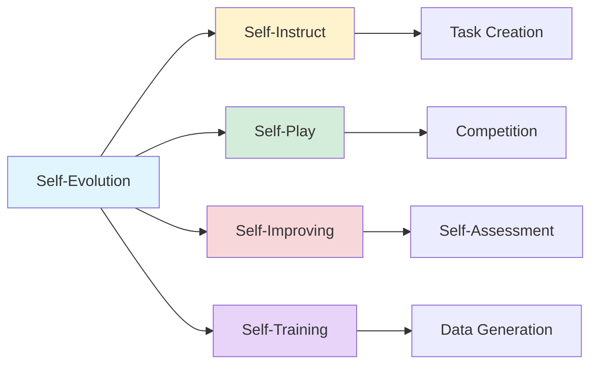

## Self-Evolution in LLMs: A Key to Unlocking AGI and ASI

*Curiosity:* How can LLMs learn and improve autonomously? What happens when models generate and learn from their own experiences without constant human supervision?

**Self-Evolution in LLMs** could be a key piece in unlocking AGI (Artificial General Intelligence) and ASI (Artificial Super Intelligence). This paradigm enables AI models to autonomously acquire, refine, and learn from their own experiences, similar to how humans learn from trial and error.

### What is Self-Evolution?

*Retrieve:* Understanding the self-evolution paradigm.

**Definition**: Self-Evolution refers to a paradigm where AI models autonomously acquire, refine, and learn from their own experiences. The model generates and learns from its own data without constant human supervision.

**Key Characteristics**:
- Autonomous learning
- Self-generated training data
- Continuous improvement
- Reduced human supervision

### Self-Evolution Architecture



### Why Self-Evolution is Better

*Retrieve:* Advantages over traditional training methods.

| Aspect | Traditional Methods | Self-Evolution | Benefit |
|:-------|:-------------------|:---------------|:--------|
| **Human Supervision** | ⚠️ Significant | ✅ Minimal | ⬇️ Cost, ⬆️ Scalability |
| **Scalability** | ⚠️ Limited | ✅ High | ⬆️ Adaptability |
| **Data Generation** | ❌ Human-created | ✅ Self-generated | ⬆️ Efficiency |
| **Learning Efficiency** | ⚠️ Fixed | ✅ Optimized | ⬆️ Performance |
| **Task Complexity** | ⚠️ Challenging | ✅ Handles well | ⬆️ Capability |

**Key Advantages**:

1. **Autonomous Approach**: More efficient learning, scalability, and ability to tackle sophisticated tasks without intensive human intervention
2. **Optimized Learning**: Models optimize their learning process, reducing need for extensive human annotation
3. **Deeper Understanding**: Self-evolving LLMs develop deeper understanding of language and context
4. **Robust Performance**: Better performance across wide range of tasks and domains

### Self-Evolution Methods

*Innovate:* Four key self-evolution techniques.

| Method | Description | How It Works | Use Case |
|:-------|:------------|:-------------|:---------|
| **Self-Instruct** | Model creates own tasks | Generates tasks, learns from results, adjusts based on feedback | ⬆️ Task generation |
| **Self-Play** | Model competes with itself | Simulates interactions, learns strategies autonomously | ⬆️ Strategy learning |
| **Self-Improving** | Continuous self-assessment | Identifies weaknesses, optimizes parameters | ⬆️ Performance enhancement |
| **Self-Training** | Generates training data | Creates data from unlabeled sources | ⬆️ Data efficiency |

**Self-Evolution Methods Overview**:



### Self-Evolution Workflow

*Retrieve:* How self-evolution works in practice.

**Process**:

1. **Initial Model**: Start with base LLM
2. **Self-Generation**: Model generates tasks/data
3. **Self-Evaluation**: Model evaluates its performance
4. **Self-Improvement**: Model adjusts and learns
5. **Iteration**: Repeat process autonomously

**Example**:

```python
# Conceptual self-evolution loop
class SelfEvolvingLLM:
    def __init__(self, base_model):
        self.model = base_model
    
    def self_evolve(self, iterations=10):
        for i in range(iterations):
            # 1. Generate tasks
            tasks = self.generate_tasks()
            
            # 2. Execute and evaluate
            results = self.execute_tasks(tasks)
            performance = self.evaluate(results)
            
            # 3. Self-improve
            if performance < threshold:
                self.improve_model()
            
            # 4. Continue evolution
            self.model = self.refined_model
```

### Comparison: Traditional vs. Self-Evolution

| Training Approach | Data Source | Supervision | Scalability | Efficiency |
|:------------------|:------------|:------------|:------------|:-----------|
| **Traditional** | Human-created | High | Limited | Fixed |
| **Self-Evolution** | Self-generated | Low | High | Optimized |

### Potential Impact

*Innovate:* Self-evolution could unlock AGI and ASI.

**Path to AGI/ASI**:
- Autonomous learning capabilities
- Continuous self-improvement
- Reduced human dependency
- Enhanced generalization

**Challenges**:
- Ensuring quality of self-generated data
- Preventing harmful behaviors
- Maintaining alignment with human values

### Resources

> **Survey Paper**: "A Survey on Self-Evolution of Large Language Models"
> - Complete overview of self-evolution
> - Future directions
> - Research trends
{: .prompt-info}

### Key Takeaways

*Retrieve:* Self-evolution enables LLMs to autonomously learn and improve from their own experiences, potentially unlocking AGI and ASI through reduced human supervision and optimized learning.

*Innovate:* By implementing self-evolution methods like Self-Instruct, Self-Play, Self-Improving, and Self-Training, we can create LLMs that continuously enhance their capabilities autonomously.

*Curiosity → Retrieve → Innovation:* Start with curiosity about autonomous learning, retrieve insights from self-evolution research, and innovate by applying these methods to create more capable AI systems.

**Next Steps**:
- Read the survey paper
- Understand each method
- Experiment with self-evolution
- Contribute to research

{: .light .w-75 .shadow .rounded-10 w='1212' h='668' }


<details markdown="1">
<summary style= "font-size:24px; line-height:24px; font-weight:bold; cursor:pointer;" > Translate to Korean </summary>

* * * 

## LLM의 자기 진화

😎 LLM의 자기 진화는 AGI와 ASI(Artificial General and Super Intelligence)를 여는 데 핵심적인 요소가 될 수 있습니다. 여기 당신이 알아야 할 모든 것이 있습니다!

💡 자기 진화(Self-Evolution)는 AI 모델이 자신의 경험을 자율적으로 습득하고, 개선하고, 학습하는 패러다임을 말합니다. 인간이 시행착오를 통해 학습하는 방식과 매우 유사하지만, 이 경우 모델은 지속적인 인간의 감독 없이 자체 데이터를 생성하고 학습합니다.

### 🤔 전통적인 방법보다 나은 이유는 무엇입니까?
- ⛳대규모 데이터 세트에 대한 사전 훈련 및 특정 작업에 대한 미세 조정과 같은 기존 LLM 훈련 방법은 상당한 사람의 감독이 필요하며 작업이 더욱 복잡해짐에 따라 확장성과 적응성의 한계에 직면할 수 있습니다. 
- ⛳ 자기 진화는 보다 자율적인 접근 방식을 제공하여 잠재적으로 보다 효율적인 학습, 확장성 및 집중적인 인간 개입 없이 정교한 작업을 처리할 수 있는 능력으로 이어질 수 있습니다.
- ⛳ LLM은 자체 경험을 통해 학습함으로써 학습 프로세스를 최적화하여 광범위한 인간 주석 및 감독의 필요성을 줄여 보다 효율적인 교육 및 배포로 이어질 수 있습니다.
- ⛳ 스스로 진화하는 LLM은 언어와 컨텍스트에 대한 더 깊은 이해를 개발하여 광범위한 작업과 도메인에서 보다 강력한 성능을 제공할 수 있습니다.

### 🤔 자기 진화 방법의 예는 무엇입니까?
- ⛳ 자기 지시: 모델은 자체 작업을 생성하고, 결과에서 학습하고, 피드백에 따라 응답을 조정하여 자율성을 향상시킵니다.
- ⛳ 셀프 플레이: 모델은 자체적으로 경쟁하거나 환경과의 상호 작용을 시뮬레이션하여 자율적으로 전략을 학습하고 구체화합니다.
- ⛳ 자체 개선: 지속적인 자체 평가를 통해 모델은 약점을 식별하고 매개변수를 최적화하여 시간이 지남에 따라 성능을 향상시킬 수 있습니다.
- ⛳ 자가 학습: 이 모델은 레이블이 지정되지 않은 원본에서 학습 데이터를 생성하여 작업별 성능을 자율적으로 개선하는 데 활용합니다.

"A Survey on Self-Evolution of Large Language Models"에서 자기 진화와 미래 방향에 대한 전체 개요를 읽어보세요.

</details>