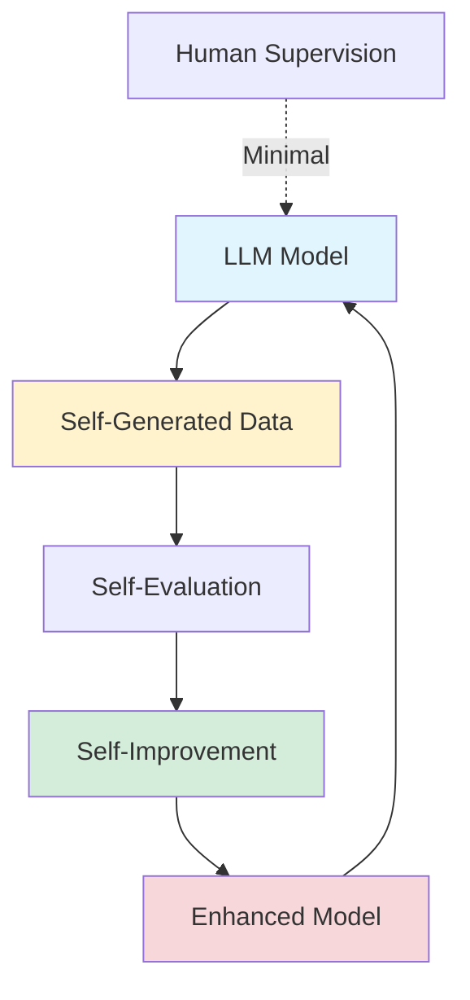
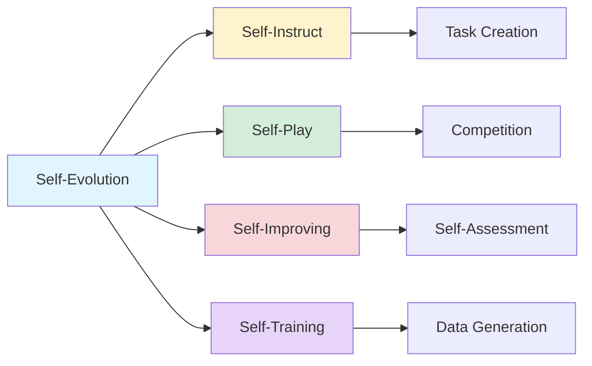

## Self-Evolution in LLMs: A Key to Unlocking AGI and ASI

*Curiosity:* How can LLMs learn and improve autonomously? What happens when models generate and learn from their own experiences without constant human supervision?

**Self-Evolution in LLMs** could be a key piece in unlocking AGI (Artificial General Intelligence) and ASI (Artificial Super Intelligence). This paradigm enables AI models to autonomously acquire, refine, and learn from their own experiences, similar to how humans learn from trial and error.

### What is Self-Evolution?

*Retrieve:* Understanding the self-evolution paradigm.

**Definition**: Self-Evolution refers to a paradigm where AI models autonomously acquire, refine, and learn from their own experiences. The model generates and learns from its own data without constant human supervision.

**Key Characteristics**:
- Autonomous learning
- Self-generated training data
- Continuous improvement
- Reduced human supervision

### Self-Evolution Architecture


```mermaid
graph TB
    A[LLM Model] --> B[Self-Generated Data]
    B --> C[Self-Evaluation]
    C --> D[Self-Improvement]
    D --> E[Enhanced Model]
    E --> A
    
    F[Human Supervision] -.->|Minimal| A
    
    style A fill:#e1f5ff
    style B fill:#fff3cd
    style D fill:#d4edda
    style E fill:#f8d7da
```

### Why Self-Evolution is Better

*Retrieve:* Advantages over traditional training methods.

| Aspect | Traditional Methods | Self-Evolution | Benefit |
|:-------|:-------------------|:---------------|:--------|
| **Human Supervision** | ⚠️ Significant | ✅ Minimal | ⬇️ Cost, ⬆️ Scalability |
| **Scalability** | ⚠️ Limited | ✅ High | ⬆️ Adaptability |
| **Data Generation** | ❌ Human-created | ✅ Self-generated | ⬆️ Efficiency |
| **Learning Efficiency** | ⚠️ Fixed | ✅ Optimized | ⬆️ Performance |
| **Task Complexity** | ⚠️ Challenging | ✅ Handles well | ⬆️ Capability |

**Key Advantages**:

1. **Autonomous Approach**: More efficient learning, scalability, and ability to tackle sophisticated tasks without intensive human intervention
2. **Optimized Learning**: Models optimize their learning process, reducing need for extensive human annotation
3. **Deeper Understanding**: Self-evolving LLMs develop deeper understanding of language and context
4. **Robust Performance**: Better performance across wide range of tasks and domains

### Self-Evolution Methods

*Innovate:* Four key self-evolution techniques.

| Method | Description | How It Works | Use Case |
|:-------|:------------|:-------------|:---------|
| **Self-Instruct** | Model creates own tasks | Generates tasks, learns from results, adjusts based on feedback | ⬆️ Task generation |
| **Self-Play** | Model competes with itself | Simulates interactions, learns strategies autonomously | ⬆️ Strategy learning |
| **Self-Improving** | Continuous self-assessment | Identifies weaknesses, optimizes parameters | ⬆️ Performance enhancement |
| **Self-Training** | Generates training data | Creates data from unlabeled sources | ⬆️ Data efficiency |

**Self-Evolution Methods Overview**:


```mermaid
graph LR
    A[Self-Evolution] --> B[Self-Instruct]
    A --> C[Self-Play]
    A --> D[Self-Improving]
    A --> E[Self-Training]
    
    B --> B1[Task Creation]
    C --> C1[Competition]
    D --> D1[Self-Assessment]
    E --> E1[Data Generation]
    
    style A fill:#e1f5ff
    style B fill:#fff3cd
    style C fill:#d4edda
    style D fill:#f8d7da
    style E fill:#e7d4f8
```

### Self-Evolution Workflow

*Retrieve:* How self-evolution works in practice.

**Process**:

1. **Initial Model**: Start with base LLM
2. **Self-Generation**: Model generates tasks/data
3. **Self-Evaluation**: Model evaluates its performance
4. **Self-Improvement**: Model adjusts and learns
5. **Iteration**: Repeat process autonomously

**Example**:

```python
# Conceptual self-evolution loop
class SelfEvolvingLLM:
    def __init__(self, base_model):
        self.model = base_model
    
    def self_evolve(self, iterations=10):
        for i in range(iterations):
            # 1. Generate tasks
            tasks = self.generate_tasks()
            
            # 2. Execute and evaluate
            results = self.execute_tasks(tasks)
            performance = self.evaluate(results)
            
            # 3. Self-improve
            if performance < threshold:
                self.improve_model()
            
            # 4. Continue evolution
            self.model = self.refined_model
```

### Comparison: Traditional vs. Self-Evolution

| Training Approach | Data Source | Supervision | Scalability | Efficiency |
|:------------------|:------------|:------------|:------------|:-----------|
| **Traditional** | Human-created | High | Limited | Fixed |
| **Self-Evolution** | Self-generated | Low | High | Optimized |

### Potential Impact

*Innovate:* Self-evolution could unlock AGI and ASI.

**Path to AGI/ASI**:
- Autonomous learning capabilities
- Continuous self-improvement
- Reduced human dependency
- Enhanced generalization

**Challenges**:
- Ensuring quality of self-generated data
- Preventing harmful behaviors
- Maintaining alignment with human values

### Resources

> **Survey Paper**: "A Survey on Self-Evolution of Large Language Models"
> - Complete overview of self-evolution
> - Future directions
> - Research trends
{: .prompt-info}

### Key Takeaways

*Retrieve:* Self-evolution enables LLMs to autonomously learn and improve from their own experiences, potentially unlocking AGI and ASI through reduced human supervision and optimized learning.

*Innovate:* By implementing self-evolution methods like Self-Instruct, Self-Play, Self-Improving, and Self-Training, we can create LLMs that continuously enhance their capabilities autonomously.

*Curiosity → Retrieve → Innovation:* Start with curiosity about autonomous learning, retrieve insights from self-evolution research, and innovate by applying these methods to create more capable AI systems.

**Next Steps**:
- Read the survey paper
- Understand each method
- Experiment with self-evolution
- Contribute to research

{: .light .w-75 .shadow .rounded-10 w='1212' h='668' }


<details markdown="1">
<summary style= "font-size:24px; line-height:24px; font-weight:bold; cursor:pointer;" > Translate to Korean </summary>

* * * 

## Self-Evolution of LLMs

😎 The self-evolution of LLMs could be a key factor in unlocking AGI and ASI (Artificial General and Super Intelligence). Here is everything you need to know!

💡 Self-Evolution refers to a paradigm where AI models autonomously acquire, improve, and learn from their own experiences. Much like how humans learn through trial and error, in this case the model generates and learns from its own data without continuous human supervision.

### 🤔 Why is it better than traditional methods?
- ⛳ Traditional LLM training methods such as pre-training on large datasets and fine-tuning for specific tasks require significant human supervision and may face limitations in scalability and adaptability as tasks become more complex. 
- ⛳ Self-evolution offers a more autonomous approach, potentially leading to more efficient learning, scalability, and the ability to handle sophisticated tasks without intensive human intervention.
- ⛳ By learning from its own experiences, an LLM can optimize the learning process, reducing the need for extensive human annotation and supervision, leading to more efficient training and deployment.
- ⛳ A self-evolving LLM can develop a deeper understanding of language and context, delivering more robust performance across a wider range of tasks and domains.

### 🤔 What are examples of self-evolution methods?
- ⛳ Self-Instruction: The model generates its own tasks, learns from the results, and adjusts its responses based on feedback to enhance autonomy.
- ⛳ Self-Play: The model competes against itself or simulates interactions with an environment, autonomously learning and refining strategies.
- ⛳ Self-Improvement: Through continuous self-evaluation, the model can identify weaknesses and optimize parameters to improve performance over time.
- ⛳ Self-Learning: The model generates training data from unlabeled sources and utilizes it to autonomously improve task-specific performance.

Read the full overview of self-evolution and future directions in "A Survey on Self-Evolution of Large Language Models".

</details>
