## Recommended Materials for Cracking Your Next Technical Interview

*Curiosity:* How can we systematically prepare for technical interviews? What resources should we retrieve to maximize our chances of success?

**Technical interviews** require comprehensive preparation across multiple areas. This curated list of recommended materials will help you retrieve the knowledge and practice needed to excel in coding, system design, behavioral, and OOD interviews.

### Interview Preparation Roadmap

```mermaid
graph TB
    A[Technical Interview Prep] --> B[Coding]
    A --> C[System Design]
    A --> D[Behavioral]
    A --> E[OOD]
    A --> F[Mock Interviews]
    A --> G[Job Applications]
    
    B --> B1[Neetcode]
    B --> B2[Leetcode]
    B --> B3[Cracking the Coding Interview]
    
    C --> C1[System Design Interview Books]
    C --> C2[Grokking System Design]
    C --> C3[Designing Data-Intensive Apps]
    
    D --> D1[Tech Interview Handbook]
    D --> D2[A Life Engineered]
    D --> D3[STAR Method]
    
    E --> E1[InterviewReady]
    E --> E2[OOD by Educative]
    E --> E3[Head First Design Patterns]
    
    F --> F1[Interviewing.io]
    F --> F2[Pramp]
    F --> F3[Meetapro]
    
    G --> G1[LinkedIn]
    G --> G2[Monster]
    G --> G3[Indeed]
    
    style A fill:#e1f5ff
    style B fill:#fff3cd
    style C fill:#d4edda
    style D fill:#f8d7da
    style E fill:#e7d4f8
    style F fill:#d1ecf1
    style G fill:#ffe5e5
```

### 📝 Coding Interview Preparation

*Retrieve:* Master data structures and algorithms for coding interviews.

| Resource | Type | Description | Focus |
|:---------|:------|:------------|:------|
| **Neetcode** | Online Platform | Structured problem-solving path | ⬆️ Systematic learning |
| **Leetcode** | Online Platform | Extensive problem database | ⬆️ Practice |
| **Cracking the Coding Interview** | Book | Classic interview prep guide | ⬆️ Fundamentals |

**Key Topics**:
- Data structures (arrays, linked lists, trees, graphs)
- Algorithms (sorting, searching, dynamic programming)
- Problem-solving patterns
- Time/space complexity analysis

### 🏗️ System Design Interview

*Retrieve:* Learn to design scalable, distributed systems.

| Resource | Type | Description | Focus |
|:---------|:------|:------------|:------|
| **System Design Interview Book 1, 2** | Books | By Alex Xu, Sahn Lam | ⬆️ Real-world systems |
| **Grokking the System Design** | Course | By Design Guru | ⬆️ Step-by-step approach |
| **Designing Data-Intensive Applications** | Book | By Martin Kleppmann | ⬆️ Deep understanding |

**Key Topics**:
- Scalability patterns
- Database design
- Caching strategies
- Load balancing
- Distributed systems

**System Design Process**:

### 💬 Behavioral Interview

*Retrieve:* Prepare for culture fit and behavioral questions.

| Resource | Type | Description | Focus |
|:---------|:------|:------------|:------|
| **Tech Interview Handbook** | GitHub Repo | Comprehensive behavioral guide | ⬆️ Question bank |
| **A Life Engineered** | YouTube | Interview preparation channel | ⬆️ Real experiences |
| **STAR Method** | Framework | Situation, Task, Action, Result | ⬆️ Structured answers |

**STAR Method Framework**:

| Component | Description | Example |
|:----------|:------------|:--------|
| **Situation** | Context and background | "At my previous company..." |
| **Task** | Your responsibility | "I was tasked with..." |
| **Action** | What you did | "I implemented..." |
| **Result** | Outcome and impact | "This resulted in..." |

### 🎯 Object-Oriented Design (OOD) Interview

*Retrieve:* Master OOD principles and design patterns.

| Resource | Type | Description | Focus |
|:---------|:------|:------------|:------|
| **InterviewReady** | Platform | OOD interview prep | ⬆️ Practice problems |
| **OOD by Educative** | Course | Object-oriented design course | ⬆️ Concepts |
| **Head First Design Patterns** | Book | Design patterns guide | ⬆️ Patterns |

**Key Topics**:
- SOLID principles
- Design patterns (Singleton, Factory, Observer, etc.)
- Class relationships
- UML diagrams
- System design for OOD

### 🎭 Mock Interviews

*Innovate:* Practice with real interview scenarios.

| Platform | Features | Best For |
|:---------|:---------|:---------|
| **Interviewing.io** | Anonymous practice | ⬆️ Real interviewers |
| **Pramp** | Peer-to-peer practice | ⬆️ Free practice |
| **Meetapro** | Professional mock interviews | ⬆️ Expert feedback |

**Benefits**:
- Real interview experience
- Feedback on performance
- Time management practice
- Confidence building

### 💼 Job Application Platforms

*Retrieve:* Where to find and apply for technical positions.

| Platform | Type | Features |
|:---------|:------|:---------|
| **LinkedIn** | Professional Network | ⬆️ Networking, job postings |
| **Monster** | Job Board | ⬆️ Job listings |
| **Indeed** | Job Aggregator | ⬆️ Comprehensive listings |

**Application Strategy**:

### Preparation Timeline

| Phase | Duration | Focus | Resources |
|:------|:---------|:------|:----------|
| **Foundation** | 2-3 months | Data structures, algorithms | Leetcode, Neetcode |
| **System Design** | 1-2 months | Architecture, scalability | Books, courses |
| **Behavioral** | 2-4 weeks | STAR method, stories | Handbook, practice |
| **OOD** | 1-2 months | Design patterns, principles | Books, platforms |
| **Mock Interviews** | Ongoing | Real practice | Interviewing.io, Pramp |

### Key Takeaways

*Retrieve:* Successful technical interview preparation requires systematic study across coding, system design, behavioral, and OOD areas, combined with consistent practice through mock interviews.

*Innovate:* By following a structured preparation plan using these recommended resources, you can build confidence, improve problem-solving skills, and increase your chances of landing your dream technical role.

*Curiosity → Retrieve → Innovation:* Start with curiosity about interview success, retrieve knowledge from these resources, and innovate your preparation strategy based on your strengths and weaknesses.

**Next Steps**:
- Assess your current level
- Create a study schedule
- Start with fundamentals
- Practice consistently
- Do mock interviews
- Apply to positions

**Question for You**: What are your favorite interview preparation resources?

{: .light .w-75 .shadow .rounded-10 w='1212' h='668' }

 Translate to Korean 

* * * 

## 다음 기술 면접을 위한 추천 자료

### 코딩
- 니트코드
- 리트코드
- 코딩 인터뷰 책 깨기

### 시스템 설계 인터뷰 
- 시스템 디자인 인터뷰 북 1, 2 by Alex Xu, Sahn Lam
- Design Guru의 시스템 설계 Grokking
- 데이터 집약적 응용 프로그램 교재 설계

### 행동면접
- 기술 인터뷰 핸드북(Github 리포지토리)
- 라이프 엔지니어링(YT)
- STAR 방법(일반 방법)

### OOD 인터뷰
- 인터뷰 준비
- 교육적인 OOD
- 헤드 퍼스트 디자인 패턴 북

### 모의 면접
- 인터뷰
- 유랑
- 미타프로

### 구직 신청
- 링크드인
- 괴물
- 참으로

당신에게: 가장 좋아하는 면접 준비 자료는 무엇입니까?

