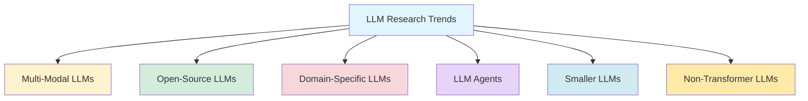

## LLM Research Trends: What's Next in Large Language Models

*Curiosity:* What are the emerging trends in LLM research? How can we stay updated with rapid progress in the field?

**The LLM space** is experiencing rapid progress, with new papers or releases almost every day. Understanding emerging trends helps navigate this fast-moving landscape.

> **Complete Guide**: <https://github.com/aishwaryanr/awesome-generative-ai-guide/blob/main/free_courses/Applied_LLMs_Mastery_2024/week10_research_trends.md>
{: .prompt-info}

### Research Trends Overview

### 6 Major Research Trends 

#### 1. Multi-Modal LLMs

*Retrieve:* Combining text processing with multimodal components like audio, imagery, and videos.

| Model | Capabilities | Use Case |
|:------|:-------------|:---------|
| **OpenAI Sora** | Video generation | Content creation |
| **Gemini** | Text, image, video | General purpose |
| **LLaVA** | Vision-language | Visual understanding |

**Impact**: Enables richer understanding and generation across modalities.

#### 2. Open-Source LLMs

*Retrieve:* Models providing weights, checkpoints, and training data for transparency.

| Model | Features | Benefit |
|:------|:---------|:--------|
| **LLM360** | Full transparency | Reproducibility |
| **LLaMA** | Model weights | Accessibility |
| **OLMo** | Training data | Research |
| **Llama-3** | Open weights | Community |

**Impact**: Promotes fairness, transparency, and community innovation.

#### 3. Domain-Specific LLMs

*Innovate:* LLMs tailored for specific fields with optimized performance.

| Model | Domain | Application |
|:------|:-------|:------------|
| **BioGPT** | Biology | Scientific research |
| **StarCoder** | Code generation | Software development |
| **MathVista** | Mathematics | Problem solving |

**Impact**: Better performance in specialized tasks.

#### 4. LLM Agents

*Retrieve:* LLMs combined with planning and memory modules for complex tasks.

| Agent | Capabilities | Use Case |
|:------|:-------------|:---------|
| **ChemCrow** | Chemistry tasks | Scientific research |
| **ToolLLM** | Tool usage | Automation |
| **OS-Copilot** | OS operations | System management |

**Impact**: Enables autonomous task execution.

#### 5. Smaller LLMs (Including Quantized)

*Innovate:* Reduced precision or parameters for resource-constrained deployment.

| Model | Size | Benefit |
|:------|:-----|:--------|
| **BitNet** | Quantized | Efficiency |
| **Gemma 1B** | 1B parameters | Accessibility |
| **Lit-LLaMA** | Lightweight | Edge devices |

**Impact**: Makes LLMs accessible on edge devices.

#### 6. Non-Transformer LLMs

*Retrieve:* Alternative architectures addressing transformer limitations.

| Model | Architecture | Advantage |
|:------|:-------------|:----------|
| **Mamba** | State space | Efficiency |
| **RMKV** | RNN-based | Long context |

**Impact**: Offers solutions to transformer pain points.

### Trend Comparison

| Trend | Focus | Key Benefit |
|:------|:------|:------------|
| **Multi-Modal** | Rich inputs/outputs | ⬆️ Capabilities |
| **Open-Source** | Transparency | ⬆️ Accessibility |
| **Domain-Specific** | Specialization | ⬆️ Performance |
| **Agents** | Autonomy | ⬆️ Task execution |
| **Smaller LLMs** | Efficiency | ⬇️ Resource needs |
| **Non-Transformer** | Architecture | ⬆️ Alternatives |

### Key Takeaways

*Retrieve:* Six major trends are shaping LLM research: multi-modal capabilities, open-source models, domain-specific optimization, agent systems, smaller/quantized models, and non-transformer architectures.

*Innovate:* By understanding these trends, you can identify opportunities to apply new techniques, build specialized models, and create efficient applications that leverage the latest advances.

*Curiosity → Retrieve → Innovation:* Start with curiosity about LLM research directions, retrieve insights from emerging trends, and innovate by applying these advances to solve real-world problems.

**Next Steps**:
- Explore the complete guide
- Study specific trends
- Experiment with new models
- Build applications leveraging trends
---

{: .light .w-75 .shadow .rounded-10 w='1212' h='668' }

 Translate to Korean 

* * * 

## 내 가이드를 사용하여 다가오는 모든 트렌드를 따라잡으세요! 

💡 LLM 분야는 거의 매일 새로운 논문이나 발표를 통해 급속한 발전을 이루고 있습니다.

최신 발전 사항을 최신 상태로 유지하려는 경우 새로운 패턴에 대한 가이드가 있습니다. <https://github.com/aishwaryanr/awesome-generative-ai-guide/blob/main/free_courses/Applied_LLMs_Mastery_2024/week10_research_trends.md>

그들은: 

#### 🚀멀티모달 LLM
- 📕텍스트 처리를 오디오, 이미지 및 비디오와 같은 다중 모드 구성 요소와 결합합니다. 예: OpenAI Sora, Gemini, LLaVA
---

#### 🚀오픈 소스 LLM
- 📕오픈 소스 모델은 모델 가중치와 선택적으로 체크포인트 및 학습 데이터를 제공하여 공정성과 투명성을 촉진합니다. 예: LLM360, LLaMA, OLMo, Llama-3
---

#### 🚀도메인별 LLM
- 📕도메인별 LLM은 코드 생성 또는 생물학과 같은 특정 분야에서 탁월한 성능을 발휘하도록 맞춤화되어 그에 따라 성능을 최적화합니다. 예: BioGPT, StarCoder, MathVista
---

#### 🚀LLM 에이전트
- 📕LLM 에이전트는 복잡한 작업을 실행하기 위해 LLM이 계획 및 메모리와 같은 모듈과 결합한 애플리케이션입니다. 예: ChemCrow, ToolLLM, OS-Copilot
---

#### 🚀더 작은 LLM(양자화된 LLM 포함)
- 📕정밀도가 낮거나 매개변수가 적은 LLM은 리소스가 제한된 장치에 배포하는 데 적합합니다. 예: BitNet, Gemma 1B, Lit-LLaMA
---

#### 🚀비변압기 LLM
 -📕표준 트랜스포머 아키텍처(예: RNN 통합)에서 벗어나 트랜스포머 문제점에 대한 솔루션을 제공하는 LLM입니다. 예: 맘바, RMKV
---

