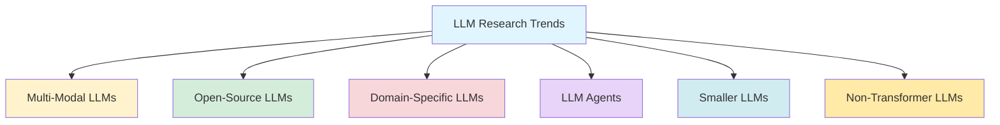

## LLM Research Trends: What's Next in Large Language Models

*Curiosity:* What are the emerging trends in LLM research? How can we stay updated with rapid progress in the field?

**The LLM space** is experiencing rapid progress, with new papers or releases almost every day. Understanding emerging trends helps navigate this fast-moving landscape.

> **Complete Guide**: <https://github.com/aishwaryanr/awesome-generative-ai-guide/blob/main/free_courses/Applied_LLMs_Mastery_2024/week10_research_trends.md>
{: .prompt-info}

### Research Trends Overview

```mermaid
graph TB
    A[LLM Research Trends] --> B[Multi-Modal LLMs]
    A --> C[Open-Source LLMs]
    A --> D[Domain-Specific LLMs]
    A --> E[LLM Agents]
    A --> F[Smaller LLMs]
    A --> G[Non-Transformer LLMs]
    
    style A fill:#e1f5ff
    style B fill:#fff3cd
    style C fill:#d4edda
    style D fill:#f8d7da
    style E fill:#e7d4f8
    style F fill:#d1ecf1
    style G fill:#ffeaa7
```

### 6 Major Research Trends 

#### 1. Multi-Modal LLMs

*Retrieve:* Combining text processing with multimodal components like audio, imagery, and videos.

| Model | Capabilities | Use Case |
|:------|:-------------|:---------|
| **OpenAI Sora** | Video generation | Content creation |
| **Gemini** | Text, image, video | General purpose |
| **LLaVA** | Vision-language | Visual understanding |

**Impact**: Enables richer understanding and generation across modalities.

#### 2. Open-Source LLMs

*Retrieve:* Models providing weights, checkpoints, and training data for transparency.

| Model | Features | Benefit |
|:------|:---------|:--------|
| **LLM360** | Full transparency | Reproducibility |
| **LLaMA** | Model weights | Accessibility |
| **OLMo** | Training data | Research |
| **Llama-3** | Open weights | Community |

**Impact**: Promotes fairness, transparency, and community innovation.

#### 3. Domain-Specific LLMs

*Innovate:* LLMs tailored for specific fields with optimized performance.

| Model | Domain | Application |
|:------|:-------|:------------|
| **BioGPT** | Biology | Scientific research |
| **StarCoder** | Code generation | Software development |
| **MathVista** | Mathematics | Problem solving |

**Impact**: Better performance in specialized tasks.

#### 4. LLM Agents

*Retrieve:* LLMs combined with planning and memory modules for complex tasks.

| Agent | Capabilities | Use Case |
|:------|:-------------|:---------|
| **ChemCrow** | Chemistry tasks | Scientific research |
| **ToolLLM** | Tool usage | Automation |
| **OS-Copilot** | OS operations | System management |

**Impact**: Enables autonomous task execution.

#### 5. Smaller LLMs (Including Quantized)

*Innovate:* Reduced precision or parameters for resource-constrained deployment.

| Model | Size | Benefit |
|:------|:-----|:--------|
| **BitNet** | Quantized | Efficiency |
| **Gemma 1B** | 1B parameters | Accessibility |
| **Lit-LLaMA** | Lightweight | Edge devices |

**Impact**: Makes LLMs accessible on edge devices.

#### 6. Non-Transformer LLMs

*Retrieve:* Alternative architectures addressing transformer limitations.

| Model | Architecture | Advantage |
|:------|:-------------|:----------|
| **Mamba** | State space | Efficiency |
| **RMKV** | RNN-based | Long context |

**Impact**: Offers solutions to transformer pain points.

### Trend Comparison

| Trend | Focus | Key Benefit |
|:------|:------|:------------|
| **Multi-Modal** | Rich inputs/outputs | ⬆️ Capabilities |
| **Open-Source** | Transparency | ⬆️ Accessibility |
| **Domain-Specific** | Specialization | ⬆️ Performance |
| **Agents** | Autonomy | ⬆️ Task execution |
| **Smaller LLMs** | Efficiency | ⬇️ Resource needs |
| **Non-Transformer** | Architecture | ⬆️ Alternatives |

### Key Takeaways

*Retrieve:* Six major trends are shaping LLM research: multi-modal capabilities, open-source models, domain-specific optimization, agent systems, smaller/quantized models, and non-transformer architectures.

*Innovate:* By understanding these trends, you can identify opportunities to apply new techniques, build specialized models, and create efficient applications that leverage the latest advances.

*Curiosity → Retrieve → Innovation:* Start with curiosity about LLM research directions, retrieve insights from emerging trends, and innovate by applying these advances to solve real-world problems.

**Next Steps**:
- Explore the complete guide
- Study specific trends
- Experiment with new models
- Build applications leveraging trends
---

{: .light .w-75 .shadow .rounded-10 w='1212' h='668' }

 Translate to Korean 

* * * 

## Catch up on all upcoming trends using this guide! 

💡 The LLM field is advancing rapidly with new papers or announcements appearing almost every day.

If you want to stay up to date with the latest developments, here is a guide on new patterns. <https://github.com/aishwaryanr/awesome-generative-ai-guide/blob/main/free_courses/Applied_LLMs_Mastery_2024/week10_research_trends.md>

They include: 

#### 🚀 Multimodal LLMs
- 📕 Combines text processing with multimodal components such as audio, images, and video. Examples: OpenAI Sora, Gemini, LLaVA
---

#### 🚀 Open Source LLMs
- 📕 Open source models provide model weights and optionally checkpoints and training data, promoting fairness and transparency. Examples: LLM360, LLaMA, OLMo, Llama-3
---

#### 🚀 Domain-Specific LLMs
- 📕 Domain-specific LLMs are tailored to excel in specific fields such as code generation or biology, optimizing performance accordingly. Examples: BioGPT, StarCoder, MathVista
---

#### 🚀 LLM Agents
- 📕 LLM Agents are applications where LLMs are combined with modules like planning and memory to execute complex tasks. Examples: ChemCrow, ToolLLM, OS-Copilot
---

#### 🚀 Smaller LLMs (including quantized LLMs)
- 📕 LLMs with lower precision or fewer parameters are suitable for deployment on resource-constrained devices. Examples: BitNet, Gemma 1B, Lit-LLaMA
---

#### 🚀 Non-Transformer LLMs
 -📕 LLMs that deviate from the standard transformer architecture (e.g., RNN integration) and offer solutions to transformer limitations. Examples: Mamba, RWKV
---

