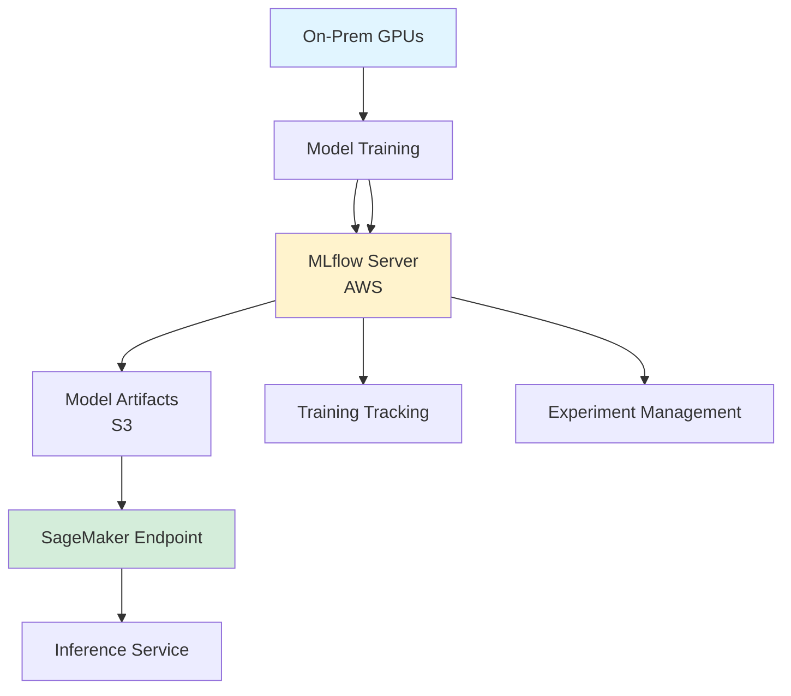

## Hybrid MLOps with MLflow: On-Prem Training + SageMaker Inference

*Curiosity:* How can we combine on-premise GPU training with cloud-based inference? What's the best way to manage ML workflows across hybrid infrastructure?

**This sample project** demonstrates a Hybrid MLOps System combining On-Prem GPUs for training with SageMaker Endpoints for inference. Perfect for organizations considering hybrid infrastructure.

> **GitHub Repository**: <https://github.com/aws-samples/aws-kr-startup-samples/tree/main/machine-learning/mlflow>
{: .prompt-info}

### System Architecture

*Retrieve:* Hybrid architecture combining on-premise training with cloud inference.

### Key Components

| Component | Location | Purpose | Benefit |
|:----------|:---------|:--------|:---------|
| **Training** | On-Prem GPUs | Model training | ⬇️ Cost control |
| **MLflow** | AWS | Experiment tracking | ⬆️ Centralized management |
| **Model Artifacts** | S3 | Storage | ⬆️ Scalability |
| **Inference** | SageMaker | Model serving | ⬆️ Easy deployment |

### Workflow

*Innovate:* Streamlined workflow from training to deployment.

**Training Phase**:
1. Train models on On-Prem GPUs
2. Track experiments with MLflow (AWS)
3. Store model artifacts in S3
4. Monitor training progress

**Deployment Phase**:
1. Select model from MLflow
2. Deploy to SageMaker Endpoint
3. Automatic scaling and load balancing
4. Production inference service

### Why This Architecture?

*Retrieve:* Benefits of hybrid MLOps approach.

**Advantages**:

| Benefit | Description | Impact |
|:--------|:------------|:-------|
| **Cost Efficiency** | Use existing GPUs | ⬇️ Training costs |
| **Scalability** | Cloud inference | ⬆️ Handle traffic |
| **Simplicity** | MLflow vs. Kubeflow | ⬇️ Learning curve |
| **Flexibility** | Hybrid infrastructure | ⬆️ Options |

**SageMaker Endpoint Benefits**:
- ✅ No need for ALB setup
- ✅ Automatic scaling
- ✅ Easy deployment (few clicks)
- ✅ ML developers don't need backend expertise
- ✅ Backend developers don't need ML expertise

### MLflow vs. Kubeflow

*Retrieve:* Why MLflow is better for startups.

| Feature | MLflow | Kubeflow |
|:--------|:-------|:---------|
| **Complexity** | Simple | Complex |
| **Infrastructure** | Single server | Kubernetes cluster |
| **Learning Curve** | Low | High |
| **Setup Time** | Minutes | Days |
| **Best For** | Startups, small teams | Large organizations |

**MLflow Advantage**: Run like a web server—just start one MLflow server and you're ready to go!

### Use Cases

*Innovate:* Perfect for specific scenarios.

**Ideal For**:
- Startups with limited resources
- Organizations with existing GPUs
- Teams wanting simple MLOps
- Hybrid cloud strategies

**Requirements**:
- On-Prem GPUs for training
- AWS account for MLflow and SageMaker
- S3 for model storage

### Key Takeaways

*Retrieve:* Hybrid MLOps with MLflow enables cost-effective training on-premise while leveraging cloud scalability for inference, with minimal complexity compared to Kubernetes-based solutions.

*Innovate:* By combining On-Prem GPUs, MLflow for tracking, and SageMaker for deployment, you can build a production-ready MLOps system that's simple to operate and scales efficiently.

*Curiosity → Retrieve → Innovation:* Start with curiosity about hybrid infrastructure, retrieve insights from this architecture, and innovate by building MLOps systems that balance cost, complexity, and scalability.

**Next Steps**:
- Explore the GitHub repository
- Set up MLflow on AWS
- Configure On-Prem training
- Deploy to SageMaker

{: .light  .shadow .rounded-10 w='1212' h='668' }
