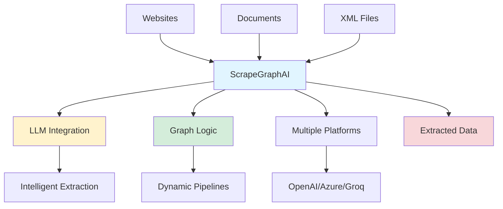
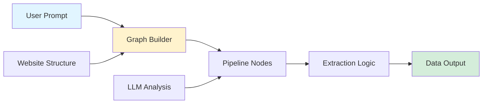

## ScrapeGraphAI: LLM and Graph-Powered Web Scraping

*Curiosity:* How can we make web scraping more intelligent and adaptive? What happens when we combine LLMs with graph-based logic for data extraction?

**ScrapeGraphAI** is a robust Python library that employs Large Language Models (LLMs) and direct graph logic to create intelligent scraping pipelines for websites, documents, and XML files. Unlike rigid methods, it dynamically adapts to variations in website structures.

### Framework Overview



### Key Features

| Feature | Description | Benefit |
|:--------|:------------|:--------|
| **Direct Graph Logic** | Graph-based pipeline creation | ⬆️ Flexibility |
| **LLM Integration** | Intelligent data extraction | ⬆️ Accuracy |
| **Multi-Platform Support** | OpenAI, Azure, Groq | ⬆️ Choice |
| **SpeechGraph** | Voice audio conversion | ⬆️ Accessibility |
| **OmniScraperGraph** | Image description (GPT-4o) | ⬆️ Rich data |

### 1. Direct Graph Logic

*Retrieve:* Graph-based approach dynamically creates scraping pipelines based on user-defined prompts.

**How It Works**:
- User defines extraction goals
- Graph logic creates pipeline
- Adapts to website structure
- Efficient data retrieval

**Architecture**:



### 2. LLM Integration

*Innovate:* LLMs interpret user inputs and automate data extraction, eliminating manual coding.

**Capabilities**:
- Natural language prompts
- Automatic structure understanding
- Intelligent field extraction
- Context-aware parsing

**Example**:

```python
from scrapegraphai import ScrapeGraphAI

# Initialize with LLM
scraper = ScrapeGraphAI(
    llm_model="gpt-4",
    api_key="your-api-key"
)

# Natural language prompt
result = scraper.scrape(
    url="https://example.com",
    prompt="Extract all product names and prices"
)

print(result)
```

### 3. Multiple AI Platform Support

*Retrieve:* Flexible integration with various LLM providers.

| Platform | Support | Features |
|:---------|:--------|:---------|
| **OpenAI** | ✅ Full | GPT-4, GPT-3.5 |
| **Azure** | ✅ Full | Azure OpenAI |
| **Groq** | ✅ Full | Fast inference |

**Configuration**:

```python
# OpenAI
scraper = ScrapeGraphAI(
    llm_model="gpt-4",
    api_key="openai-key"
)

# Azure
scraper = ScrapeGraphAI(
    llm_model="gpt-4",
    api_key="azure-key",
    api_endpoint="azure-endpoint"
)

# Groq
scraper = ScrapeGraphAI(
    llm_model="llama-3",
    api_key="groq-key",
    provider="groq"
)
```

### 4. SpeechGraph

*Innovate:* Convert scraped information into voice audio for accessible interaction.

**Features**:
- Text-to-speech conversion
- Audio output
- Accessible data interaction
- Convenient consumption

**Use Cases**:
- Accessibility applications
- Audio content creation
- Hands-free data access
- Multimodal interfaces

### 5. OmniScraperGraph

*Retrieve:* Enhanced scraping with image description capabilities (GPT-4o only).

**Capabilities**:
- Extract images from web pages
- Generate accurate descriptions
- Enrich datasets with visual information
- Multimodal data extraction

**Example**:

```python
# OmniScraperGraph with GPT-4o
omni_scraper = ScrapeGraphAI(
    llm_model="gpt-4o",
    mode="omni"
)

# Extract images with descriptions
result = omni_scraper.scrape(
    url="https://example.com",
    extract_images=True
)

# Result includes:
# - Text content
# - Images
# - Image descriptions
```

### Setup and Configuration

*Retrieve:* Simple setup with Streamlit app for easy configuration.

**Quick Start**:

```python
# Install
pip install scrapegraphai

# Basic usage
from scrapegraphai import ScrapeGraphAI

scraper = ScrapeGraphAI(
    llm_model="gpt-4",
    api_key="your-key"
)

# Scrape
data = scraper.scrape(
    url="https://example.com",
    prompt="Extract all article titles"
)
```

**Streamlit App**:
- Visual interface
- Easy configuration
- Interactive scraping
- Real-time results

### Comparison: Traditional vs. ScrapeGraphAI

| Aspect | Traditional Scraping | ScrapeGraphAI |
|:-------|:---------------------|:--------------|
| **Adaptability** | ⚠️ Rigid patterns | ✅ Dynamic |
| **Setup** | ⚠️ Manual coding | ✅ LLM-powered |
| **Maintenance** | ⚠️ High | ✅ Low |
| **Intelligence** | ❌ Pattern-based | ✅ LLM-based |
| **Multimodal** | ❌ Text only | ✅ Text + Images |

### Use Cases

*Innovate:* Apply ScrapeGraphAI to various data extraction scenarios.

**Common Use Cases**:
- E-commerce product extraction
- News article scraping
- Research data collection
- Content aggregation
- Competitive analysis

### Key Takeaways

*Retrieve:* ScrapeGraphAI combines LLMs with graph logic to create intelligent, adaptive web scraping pipelines that dynamically adjust to website structures.

*Innovate:* By leveraging LLM intelligence and graph-based pipelines, ScrapeGraphAI eliminates manual coding and pattern maintenance, making web scraping more accessible and robust.

*Curiosity → Retrieve → Innovation:* Start with curiosity about intelligent scraping, retrieve insights from ScrapeGraphAI's approach, and innovate by applying it to your data extraction needs.

> **Original Article**: <https://medium.com/@amanatulla1606/llm-web-scraping-with-scrapegraphai-a-breakthrough-in-data-extraction-d6596b282b4d>
{: .prompt-info }

**Next Steps**:
- Explore ScrapeGraphAI documentation
- Try the Streamlit app
- Experiment with different LLM providers
- Build your scraping pipelines

{: .light .w-75 .shadow .rounded-10 w='1212' h='668' }


<details markdown="1">
<summary style= "font-size:24px; line-height:24px; font-weight:bold; cursor:pointer;" > Translate to Korean </summary>

ScrapeGraphAI는 LLM(Large Language Models) 및 직접 그래프 로직을 사용하여 웹 사이트, 문서 및 XML 파일에 대한 스크래핑 파이프라인을 생성하는 강력한 웹 스크래핑 Python 라이브러리입니다. 

사전 정의된 패턴이나 수동 조정에 의존하는 경직된 방법과 달리 ScrapegraphAI는 웹사이트 구조의 변화에 동적으로 적응합니다. 

———————

## ⚙️기능:

#### ❊ 직접 그래프 로직: 

이 기능은 그래프 기반 접근 방식을 활용하여 스크래핑 파이프라인을 동적으로 생성하여 사용자 정의 프롬프트를 기반으로 효율적인 데이터 검색을 보장합니다.

#### ❊ LLM 통합: 

ScrapeGraphAI는 대규모 언어 모델(LLM)을 통합하여 사용자 입력을 해석하고 데이터 추출을 자동화하여 수동 코딩의 필요성을 제거합니다.

#### ❊ 다중 AI 플랫폼 지원: 

OpenAI, Azure 또는 Groq의 모델을 선호하는지 여부에 관계없이 ScrapeGraphAI는 특정 API 키 및 구성과의 통합을 지원하여 유연성과 선택권을 제공합니다.

#### ❊ 스피치그래프

ScrapeGraphAI는 정보를 긁어 음성 오디오로 변환 할 수 있습니다. 이 고유한 기능을 통해 추출된 데이터와 상호 작용할 수 있는 액세스 가능하고 편리한 방법을 제공할 수 있습니다.

#### ❊ 옴니스크레이퍼그래프

이미지 설명 기능을 갖춘 SmartScraperGraph의 진화. 이 향상된 기능을 통해 사용자는 단일 웹 페이지에서 이미지를 추출하고 정확한 설명을 얻을 수 있으므로 귀중한 시각적 정보로 데이터 세트를 강화할 수 있습니다. (GPT-4o만 해당)

———————

#### 간단한 설정 및 구성

ScrapeGraphAI를 설정하는 것은 간단합니다: streamlit에서 만든 앱이 있습니다.

> Original Article : <https://medium.com/@amanatulla1606/llm-web-scraping-with-scrapegraphai-a-breakthrough-in-data-extraction-d6596b282b4d>
{: .prompt-info }

</details>