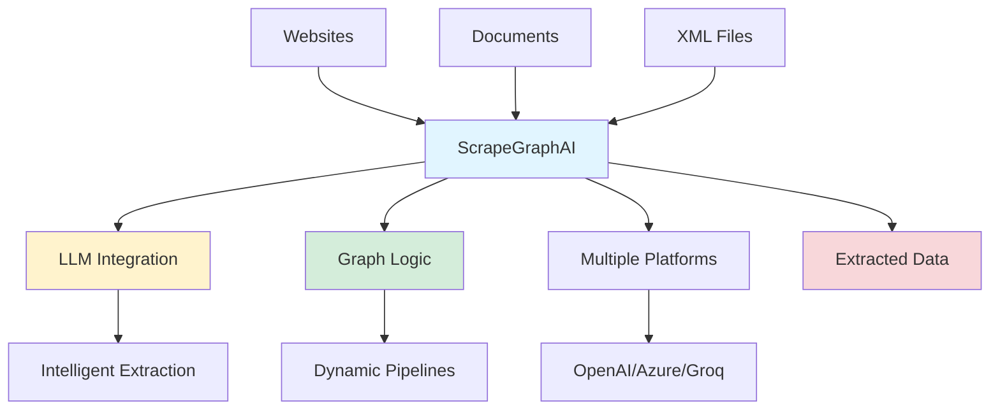
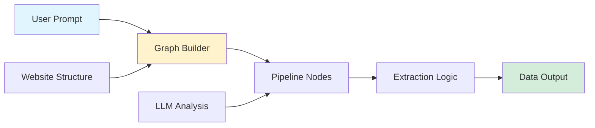

## ScrapeGraphAI: LLM and Graph-Powered Web Scraping

*Curiosity:* How can we make web scraping more intelligent and adaptive? What happens when we combine LLMs with graph-based logic for data extraction?

**ScrapeGraphAI** is a robust Python library that employs Large Language Models (LLMs) and direct graph logic to create intelligent scraping pipelines for websites, documents, and XML files. Unlike rigid methods, it dynamically adapts to variations in website structures.

### Framework Overview


```mermaid
graph TB
    A[ScrapeGraphAI] --> B[LLM Integration]
    A --> C[Graph Logic]
    A --> D[Multiple Platforms]
    
    B --> B1[Intelligent Extraction]
    C --> C1[Dynamic Pipelines]
    D --> D1[OpenAI/Azure/Groq]
    
    E[Websites] --> A
    F[Documents] --> A
    G[XML Files] --> A
    A --> H[Extracted Data]
    
    style A fill:#e1f5ff
    style B fill:#fff3cd
    style C fill:#d4edda
    style H fill:#f8d7da
```

### Key Features

| Feature | Description | Benefit |
|:--------|:------------|:--------|
| **Direct Graph Logic** | Graph-based pipeline creation | ⬆️ Flexibility |
| **LLM Integration** | Intelligent data extraction | ⬆️ Accuracy |
| **Multi-Platform Support** | OpenAI, Azure, Groq | ⬆️ Choice |
| **SpeechGraph** | Voice audio conversion | ⬆️ Accessibility |
| **OmniScraperGraph** | Image description (GPT-4o) | ⬆️ Rich data |

### 1. Direct Graph Logic

*Retrieve:* Graph-based approach dynamically creates scraping pipelines based on user-defined prompts.

**How It Works**:
- User defines extraction goals
- Graph logic creates pipeline
- Adapts to website structure
- Efficient data retrieval

**Architecture**:


```mermaid
graph LR
    A[User Prompt] --> B[Graph Builder]
    B --> C[Pipeline Nodes]
    C --> D[Extraction Logic]
    D --> E[Data Output]
    
    F[Website Structure] --> B
    G[LLM Analysis] --> C
    
    style A fill:#e1f5ff
    style B fill:#fff3cd
    style E fill:#d4edda
```

### 2. LLM Integration

*Innovate:* LLMs interpret user inputs and automate data extraction, eliminating manual coding.

**Capabilities**:
- Natural language prompts
- Automatic structure understanding
- Intelligent field extraction
- Context-aware parsing

**Example**:

```python
from scrapegraphai import ScrapeGraphAI

# Initialize with LLM
scraper = ScrapeGraphAI(
    llm_model="gpt-4",
    api_key="your-api-key"
)

# Natural language prompt
result = scraper.scrape(
    url="https://example.com",
    prompt="Extract all product names and prices"
)

print(result)
```

### 3. Multiple AI Platform Support

*Retrieve:* Flexible integration with various LLM providers.

| Platform | Support | Features |
|:---------|:--------|:---------|
| **OpenAI** | ✅ Full | GPT-4, GPT-3.5 |
| **Azure** | ✅ Full | Azure OpenAI |
| **Groq** | ✅ Full | Fast inference |

**Configuration**:

```python
# OpenAI
scraper = ScrapeGraphAI(
    llm_model="gpt-4",
    api_key="openai-key"
)

# Azure
scraper = ScrapeGraphAI(
    llm_model="gpt-4",
    api_key="azure-key",
    api_endpoint="azure-endpoint"
)

# Groq
scraper = ScrapeGraphAI(
    llm_model="llama-3",
    api_key="groq-key",
    provider="groq"
)
```

### 4. SpeechGraph

*Innovate:* Convert scraped information into voice audio for accessible interaction.

**Features**:
- Text-to-speech conversion
- Audio output
- Accessible data interaction
- Convenient consumption

**Use Cases**:
- Accessibility applications
- Audio content creation
- Hands-free data access
- Multimodal interfaces

### 5. OmniScraperGraph

*Retrieve:* Enhanced scraping with image description capabilities (GPT-4o only).

**Capabilities**:
- Extract images from web pages
- Generate accurate descriptions
- Enrich datasets with visual information
- Multimodal data extraction

**Example**:

```python
# OmniScraperGraph with GPT-4o
omni_scraper = ScrapeGraphAI(
    llm_model="gpt-4o",
    mode="omni"
)

# Extract images with descriptions
result = omni_scraper.scrape(
    url="https://example.com",
    extract_images=True
)

# Result includes:
# - Text content
# - Images
# - Image descriptions
```

### Setup and Configuration

*Retrieve:* Simple setup with Streamlit app for easy configuration.

**Quick Start**:

```python
# Install
pip install scrapegraphai

# Basic usage
from scrapegraphai import ScrapeGraphAI

scraper = ScrapeGraphAI(
    llm_model="gpt-4",
    api_key="your-key"
)

# Scrape
data = scraper.scrape(
    url="https://example.com",
    prompt="Extract all article titles"
)
```

**Streamlit App**:
- Visual interface
- Easy configuration
- Interactive scraping
- Real-time results

### Comparison: Traditional vs. ScrapeGraphAI

| Aspect | Traditional Scraping | ScrapeGraphAI |
|:-------|:---------------------|:--------------|
| **Adaptability** | ⚠️ Rigid patterns | ✅ Dynamic |
| **Setup** | ⚠️ Manual coding | ✅ LLM-powered |
| **Maintenance** | ⚠️ High | ✅ Low |
| **Intelligence** | ❌ Pattern-based | ✅ LLM-based |
| **Multimodal** | ❌ Text only | ✅ Text + Images |

### Use Cases

*Innovate:* Apply ScrapeGraphAI to various data extraction scenarios.

**Common Use Cases**:
- E-commerce product extraction
- News article scraping
- Research data collection
- Content aggregation
- Competitive analysis

### Key Takeaways

*Retrieve:* ScrapeGraphAI combines LLMs with graph logic to create intelligent, adaptive web scraping pipelines that dynamically adjust to website structures.

*Innovate:* By leveraging LLM intelligence and graph-based pipelines, ScrapeGraphAI eliminates manual coding and pattern maintenance, making web scraping more accessible and robust.

*Curiosity → Retrieve → Innovation:* Start with curiosity about intelligent scraping, retrieve insights from ScrapeGraphAI's approach, and innovate by applying it to your data extraction needs.

> **Original Article**: <https://medium.com/@amanatulla1606/llm-web-scraping-with-scrapegraphai-a-breakthrough-in-data-extraction-d6596b282b4d>
{: .prompt-info }

**Next Steps**:
- Explore ScrapeGraphAI documentation
- Try the Streamlit app
- Experiment with different LLM providers
- Build your scraping pipelines

{: .light .w-75 .shadow .rounded-10 w='1212' h='668' }


<details markdown="1">
<summary style= "font-size:24px; line-height:24px; font-weight:bold; cursor:pointer;" > Translate to Korean </summary>

ScrapeGraphAI is a powerful web scraping Python library that uses LLMs (Large Language Models) and direct graph logic to create scraping pipelines for websites, documents, and XML files. 

Unlike rigid methods that rely on predefined patterns or manual adjustments, ScrapeGraphAI dynamically adapts to changes in website structure. 

———————

## ⚙️ Features:

#### ❊ Direct Graph Logic: 

This feature leverages a graph-based approach to dynamically generate scraping pipelines, ensuring efficient data retrieval based on user-defined prompts.

#### ❊ LLM Integration: 

ScrapeGraphAI integrates Large Language Models (LLMs) to interpret user input and automate data extraction, eliminating the need for manual coding.

#### ❊ Multi-AI Platform Support: 

Whether you prefer models from OpenAI, Azure, or Groq, ScrapeGraphAI supports integration with specific API keys and configurations, providing flexibility and choice.

#### ❊ SpeechGraph

ScrapeGraphAI can scrape information and convert it to spoken audio. This unique feature provides an accessible and convenient way to interact with extracted data.

#### ❊ OmniScraperGraph

An evolution of SmartScraperGraph with image description capabilities. This enhanced feature allows users to extract images from a single web page and obtain accurate descriptions, enriching datasets with valuable visual information. (GPT-4o only)

———————

#### Simple Setup and Configuration

Setting up ScrapeGraphAI is straightforward: there is an app built with Streamlit.

> Original Article : <https://medium.com/@amanatulla1606/llm-web-scraping-with-scrapegraphai-a-breakthrough-in-data-extraction-d6596b282b4d>
{: .prompt-info }

</details>
