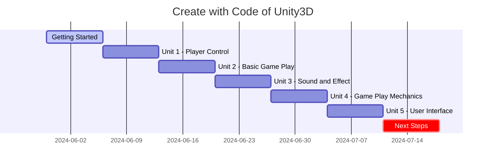

## On Going 

| Subject | Type | Link|
| :--- | :--- | :--- |
| Working on my Unity project | Github | <https://github.com/akillness/PlayerControl> |

## Course



| Subject | Type | Link|
| :--- | :--- | :--- |
| `Create with Code in Unity` | Tutorial | <https://learn.unity.com/course/create-with-code> |
| Game Maker's Toolkit | Video | <https://www.youtube.com/@GMTK> |

## Introduction

In this official course from Unity, you will learn to Create with Code as you program your own exciting projects from scratch in C#. 

As you iterate with prototypes, tackle programming challenges, complete quizzes, and develop your own personal project, you will transform from an absolute beginner to a capable Unity developer. 

By the end of the course - if you are completing it through a school program - you will also be ready to put your skills to the test on the Unity Certified User Programmer Exam. Most importantly, though, when you complete this course, you will have the confidence that you can Create with Code. 

<!-- 

 Translate to Korean 

* * * 

## 내 가이드를 사용하여 다가오는 모든 트렌드를 따라잡으세요! 

 -->