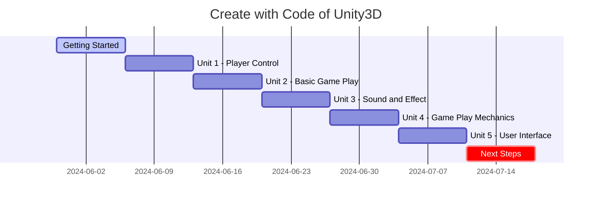

## Game Development Course with Unity3D Programming

*Curiosity:* How can we learn game development with Unity? What's the path from beginner to capable Unity developer?

**This official Unity course** teaches you to Create with Code by programming your own exciting projects from scratch in C#.

### Learning Roadmap

*Retrieve:* Course structure and timeline.

### Course Units

*Innovate:* Learning progression.

| Unit | Topic | Duration | Focus |
|:-----|:------|:---------|:------|
| **Getting Started** | Introduction | 1 week | ⬆️ Basics |
| **Unit 1** | Player Control | 1 week | ⬆️ Input handling |
| **Unit 2** | Basic Game Play | 1 week | ⬆️ Core mechanics |
| **Unit 3** | Sound and Effect | 1 week | ⬆️ Audio/visual |
| **Unit 4** | Game Play Mechanics | 1 week | ⬆️ Advanced features |
| **Unit 5** | User Interface | 1 week | ⬆️ UI/UX |
| **Next Steps** | Advanced topics | 1 week | ⬆️ Mastery |

### Resources

*Retrieve:* Available learning materials.

| Subject | Type | Link |
|:--------|:------|:-----|
| **Working on my Unity project** | Github | <https://github.com/akillness/PlayerControl> |
| **Create with Code in Unity** | Tutorial | <https://learn.unity.com/course/create-with-code> |
| **Game Maker's Toolkit** | Video | <https://www.youtube.com/@GMTK> |
| **AI and Game** | News | <https://www.aiandgames.com/> |

### Course Introduction



*Retrieve:* Course overview.

**Learning Process**:
- Iterate with prototypes
- Tackle programming challenges
- Complete quizzes
- Develop personal project

**Outcome**: Transform from absolute beginner to capable Unity developer.

**Certification**: Ready for Unity Certified User Programmer Exam (if completing through school program).

**Most Important**: Gain confidence that you can Create with Code.

### Key Takeaways

*Retrieve:* Unity's Create with Code course provides a structured 7-week path from beginner to capable Unity developer, covering player control, gameplay, sound, mechanics, and UI.

*Innovate:* By following this course and building your own projects, you can learn C# programming, Unity development, and game design principles, transforming from beginner to confident game developer.

*Curiosity → Retrieve → Innovation:* Start with curiosity about game development, retrieve insights from Unity's structured course, and innovate by building your own games and projects.

**Next Steps**:
- Start Getting Started unit
- Follow the roadmap
- Build your project
- Complete all units 

<!-- 

 Translate to Korean 

* * * 

## 내 가이드를 사용하여 다가오는 모든 트렌드를 따라잡으세요! 

 -->