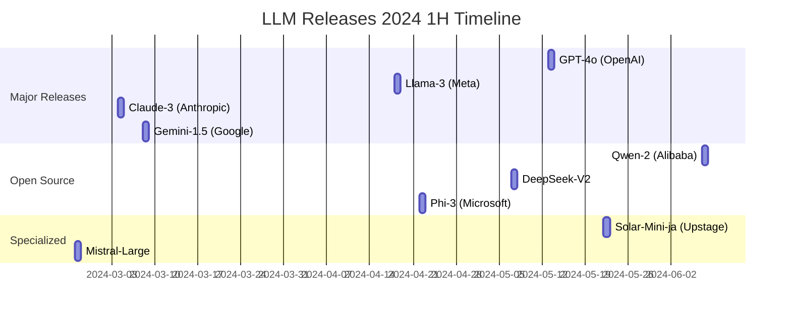
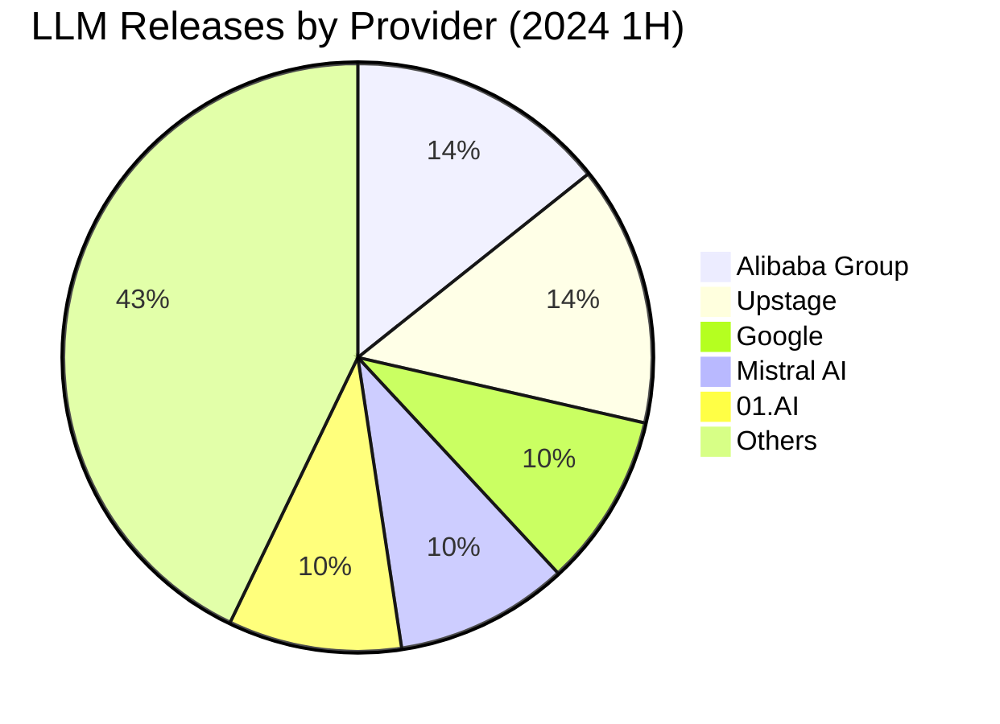
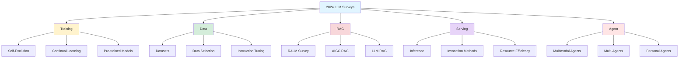
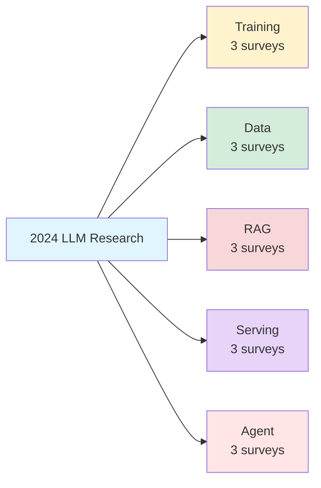

## 🌟 LLM Provider's Release (2024 1H): A Comprehensive Overview

*Curiosity:* What patterns can we retrieve from the rapid pace of LLM releases in 2024? How do these innovations connect to the broader evolution of the field?

**2024's first half** witnessed an unprecedented surge in LLM releases, with 21 major models from leading providers. This comprehensive overview retrieves insights from release patterns, technical innovations, and market dynamics to understand where the field is heading.

### Release Timeline Overview

### 21 LLM Releases: Complete Catalog

| # | Model | Provider | Release Date | Key Features | News | Paper |
|:--|:------|:---------|:-------------|:-------------|:-----|:------|
| 1 | **Qwen-2** | Alibaba Group | 2024.06.07 | Multilingual, large-scale | [Link](https://qwenlm.github.io/blog/qwen2/) | - |
| 2 | **Solar-Mini-ja** | Upstage | 2024.05.22 | Japanese-optimized | [Link](https://www.upstage.ai/feed/tech/solar-mini-chat-ja) | - |
| 3 | **Yi-Large** | 01.AI | 2024.05.13 | Large-scale model | [Link](https://x.com/01AI_Yi/status/1789929378467426794) | - |
| 4 | **Yi-1.5** | 01.AI | 2024.05.13 | Enhanced version | [Link](https://x.com/01AI_Yi/status/1789869537317540016) | [arXiv](https://arxiv.org/abs/2403.04652) |
| 5 | **GPT-4o** | OpenAI | 2024.05.13 | Omni-modal, faster | [Link](https://openai.com/index/hello-gpt-4o/) | - |
| 6 | **Qwen-Max** | Alibaba Group | 2024.05.11 | Maximum performance | [Link](https://qwenlm.github.io/blog/qwen-max-0428/) | - |
| 7 | **DeepSeek-V2** | DeepSeek | 2024.05.07 | Efficient architecture | [Link](https://x.com/deepseek_ai/status/1787478986731429933) | [arXiv](https://arxiv.org/abs/2405.04434) |
| 8 | **Snowflake-Arctic** | Snowflake | 2024.04.24 | Enterprise-focused | [Link](https://www.snowflake.com/blog/arctic-open-efficient-foundation-language-models-snowflake/) | - |
| 9 | **Phi-3** | Microsoft | 2024.04.22 | Small language model | [Link](https://azure.microsoft.com/en-us/blog/introducing-phi-3-redefining-whats-possible-with-slms/) | [arXiv](https://arxiv.org/abs/2404.14219) |
| 10 | **Llama-3** | Meta | 2024.04.18 | Open-source leader | [Link](https://ai.meta.com/blog/meta-llama-3/) | - |
| 11 | **Mixtral-8x22B** | Mistral AI | 2024.04.17 | Mixture of experts | [Link](https://mistral.ai/news/mixtral-8x22b/) | - |
| 12 | **Reka-Core** | Reka AI | 2024.04.15 | Multimodal | [Link](https://www.reka.ai/news/reka-core-our-frontier-class-multimodal-language-model) | [arXiv](https://arxiv.org/abs/2404.12387) |
| 13 | **Command-R-Plus** | Cohere | 2024.04.04 | Enterprise RAG | [Link](https://cohere.com/blog/command-r-plus-microsoft-azure) | - |
| 14 | **DBRX** | Databricks | 2024.03.27 | Open-source SOTA | [Link](https://www.databricks.com/blog/introducing-dbrx-new-state-art-open-llm) | - |
| 15 | **Gemini-1.5** | Google | 2024.03.08 | Long context | [Link](https://blog.google/technology/ai/google-gemini-next-generation-model-february-2024/) | [arXiv](https://arxiv.org/abs/2403.05530) |
| 16 | **Claude-3** | Anthropic | 2024.03.04 | Safety-focused | [Link](https://www.anthropic.com/news/claude-3-family) | - |
| 17 | **Mistral-Large** | Mistral AI | 2024.02.26 | European leader | [Link](https://mistral.ai/news/mistral-large/) | - |
| 18 | **Gemma** | Google | 2024.02.21 | Open models | [Link](https://blog.google/technology/developers/gemma-open-models/) | [arXiv](https://arxiv.org/abs/2403.08295) |
| 19 | **Qwen-1.5** | Alibaba Group | 2024.02.04 | Multilingual | [Link](https://qwenlm.github.io/blog/qwen1.5/) | - |
| 20 | **Solar-Mini** | Upstage | 2024.01.25 | Efficient Korean | [Link](https://www.upstage.ai/feed/product/solarmini-performance-report) | - |
| 21 | **Solar-10.7B** | Upstage | 2023.12.23 | Top pre-trained | [Link](https://www.upstage.ai/feed/press/solar-10-7b-emerges-as-worlds-top-pre-trained-llm) | [arXiv](https://arxiv.org/abs/2312.15166) |

### Provider Distribution

### Key Trends & Insights

*Retrieve:* Analysis of release patterns reveals several key trends:

1. **Open Source Acceleration**: Major releases from Meta (Llama-3), Alibaba (Qwen series), and Databricks (DBRX)
2. **Multimodal Expansion**: GPT-4o, Gemini-1.5, Reka-Core emphasize vision capabilities
3. **Efficiency Focus**: Phi-3, Solar-Mini demonstrate small model excellence
4. **Regional Specialization**: Solar-Mini-ja (Japanese), Qwen series (Chinese)

*Innovate:* These releases show the field moving toward:
- More efficient architectures (DeepSeek-V2, Phi-3)
- Better multilingual support (Qwen, Solar)
- Enterprise-ready solutions (Snowflake Arctic, Command-R-Plus)

1. 𝐐𝐰𝐞𝐧-2 (​Alibaba Group​, 2024.06.07)
- • 📣News: <https://qwenlm.github.io/blog/qwen2/>

2. 𝐒𝐨𝐥𝐚𝐫-𝐌𝐢𝐧𝐢-𝐣𝐚 (​Upstage​, 2024.05.22)
- • 📣News: <https://www.upstage.ai/feed/tech/solar-mini-chat-ja>

3. 𝐘𝐢-𝐋𝐚𝐫𝐠𝐞 (​01.AI​, 2024.05.13)
- • 📣News: <https://x.com/01AI_Yi/status/1789929378467426794>

4. 𝐘𝐢-1.5 (​01.AI​, 2024.05.13)
- • 📣News: <https://x.com/01AI_Yi/status/1789869537317540016>
- • 📋arXiv: <https://arxiv.org/abs/2403.04652>

5. 𝐆𝐏𝐓-4𝐨 (​OpenAI​, 2024.05.13)
- • 📣News: <https://openai.com/index/hello-gpt-4o/>

6. 𝐐𝐰𝐞𝐧-𝐌𝐚𝐱 (​Alibaba Group​, 2024.05.11)
- • 📣News: <https://qwenlm.github.io/blog/qwen-max-0428/>

7. 𝐃𝐞𝐞𝐩𝐒𝐞𝐞𝐤-𝐕2 (DeepSeek, 2024.05.07)
- • 📣News: <https://x.com/deepseek_ai/status/1787478986731429933>
- • 📋arXiv: <https://arxiv.org/abs/2405.04434>

8. 𝐒𝐧𝐨𝐰𝐟𝐥𝐚𝐤𝐞-𝐀𝐫𝐜𝐭𝐢𝐜 (​Snowflake​, 2024.04.24)
- • 📣News: <https://www.snowflake.com/blog/arctic-open-efficient-foundation-language-models-snowflake/>

9. 𝐏𝐡𝐢-3 (​Microsoft​, 2024.04.22)
- • 📣News: <https://azure.microsoft.com/en-us/blog/introducing-phi-3-redefining-whats-possible-with-slms/>
- • 📋arXiv: <https://arxiv.org/abs/2404.14219>

10. 𝐋𝐥𝐚𝐦𝐚-3 (​Meta Facebook​, 2024.04.18)
- • 📣News: <https://ai.meta.com/blog/meta-llama-3/>

11. 𝐌𝐢𝐱𝐭𝐫𝐚𝐥-8𝐱22𝐁 (​Mistral AI​, 2024.04.17)
- • 📣News: <https://mistral.ai/news/mixtral-8x22b/>

12. 𝐑𝐞𝐤𝐚-𝐂𝐨𝐫𝐞 (​Reka AI​​, 2024.04.15)
- • 📣News: <https://www.reka.ai/news/reka-core-our-frontier-class-multimodal-language-model>
- • 📋arXiv: <https://arxiv.org/abs/2404.12387>

13. 𝐂𝐨𝐦𝐦𝐚𝐧𝐝-𝐑-𝐏𝐥𝐮𝐬 (​Cohere​, 2024.04.04)
- • 📣News: <https://cohere.com/blog/command-r-plus-microsoft-azure>

14. 𝐃𝐁𝐑𝐗 (​Databricks​, 2024.03.27)
- • 📣News: <https://www.databricks.com/blog/introducing-dbrx-new-state-art-open-llm>

15. 𝐆𝐞𝐦𝐢𝐧𝐢-1.5 (​Google​, 2024.03.08)
- • 📣News: <https://blog.google/technology/ai/google-gemini-next-generation-model-february-2024/>
- • 📋arXiv: <https://arxiv.org/abs/2403.05530>

16. 𝐂𝐥𝐚𝐮𝐝𝐞-3 (​Anthropic​, 2024.03.04)
- • 📣News: <https://www.anthropic.com/news/claude-3-family>

17. 𝐌𝐢𝐬𝐭𝐫𝐚𝐥-𝐋𝐚𝐫𝐠𝐞 (​Mistral AI​, 2024.02.26)
- • 📣News: <https://mistral.ai/news/mistral-large/>

18. 𝐆𝐞𝐦𝐦𝐚 (​Google​, 2024.02.21)
- • 📣News: <https://blog.google/technology/developers/gemma-open-models/>
- • 📋arXiv: <https://arxiv.org/abs/2403.08295>

19. 𝐐𝐰𝐞𝐧-1.5 (​Alibaba Group​, 2024.02.04)
- • 📣News: <https://qwenlm.github.io/blog/qwen1.5/>

20. 𝐒𝐨𝐥𝐚𝐫-𝐌𝐢𝐧𝐢 (​Upstage​, 2024.01.25)
- • 📣News: <https://www.upstage.ai/feed/product/solarmini-performance-report>

21. 𝐒𝐨𝐥𝐚𝐫-10.7𝐁 (​Upstage​, 2023.12.23)
- • 📣News: <https://www.upstage.ai/feed/press/solar-10-7b-emerges-as-worlds-top-pre-trained-llm>
- • 📋arXiv: <https://arxiv.org/abs/2312.15166>

* * *

## 📝 2024 LLM Survey: Comprehensive Research Overview

*Retrieve:* What are the latest research trends across training, data, RAG, serving, and agents? This section compiles essential survey papers that capture the state of the art.

> **Essential Reading**: These surveys provide comprehensive overviews of rapidly evolving LLM research areas.
{: .prompt-warning }

{: .light .shadow .rounded-10 w='1212' h='668' }

### Survey Categories Overview

### 📚 Training Surveys

*Retrieve:* How do LLMs evolve and adapt? These surveys explore self-evolution, continual learning, and transfer learning.

| Survey | Date | Focus | arXiv | GitHub |
|:-------|:-----|:------|:------|:-------|
| **Self-Evolution of LLMs** | 2024.04.22 | Autonomous improvement mechanisms | [Link](https://arxiv.org/abs/2404.14387) | [Repo](https://github.com/AlibabaResearch/DAMO-ConvAI/tree/main/Awesome-Self-Evolution-of-LLM) |
| **Continual Learning of LLMs** | 2024.04.25 | Lifelong learning approaches | [Link](https://arxiv.org/abs/2404.16789) | [Repo](https://github.com/Wang-ML-Lab/llm-continual-learning-survey) |
| **Continual Learning with PTMs** | 2024.01.29 | Pre-trained model adaptation | [Link](https://arxiv.org/abs/2401.16386) | [Repo](https://github.com/sun-hailong/LAMDA-PILOT) |

### 📊 Data Surveys

*Innovate:* Data quality and selection are critical for LLM performance. These surveys explore dataset curation and optimization.

| Survey | Date | Focus | arXiv | GitHub |
|:-------|:-----|:------|:------|:-------|
| **Datasets for LLMs** | 2024.02.28 | Comprehensive dataset catalog | [Link](https://arxiv.org/pdf/2402.18041) | [Repo](https://github.com/lmmlzn/Awesome-LLMs-Datasets) |
| **Data Selection for LMs** | 2024.02.26 | Selection strategies | [Link](https://arxiv.org/abs/2402.16827) | [Repo](https://github.com/alon-albalak/data-selection-survey) |
| **Data Selection for Instruction Tuning** | 2024.02.04 | Instruction data curation | [Link](https://arxiv.org/abs/2402.05123) | [Repo](https://github.com/Bolin97/awesome-instruction-selector) |

### 🔍 RAG Surveys

*Retrieve:* Retrieval-Augmented Generation is transforming how LLMs access knowledge. These surveys cover the latest RAG research.

| Survey | Date | Focus | arXiv | GitHub |
|:-------|:-----|:------|:------|:-------|
| **RAG and RAU Survey** | 2024.04.30 | RALM in NLP | [Link](https://arxiv.org/abs/2404.19543) | [Repo](https://github.com/2471023025/RALM_Survey) |
| **RAG for AIGC** | 2024.02.29 | AI-generated content | [Link](https://arxiv.org/abs/2402.19473) | [Repo](https://github.com/hymie122/RAG-Survey) |
| **RAG for LLMs** | 2023.12.18 | Comprehensive RAG overview | [Link](https://arxiv.org/abs/2312.10997) | [Repo](https://github.com/Tongji-KGLLM/RAG-Survey) |

### ⚡ Serving Surveys

*Innovate:* Efficient inference and serving are crucial for production deployment. These surveys explore optimization strategies.

| Survey | Date | Focus | arXiv | GitHub |
|:-------|:-----|:------|:------|:-------|
| **LLM Inference Unveiled** | 2024.02.26 | Roofline model insights | [Link](https://arxiv.org/abs/2402.16363) | [Repo](https://github.com/hahnyuan/LLM-Viewer) |
| **Effective LLM Service Invocation** | 2024.02.05 | LLMaaS strategies | [Link](https://arxiv.org/abs/2402.03408) | [Repo](https://github.com/W-caner/Effective-strategy-for-LMaas) |
| **Resource-Efficient LLMs** | 2024.01.01 | Efficiency optimization | [Link](https://arxiv.org/abs/2401.00625) | [Repo](https://github.com/tiingweii-shii/Awesome-Resource-Efficient-LLM-Papers) |

### 🤖 Agent Surveys

*Retrieve:* AI agents represent the next frontier. These surveys explore multimodal, multi-agent, and personal agent systems.

| Survey | Date | Focus | arXiv | GitHub |
|:-------|:-----|:------|:------|:-------|
| **Large Multimodal Agents** | 2024.02.23 | Vision-language agents | [Link](https://arxiv.org/abs/2402.15116) | [Repo](https://github.com/jun0wanan/awesome-large-multimodal-agents) |
| **LLM-based Multi-Agents** | 2024.01.21 | Multi-agent systems | [Link](https://arxiv.org/abs/2402.01680) | [Repo](https://github.com/taichengguo/LLM_MultiAgents_Survey_Papers) |
| **Personal LLM Agents** | 2024.01.10 | Personalization & security | [Link](https://arxiv.org/abs/2401.05459) | [Repo](https://github.com/MobileLLM/Personal_LLM_Agents_Survey) |

### Research Trends Summary

### Key Takeaways

*Retrieve:* These 15 comprehensive surveys cover the essential areas of LLM research: training methodologies, data strategies, RAG systems, serving optimization, and agent architectures.

*Innovate:* By studying these surveys, you can retrieve the latest research insights and innovate on your own LLM applications, staying at the forefront of this rapidly evolving field.

*Curiosity → Retrieve → Innovation:* Start with curiosity about LLM capabilities, retrieve knowledge from these surveys, and innovate by applying cutting-edge techniques to your projects.

> Information about Tokens in LLsM
{: .prompt-Tip}

### Why do we keep talking about "tokens" in LLMs instead of words? 

It happens to be much more efficient to break the words into sub-words (tokens) for model performance!

The typical strategy used in most modern LLMs since GPT-1 is the Byte Pair Encoding (BPE) strategy. The idea is to use, as tokens, sub-word units that appear often in the training data. The algorithm works as follows:

- We start with a character-level tokenization
- we count the pair frequencies
- We merge the most frequent pair
- We repeat the process until the dictionary is as big as we want it to be

The size of the dictionary becomes a hyperparameter that we can adjust based on our training data. For example, GPT-1 has a dictionary size of ~40K merges, GPT-2, GPT-3, and ChatGPT have a dictionary size of ~50K, and Llama 3 128K.

{: .light .shadow .rounded-10 w='1212' h='668' }