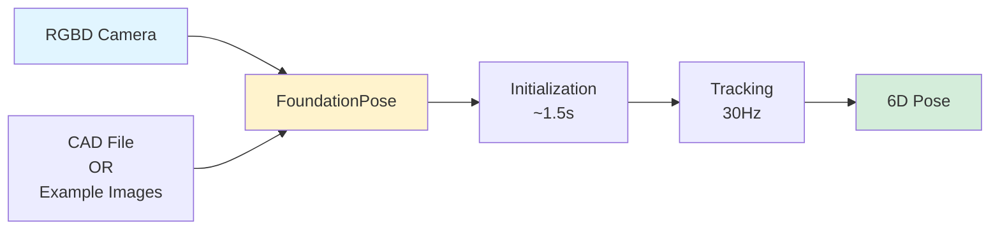

## FoundationPose: Unified 6D Pose Estimation and Tracking

*Curiosity:* How can we achieve real-time 6D pose estimation on consumer GPUs? What makes FoundationPose outperform previous methods?

**FoundationPose** is NVIDIA's solution for unified 6D pose estimation and tracking of novel objects. The demo ran real-time on an RTX3090—a 4-year-old GPU. Today, you can get the same AI performance (in TOPS) for ~300€.

> **Resources**:
> - **📄 Paper**: <https://arxiv.org/abs/2312.08344>
> - **🌐 Project Page**: <https://nvlabs.github.io/FoundationPose/>
> - **💻 Code**: <https://github.com/NVlabs/FoundationPose>
{: .prompt-info}

### Performance Highlights

*Retrieve:* FoundationPose achieves impressive real-time performance.

| Metric | Value | Impact |
|:-------|:------|:-------|
| **Initialization** | ~1.5s | ⬆️ Fast lock-on |
| **Tracking Rate** | 30Hz | ⬆️ Real-time |
| **Hardware** | RTX3090 (4 years old) | ⬇️ Accessible |
| **Cost** | ~300€ equivalent | ⬇️ Affordable |

**Key Achievement**: Outperforms any prior work while running on consumer hardware.

### System Requirements

*Retrieve:* FoundationPose requirements and capabilities.

**Required Components**:
- RGBD camera
- Example images with ground truth poses (if no CAD file)
- OR textured CAD file

**Complexity**: Complex solution, but delivers superior results.

### Architecture Overview

### Why This Matters

*Innovate:* Real-time performance on accessible hardware opens new possibilities.

**Implications**:
- ✅ Affordable robotics applications
- ✅ Real-time object tracking
- ✅ Accessible to more developers
- ✅ Fast incremental improvements

**Future Potential**: With 30Hz performance on 'low-end' GPUs, we can expect:
- Efficiency improvements
- Smarter solutions
- Better code synergies
- Rapid incremental advances

### Use Cases

*Retrieve:* Applications enabled by FoundationPose.

**Potential Applications**:
- Robotics manipulation
- AR/VR object tracking
- Industrial automation
- Autonomous systems

**Jetson Deployment**: Looking forward to running on Jetson for edge deployment!

### Key Takeaways

*Retrieve:* FoundationPose achieves real-time 6D pose estimation and tracking on consumer GPUs, outperforming previous methods while remaining accessible.

*Innovate:* By running on affordable hardware (RTX3090 equivalent for ~300€), FoundationPose makes advanced pose estimation accessible to more developers and enables rapid innovation in robotics and AR/VR applications.

*Curiosity → Retrieve → Innovation:* Start with curiosity about real-time pose estimation, retrieve insights from FoundationPose's performance, and innovate by building applications that leverage accessible, high-performance pose tracking.

**Next Steps**:
- Read the full paper
- Explore the code repository
- Test on your hardware
- Deploy to Jetson for edge applications

> 🧙Paper Authors: Bowen Wen, Wei Yang, Jan Kautz, Stan Birchfield NVIDIA 
- 1️⃣Read the Full Paper here: <https://arxiv.org/abs/2312.08344>
- 2️⃣Project Page: <https://nvlabs.github.io/FoundationPose/>
- 3️⃣Code: <https://github.com/NVlabs/FoundationPose?tab=readme-ov-file>
{: .prompt-info }

{: .light .shadow .rounded-10 w='1212' h='668' }

 Translate to Korean 

##  FoundationPose는 복잡한 솔루션

지난주 imec ITF 컨퍼런스에서 저는 NVIDIA Robotics 이 영화로 AI와 로봇 공학에 대한 프레젠테이션을 마쳤습니다. 왜? 데모는 RTX3090에서 실시간으로 실행되었습니다. 4년 된 GPU입니다. 오늘날에는 ~300€에 동일한 AI 성능(TOPS)을 얻을 수 있습니다.

~1.5초 이내에 물체의 위치와 방향을 잠근 다음 30Hz로 추적합니다.

FoundationPose는 복잡한 솔루션으로, RGBD 카메라가 필요하며, 텍스처 CAD 파일을 사용할 수 없는 경우 몇 가지 예제 이미지(실측 포즈 포함)가 필요합니다. 그러나 그것은 그것을 못 박고 이전의 어떤 작업보다 성능이 뛰어납니다.

이 성능('저가형' GPU에서 30Hz)을 사용하면 코드에서 효율성, 더 스마트한 솔루션, 더 나은 시너지 효과를 찾는 데 오랜 시간이 걸리지 않을 것입니다. 아키텍처가 작동하는 것으로 입증되면 점진적인 개선이 매우 빠르게 이루어집니다.

곧 Jetson에서 이것을 실행하기를 기대합니다!

