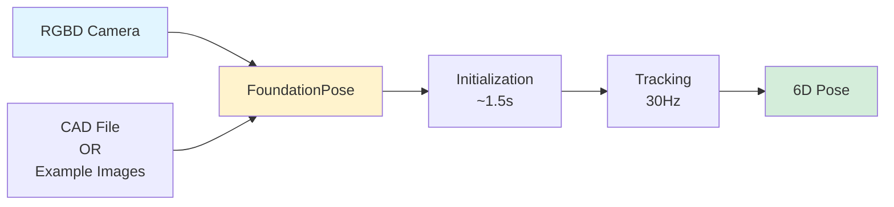

## FoundationPose: Unified 6D Pose Estimation and Tracking

*Curiosity:* How can we achieve real-time 6D pose estimation on consumer GPUs? What makes FoundationPose outperform previous methods?

**FoundationPose** is NVIDIA's solution for unified 6D pose estimation and tracking of novel objects. The demo ran real-time on an RTX3090—a 4-year-old GPU. Today, you can get the same AI performance (in TOPS) for ~300€.

> **Resources**:
> - **📄 Paper**: <https://arxiv.org/abs/2312.08344>
> - **🌐 Project Page**: <https://nvlabs.github.io/FoundationPose/>
> - **💻 Code**: <https://github.com/NVlabs/FoundationPose>
{: .prompt-info}

### Performance Highlights

*Retrieve:* FoundationPose achieves impressive real-time performance.

| Metric | Value | Impact |
|:-------|:------|:-------|
| **Initialization** | ~1.5s | ⬆️ Fast lock-on |
| **Tracking Rate** | 30Hz | ⬆️ Real-time |
| **Hardware** | RTX3090 (4 years old) | ⬇️ Accessible |
| **Cost** | ~300€ equivalent | ⬇️ Affordable |

**Key Achievement**: Outperforms any prior work while running on consumer hardware.

### System Requirements

*Retrieve:* FoundationPose requirements and capabilities.

**Required Components**:
- RGBD camera
- Example images with ground truth poses (if no CAD file)
- OR textured CAD file

**Complexity**: Complex solution, but delivers superior results.

### Architecture Overview

```mermaid
graph LR
    A[RGBD Camera] --> B[FoundationPose]
    B --> C[Initialization<br/>~1.5s]
    C --> D[Tracking<br/>30Hz]
    D --> E[6D Pose]
    
    F[CAD File<br/>OR<br/>Example Images] --> B
    
    style A fill:#e1f5ff
    style B fill:#fff3cd
    style E fill:#d4edda
```

### Why This Matters

*Innovate:* Real-time performance on accessible hardware opens new possibilities.

**Implications**:
- ✅ Affordable robotics applications
- ✅ Real-time object tracking
- ✅ Accessible to more developers
- ✅ Fast incremental improvements

**Future Potential**: With 30Hz performance on 'low-end' GPUs, we can expect:
- Efficiency improvements
- Smarter solutions
- Better code synergies
- Rapid incremental advances

### Use Cases

*Retrieve:* Applications enabled by FoundationPose.

**Potential Applications**:
- Robotics manipulation
- AR/VR object tracking
- Industrial automation
- Autonomous systems

**Jetson Deployment**: Looking forward to running on Jetson for edge deployment!

### Key Takeaways

*Retrieve:* FoundationPose achieves real-time 6D pose estimation and tracking on consumer GPUs, outperforming previous methods while remaining accessible.

*Innovate:* By running on affordable hardware (RTX3090 equivalent for ~300€), FoundationPose makes advanced pose estimation accessible to more developers and enables rapid innovation in robotics and AR/VR applications.

*Curiosity → Retrieve → Innovation:* Start with curiosity about real-time pose estimation, retrieve insights from FoundationPose's performance, and innovate by building applications that leverage accessible, high-performance pose tracking.

**Next Steps**:
- Read the full paper
- Explore the code repository
- Test on your hardware
- Deploy to Jetson for edge applications

> 🧙Paper Authors: Bowen Wen, Wei Yang, Jan Kautz, Stan Birchfield NVIDIA 
- 1️⃣Read the Full Paper here: <https://arxiv.org/abs/2312.08344>
- 2️⃣Project Page: <https://nvlabs.github.io/FoundationPose/>
- 3️⃣Code: <https://github.com/NVlabs/FoundationPose?tab=readme-ov-file>
{: .prompt-info }

{: .light .shadow .rounded-10 w='1212' h='668' }

 Translate to Korean 

##  FoundationPose is a Complex Solution

At last week's imec ITF conference, I ended my presentation on AI and robotics with this video by NVIDIA Robotics. Why? The demo runs in real time on an RTX3090 — a 4-year-old GPU. Today you can get the same AI performance (TOPS) for ~€300.

It locks onto the object's position and orientation within ~1.5 seconds, then tracks at 30 Hz.

FoundationPose is a complex solution — it requires an RGBD camera, and a few example images (with ground-truth poses) when a textured CAD file is not available. But it nails it and outperforms any previous work.

With this level of performance (30 Hz on a 'budget' GPU), it won't take long to find efficiency gains, smarter solutions, and better synergies in the code. Once an architecture is proven to work, incremental improvements happen very quickly.

Looking forward to running this on Jetson soon!

