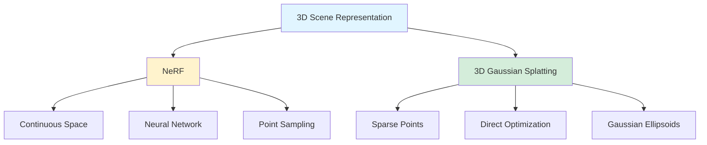
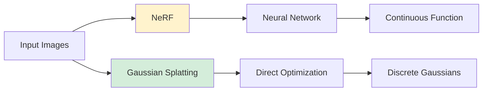

## In the world of computer vision, 3D Gaussian Splatting and NeRFs are gaining traction. 

*Curiosity:* But what sets them apart? Here’s a quick breakdown:

### Comparison Overview

*Retrieve:* Key differences between NeRF and 3D Gaussian Splatting.

### Detailed Comparison

| Aspect | NeRF | 3D Gaussian Splatting |
|:-------|:-----|:----------------------|
| **3D Space** | Continuous | Sparse points |
| **Point Generation** | Sampling per image | Structure from Motion |
| **Representation** | RGBA + viewing direction | Gaussians (shape, size, transparency, color) |
| **Color Description** | View-dependent | Spherical harmonics |
| **Optimization** | Neural network | Direct optimization |
| **Output** | Continuous function | Discrete ellipsoids |
| **Approach** | Neural, continuous | Geometric, discrete |

### 1. 3D Space Representation

*Retrieve:* Different approaches to representing 3D space.

**NeRF**:
- Creates continuous 3D space
- Samples points throughout scene
- Per training image sampling

**Gaussian Splatting**:
- Relies on sparse 3D points
- Often uses Structure from Motion
- More efficient representation

### 2. Point Description

*Retrieve:* How each method describes scene points.

**NeRF**:
- RGBA color per point
- Viewing direction dependency
- Appearance varies with location and angle

**Gaussian Splatting**:
- Complex 3D Gaussian forms
- Varying shapes, sizes, transparency
- Color described with spherical harmonics
- More flexible representation

### 3. Optimization

*Innovate:* Different optimization strategies.

**NeRF**:
- Neural network learns continuous function
- Color and opacity functions
- Implicit representation

**Gaussian Splatting**:
- Direct optimization of ellipsoid properties
- No neural network needed
- Explicit discrete structure
- Faster training

### Architecture Comparison

### When to Use Each

*Retrieve:* Choosing the right approach for your application.

| Use Case | Recommended | Reason |
|:---------|:------------|:-------|
| **High Quality** | NeRF | Continuous representation |
| **Fast Training** | Gaussian Splatting | Direct optimization |
| **Real-time Rendering** | Gaussian Splatting | Efficient discrete structure |
| **Research** | NeRF | Neural approach flexibility |
| **Production** | Gaussian Splatting | Faster, more practical |

### Key Takeaways

*Retrieve:* NeRF offers a continuous, neural approach to 3D scene representation, while 3D Gaussian Splatting provides a simpler, directly optimized discrete structure with faster training and rendering.

*Innovate:* By understanding the trade-offs between continuous neural representations and discrete geometric approaches, you can choose the right method for your specific application—whether prioritizing quality, speed, or practicality.

*Curiosity → Retrieve → Innovation:* Start with curiosity about 3D scene representation, retrieve insights from comparing NeRF and Gaussian Splatting, and innovate by applying the right approach to your 3D graphics or AR applications.

**Next Steps**:
- Explore NeRF implementations
- Try 3D Gaussian Splatting
- Compare performance
- Choose based on your needs

> Information About 3D Gaussian Splatting
- Blog : <https://xoft.tistory.com/74>
{: .prompt-info }

{: .light  .shadow .rounded-10 w='1212' h='668' }

 Translate to Korean 

## 컴퓨터 비전의 세계에서는 3D Gaussian Splatting 및 NeRF가 주목을 받고 있습니다. 그러나 무엇이 그들을 차별화합니까? 다음은 간단한 분석입니다.

### 🔍 3D 공간 표현: 
- NeRF: 각 학습 이미지에 대해 장면 전체의 지점을 샘플링하여 연속 3D 공간을 만듭니다.
- 가우시안 스플래팅(Gaussian Splatting): 종종 모션의 구조(Structure from Motion)를 사용하여 생성되는 희소 3D 포인트 세트를 사용합니다.

### 🎨 포인트 설명: 
- 가우시안 스플래팅: 구형 고조파로 설명되는 다양한 모양, 크기, 투명도 및 색상을 가진 가우시안이라는 복잡한 3D 형태를 사용합니다.
- NeRF: 각 포인트에 RGBA 색상과 보기 방향을 할당하며, 모양은 위치 및 시야각에 따라 달라집니다.

### ⚙️ 최적화: 
- NeRF: 신경망을 사용하여 색상 및 불투명도에 대한 연속 함수를 학습합니다.
- Gaussian Splatting: 신경망 없이 각 3D 타원체의 속성을 직접 최적화하여 개별 타원체 세트를 생성합니다.

본질적으로 NeRF는 연속적인 신경 접근 방식을 제공하는 반면, Gaussian Splatting은 더 간단하고 직접 최적화된 이산 구조를 제공합니다.

3D 그래픽과 AR 애플리케이션에 어떤 접근 방식이 더 흥미롭다고 생각하십니까? 댓글로 생각을 공유하세요! 💬

