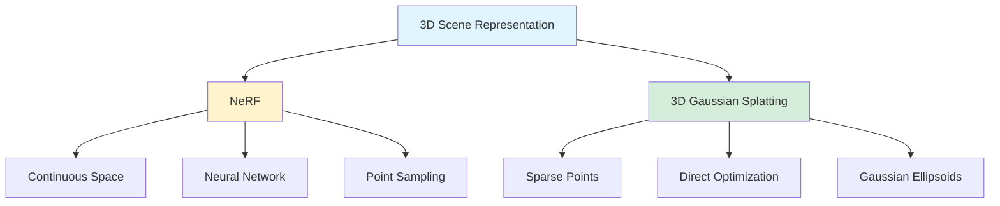
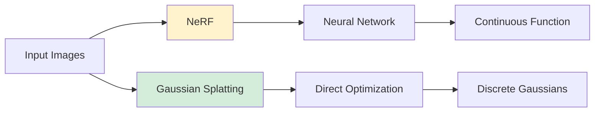

## In the world of computer vision, 3D Gaussian Splatting and NeRFs are gaining traction. 

*Curiosity:* But what sets them apart? Here’s a quick breakdown:

### Comparison Overview

*Retrieve:* Key differences between NeRF and 3D Gaussian Splatting.

```mermaid
graph TB
    A[3D Scene Representation] --> B[NeRF]
    A --> C[3D Gaussian Splatting]
    
    B --> B1[Continuous Space]
    B --> B2[Neural Network]
    B --> B3[Point Sampling]
    
    C --> C1[Sparse Points]
    C --> C2[Direct Optimization]
    C --> C3[Gaussian Ellipsoids]
    
    style A fill:#e1f5ff
    style B fill:#fff3cd
    style C fill:#d4edda
```

### Detailed Comparison

| Aspect | NeRF | 3D Gaussian Splatting |
|:-------|:-----|:----------------------|
| **3D Space** | Continuous | Sparse points |
| **Point Generation** | Sampling per image | Structure from Motion |
| **Representation** | RGBA + viewing direction | Gaussians (shape, size, transparency, color) |
| **Color Description** | View-dependent | Spherical harmonics |
| **Optimization** | Neural network | Direct optimization |
| **Output** | Continuous function | Discrete ellipsoids |
| **Approach** | Neural, continuous | Geometric, discrete |

### 1. 3D Space Representation

*Retrieve:* Different approaches to representing 3D space.

**NeRF**:
- Creates continuous 3D space
- Samples points throughout scene
- Per training image sampling

**Gaussian Splatting**:
- Relies on sparse 3D points
- Often uses Structure from Motion
- More efficient representation

### 2. Point Description

*Retrieve:* How each method describes scene points.

**NeRF**:
- RGBA color per point
- Viewing direction dependency
- Appearance varies with location and angle

**Gaussian Splatting**:
- Complex 3D Gaussian forms
- Varying shapes, sizes, transparency
- Color described with spherical harmonics
- More flexible representation

### 3. Optimization

*Innovate:* Different optimization strategies.

**NeRF**:
- Neural network learns continuous function
- Color and opacity functions
- Implicit representation

**Gaussian Splatting**:
- Direct optimization of ellipsoid properties
- No neural network needed
- Explicit discrete structure
- Faster training

### Architecture Comparison

```mermaid
graph LR
    A[Input Images] --> B[NeRF]
    A --> C[Gaussian Splatting]
    
    B --> D[Neural Network]
    D --> E[Continuous Function]
    
    C --> F[Direct Optimization]
    F --> G[Discrete Gaussians]
    
    style B fill:#fff3cd
    style C fill:#d4edda
```

### When to Use Each

*Retrieve:* Choosing the right approach for your application.

| Use Case | Recommended | Reason |
|:---------|:------------|:-------|
| **High Quality** | NeRF | Continuous representation |
| **Fast Training** | Gaussian Splatting | Direct optimization |
| **Real-time Rendering** | Gaussian Splatting | Efficient discrete structure |
| **Research** | NeRF | Neural approach flexibility |
| **Production** | Gaussian Splatting | Faster, more practical |

### Key Takeaways

*Retrieve:* NeRF offers a continuous, neural approach to 3D scene representation, while 3D Gaussian Splatting provides a simpler, directly optimized discrete structure with faster training and rendering.

*Innovate:* By understanding the trade-offs between continuous neural representations and discrete geometric approaches, you can choose the right method for your specific application—whether prioritizing quality, speed, or practicality.

*Curiosity → Retrieve → Innovation:* Start with curiosity about 3D scene representation, retrieve insights from comparing NeRF and Gaussian Splatting, and innovate by applying the right approach to your 3D graphics or AR applications.

**Next Steps**:
- Explore NeRF implementations
- Try 3D Gaussian Splatting
- Compare performance
- Choose based on your needs

> Information About 3D Gaussian Splatting
- Blog : <https://xoft.tistory.com/74>
{: .prompt-info }

{: .light  .shadow .rounded-10 w='1212' h='668' }

 Translate to Korean 

## In the world of computer vision, 3D Gaussian Splatting and NeRF are gaining significant attention. But what differentiates them? Here is a simple breakdown.

### 🔍 3D Space Representation: 
- NeRF: Creates a continuous 3D space by sampling points throughout the scene for each training image.
- Gaussian Splatting: Uses a sparse set of 3D points, often generated using Structure from Motion.

### 🎨 Point Description: 
- Gaussian Splatting: Uses complex 3D shapes called Gaussians with varying shapes, sizes, opacity, and color described by spherical harmonics.
- NeRF: Assigns RGBA color and view direction to each point, with shapes varying based on position and viewing angle.

### ⚙️ Optimization: 
- NeRF: Uses a neural network to learn continuous functions for color and opacity.
- Gaussian Splatting: Directly optimizes the properties of each 3D ellipsoid without a neural network, producing a set of individual ellipsoids.

In essence, NeRF offers a continuous neural approach, while Gaussian Splatting provides a simpler, directly optimized discrete structure.

Which approach do you find more interesting for 3D graphics and AR applications? Share your thoughts in the comments! 💬

