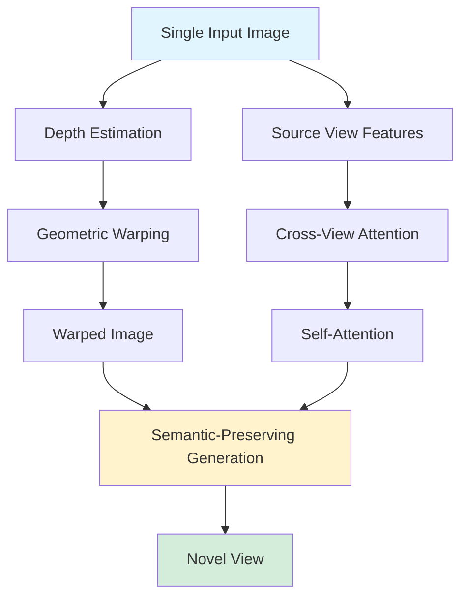

## GenWarp: Single Image to Novel Views with Semantic-Preserving Generative Warping

*Curiosity:* How can we generate novel views from a single image while preserving semantic details? What happens when we combine geometric warping with generative models?

**GenWarp** proposes a semantic-preserving generative warping framework for single-shot novel view synthesis. This approach enables T2I models to learn where to warp and where to generate, addressing limitations of existing methods.

> **Resources**:
> - **📄 Paper**: <https://arxiv.org/abs/2405.17251>
> - **🌐 Project Page**: <https://genwarp-nvs.github.io/>
> - **💻 Code**: Coming soon
{: .prompt-info}

**Organizations**: SonyAI, Sony Group Corporation, 고려대학교

### Challenge Overview

*Retrieve:* Generating novel views from a single image faces significant challenges.

| Challenge | Description | Impact |
|:----------|:------------|:-------|
| **3D Complexity** | Complex 3D scenes | ⚠️ Difficult synthesis |
| **Limited Data** | Sparse multi-view datasets | ⚠️ Training limitations |
| **Noisy Depth** | Depth estimation errors | ⚠️ Warping artifacts |
| **Semantic Loss** | Details lost during warping | ⚠️ Quality degradation |

### Previous Approaches

*Retrieve:* Recent methods combining T2I models with monocular depth estimation.

**Process**:
1. Estimate depth from input image
2. Geometrically warp to novel view
3. Inpaint warped image with T2I model

**Limitations**:
- Noisy depth maps
- Loss of semantic details
- Poor quality in novel viewpoints

### GenWarp Solution

*Innovate:* Semantic-preserving generative warping framework.

### Key Innovation

*Retrieve:* GenWarp learns where to warp and where to generate.

**Approach**:
- Augments cross-view attention with self-attention
- Conditions generative model on source view images
- Incorporates geometric warping signals
- Preserves semantic details during warping

**Architecture**:

| Component | Purpose | Innovation |
|:----------|:--------|:-----------|
| **Cross-View Attention** | Connect source and target views | ⬆️ View consistency |
| **Self-Attention** | Preserve semantic details | ⬆️ Quality |
| **Geometric Warping** | Transform to novel view | ⬆️ Accuracy |
| **Conditional Generation** | Source view conditioning | ⬆️ Fidelity |

### Key Takeaways

*Retrieve:* GenWarp addresses the challenge of single-image novel view synthesis by combining geometric warping with semantic-preserving generation, learning where to warp and where to generate.

*Innovate:* By augmenting cross-view attention with self-attention and conditioning on source views, GenWarp enables high-quality novel view synthesis while preserving semantic details that previous methods lost.

*Curiosity → Retrieve → Innovation:* Start with curiosity about novel view synthesis, retrieve insights from GenWarp's approach, and innovate by applying semantic-preserving techniques to your 3D vision applications.

**Next Steps**:
- Read the full paper
- Explore the project page
- Wait for code release
- Apply to your use cases

> 🧙Paper Authors: Junyoung Seo, Kazumi Fukuda, Takashi Shibuya, Takuya Narihira, Naoki Murata, Shoukang Hu, Chieh-Hsin (Jesse) Lai , Seungryong Kim, Yuki Mitsufuji, PhD 
- 1️⃣Read the Full Paper here: <https://arxiv.org/abs/2405.17251>
- 2️⃣Project Page: <https://genwarp-nvs.github.io/>
- 3️⃣Code: Coming 🔜
{: .prompt-info }

{: .light  .shadow .rounded-10 w='1212' h='668' }

 Translate to Korean 

## 🌟논문의 몇 가지 지침

- 🎯단일 이미지에서 새로운 뷰를 생성하는 것은 3D 장면의 복잡성과 모델을 훈련할 기존 다중 뷰 데이터 세트의 제한된 다양성으로 인해 어려운 작업으로 남아 있습니다.

- 🎯 대규모 T2I(Text-to-Image) 모델과 MDE(단안 깊이 추정)를 결합한 최근 연구는 실제 이미지를 처리하는 데 있어 가능성을 보여주었습니다.

- 🎯이러한 방법에서 입력 뷰는 추정된 깊이 맵이 있는 새로운 뷰로 기하학적으로 뒤틀린 다음 T2I 모델에 의해 뒤틀린 이미지를 그립니다. 그러나 시끄러운 깊이 맵과 입력 보기를 새로운 관점으로 왜곡할 때 의미론적 세부 정보가 손실되는 데 어려움을 겪습니다.

- 🎯이 논문에서 저자들은 T2I 생성 모델이 셀프 어텐션을 통해 크로스 뷰 어텐션을 강화하여 워프할 위치와 생성 위치를 학습할 수 있도록 하는 의미론적 보존 생성 워핑 프레임워크인 단일 샷 소설 뷰 합성을 위한 새로운 접근 방식을 제안했습니다.

- 🎯그들의 접근 방식은 소스 뷰 이미지에서 생성 모델을 조정하고 기하학적 뒤틀림 신호를 통합하여 기존 방법의 한계를 해결합니다.

🏢조직: SonyAI, Sony Group Corporation, 고려대학교 

🧙논문 저자: Junyoung Seo, Kazumi Fukuda, Takashi Shibuya, Takuya Narihira, Naoki Murata, Shoukang Hu, Chieh-Hsin (Jesse) Lai, Seungryong Kim, Yuki Mitsufuji, PhD 

