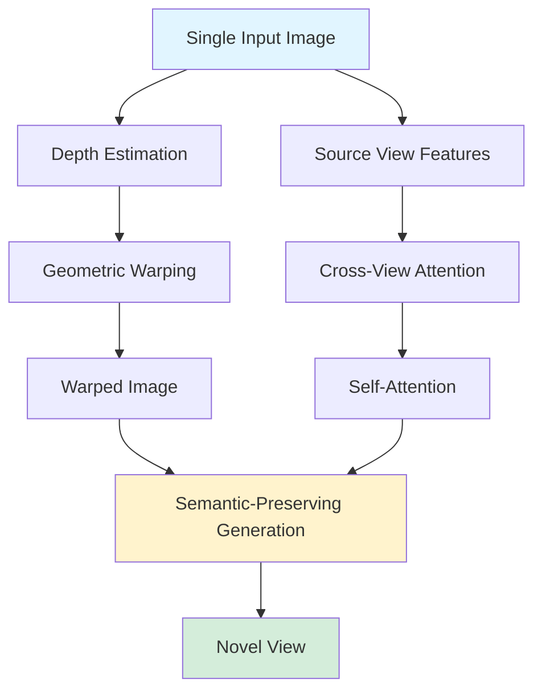

## GenWarp: Single Image to Novel Views with Semantic-Preserving Generative Warping

*Curiosity:* How can we generate novel views from a single image while preserving semantic details? What happens when we combine geometric warping with generative models?

**GenWarp** proposes a semantic-preserving generative warping framework for single-shot novel view synthesis. This approach enables T2I models to learn where to warp and where to generate, addressing limitations of existing methods.

> **Resources**:
> - **📄 Paper**: <https://arxiv.org/abs/2405.17251>
> - **🌐 Project Page**: <https://genwarp-nvs.github.io/>
> - **💻 Code**: Coming soon
{: .prompt-info}

**Organizations**: SonyAI, Sony Group Corporation, Korea University

### Challenge Overview

*Retrieve:* Generating novel views from a single image faces significant challenges.

| Challenge | Description | Impact |
|:----------|:------------|:-------|
| **3D Complexity** | Complex 3D scenes | ⚠️ Difficult synthesis |
| **Limited Data** | Sparse multi-view datasets | ⚠️ Training limitations |
| **Noisy Depth** | Depth estimation errors | ⚠️ Warping artifacts |
| **Semantic Loss** | Details lost during warping | ⚠️ Quality degradation |

### Previous Approaches

*Retrieve:* Recent methods combining T2I models with monocular depth estimation.

**Process**:
1. Estimate depth from input image
2. Geometrically warp to novel view
3. Inpaint warped image with T2I model

**Limitations**:
- Noisy depth maps
- Loss of semantic details
- Poor quality in novel viewpoints

### GenWarp Solution

*Innovate:* Semantic-preserving generative warping framework.

```mermaid
graph TB
    A[Single Input Image] --> B[Depth Estimation]
    A --> C[Source View Features]
    B --> D[Geometric Warping]
    C --> E[Cross-View Attention]
    D --> F[Warped Image]
    E --> G[Self-Attention]
    F --> H[Semantic-Preserving Generation]
    G --> H
    H --> I[Novel View]
    
    style A fill:#e1f5ff
    style H fill:#fff3cd
    style I fill:#d4edda
```

### Key Innovation

*Retrieve:* GenWarp learns where to warp and where to generate.

**Approach**:
- Augments cross-view attention with self-attention
- Conditions generative model on source view images
- Incorporates geometric warping signals
- Preserves semantic details during warping

**Architecture**:

| Component | Purpose | Innovation |
|:----------|:--------|:-----------|
| **Cross-View Attention** | Connect source and target views | ⬆️ View consistency |
| **Self-Attention** | Preserve semantic details | ⬆️ Quality |
| **Geometric Warping** | Transform to novel view | ⬆️ Accuracy |
| **Conditional Generation** | Source view conditioning | ⬆️ Fidelity |

### Key Takeaways

*Retrieve:* GenWarp addresses the challenge of single-image novel view synthesis by combining geometric warping with semantic-preserving generation, learning where to warp and where to generate.

*Innovate:* By augmenting cross-view attention with self-attention and conditioning on source views, GenWarp enables high-quality novel view synthesis while preserving semantic details that previous methods lost.

*Curiosity → Retrieve → Innovation:* Start with curiosity about novel view synthesis, retrieve insights from GenWarp's approach, and innovate by applying semantic-preserving techniques to your 3D vision applications.

**Next Steps**:
- Read the full paper
- Explore the project page
- Wait for code release
- Apply to your use cases

> 🧙Paper Authors: Junyoung Seo, Kazumi Fukuda, Takashi Shibuya, Takuya Narihira, Naoki Murata, Shoukang Hu, Chieh-Hsin (Jesse) Lai , Seungryong Kim, Yuki Mitsufuji, PhD 
- 1️⃣Read the Full Paper here: <https://arxiv.org/abs/2405.17251>
- 2️⃣Project Page: <https://genwarp-nvs.github.io/>
- 3️⃣Code: Coming 🔜
{: .prompt-info }

{: .light  .shadow .rounded-10 w='1212' h='668' }

 Translate to Korean 

## 🌟 Key Guidelines from the Paper

- 🎯 Generating novel views from a single image remains a challenging task due to the complexity of 3D scenes and the limited diversity of existing multi-view datasets used to train models.

- 🎯 Recent work combining large-scale T2I (Text-to-Image) models with MDE (Monocular Depth Estimation) has shown promise in handling real-world images.

- 🎯 In these methods, the input view is geometrically warped to the new view using an estimated depth map, and then the T2I model inpaints the warped image. However, they struggle with noisy depth maps and loss of semantic detail when warping the input view to a new perspective.

- 🎯 In this paper, the authors propose a novel approach for single-shot novel view synthesis — a semantics-preserving generative warping framework that enables T2I generative models to enhance cross-view attention via self-attention, learning where to warp and where to generate.

- 🎯 Their approach addresses the limitations of existing methods by conditioning the generative model on source-view images and incorporating geometric warping signals.

🏢 Organizations: SonyAI, Sony Group Corporation, Korea University 

🧙 Paper Authors: Junyoung Seo, Kazumi Fukuda, Takashi Shibuya, Takuya Narihira, Naoki Murata, Shoukang Hu, Chieh-Hsin (Jesse) Lai, Seungryong Kim, Yuki Mitsufuji, PhD 

