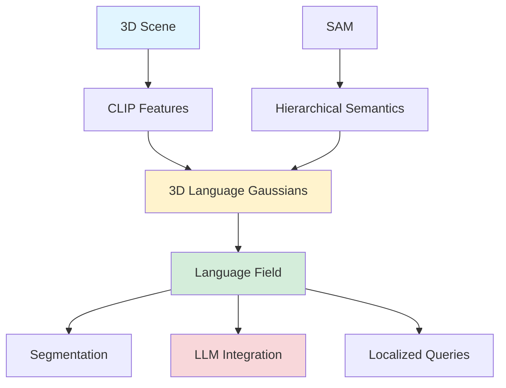
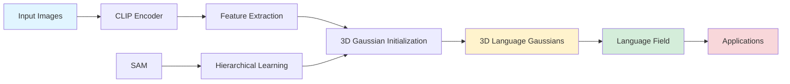

## LangSplat: 3D Language Gaussian Splatting

*Curiosity:* How can we integrate semantic understanding into 3D Gaussian Splatting? What happens when we connect 3D reconstruction with language models for localized information retrieval?

**LangSplat** is a groundbreaking method that grounds CLIP features into 3D language Gaussians, achieving precise 3D language fields while being **199× faster than LERF**. This research from Tsinghua University and Harvard University was accepted to CVPR 2024.



### Why Semantic 3D Reconstruction Matters

*Retrieve:* Having semantics in 3D reconstruction enables powerful applications.

**Applications**:
- 🎯 Segmentation: Semantic object segmentation
- 🔍 Localized Information: Connect to LLMs for context-aware queries
- 📍 Spatial Understanding: Language-guided 3D navigation
- 🗣️ Interactive 3D: Natural language interaction with 3D scenes

### Method Overview



### Key Innovations

| Innovation | Description | Benefit |
|:-----------|:------------|:--------|
| **CLIP Grounding** | Ground CLIP features into 3D Gaussians | ⬆️ Semantic understanding |
| **Hierarchical Semantics** | Learn using SAM | ⬇️ Query complexity |
| **Language Fields** | Precise 3D language representation | ⬆️ Accuracy |
| **Performance** | 199× faster than LERF | ⬆️ Speed |

### Technical Approach

*Retrieve:* The method grounds CLIP features into a set of 3D language Gaussians.

**Process**:
1. Extract CLIP features from images
2. Ground features into 3D Gaussian representation
3. Learn hierarchical semantics using SAM
4. Create precise 3D language fields

**Advantages**:
- Eliminates extensive querying across scales
- Removes need for DINO feature regularization
- Faster inference
- Better semantic understanding

### Performance Comparison

| Metric | LERF | LangSplat | Improvement |
|:-------|:-----|:----------|:------------|
| **Speed** | Baseline | 199× faster | ⬆️ Massive |
| **Precision** | Good | Precise | ⬆️ Better |
| **Query Efficiency** | Extensive | Optimized | ⬇️ Reduced |

### Architecture



### Use Cases

*Innovate:* LangSplat enables new applications in semantic 3D understanding.

**Applications**:
- **Segmentation**: Semantic object segmentation in 3D
- **LLM Integration**: Connect to language models for queries
- **Localized Information**: Retrieve context-aware information
- **Interactive 3D**: Natural language interaction

**Example Workflow**:

```python
# Conceptual example
from langsplat import LangSplat

# Initialize LangSplat
langsplat = LangSplat(
    images=scene_images,
    camera_poses=camera_poses
)

# Build 3D language field
language_field = langsplat.build_language_field()

# Query with natural language
result = language_field.query(
    "Where is the red chair?",
    position=(x, y, z)
)

# Integrate with LLM
llm_response = llm.query(
    context=language_field.get_context(result),
    question="What objects are near the chair?"
)
```

### Research Impact

*Retrieve:* This method represents a significant advancement in semantic 3D reconstruction.

**Contributions**:
- First method to ground CLIP in 3D Gaussians
- 199× speedup over previous methods
- Hierarchical semantic learning
- Practical for real-time applications

### Key Takeaways

*Retrieve:* LangSplat grounds CLIP features into 3D language Gaussians, achieving precise semantic understanding while being 199× faster than previous methods.

*Innovate:* By combining 3D Gaussian Splatting with language understanding, LangSplat enables new applications in semantic segmentation, LLM integration, and interactive 3D scenes.

*Curiosity → Retrieve → Innovation:* Start with curiosity about semantic 3D reconstruction, retrieve insights from LangSplat's approach, and innovate by applying it to your 3D understanding applications.

> **🧙 Paper Authors**: Minghan Qin¹*, Wanhua Li²*†, Jiawei Zhou¹*, Haoqian Wang¹†, Hanspeter Pfister²  
> (* indicates equal contribution, † means Co-corresponding author)  
> ¹Tsinghua University, ²Harvard University
> 
> - **1️⃣ Full Paper**: [arXiv](https://arxiv.org/pdf/2312.16084)
> - **2️⃣ Project Page**: [LangSplat](https://langsplat.github.io/)
> - **3️⃣ Code**: [GitHub](https://github.com/minghanqin/LangSplat)
{: .prompt-info}

**Next Steps**:
- Read the full paper
- Explore the project page
- Check out the code repository
- Experiment with semantic 3D reconstruction


<details markdown="1">
<summary style= "font-size:24px; line-height:24px; font-weight:bold; cursor:pointer;" > Translate to Korean </summary>

## 3D 재구성에서 시맨틱을 갖는 것은 세그멘테이션에 사용하거나 LLM에 연결하여 현지화된 정보를 검색할 수 있기 때문에 매우 강력합니다. 3D 가우시안 스플래팅에 대해 그렇게 할 수 있습니까?

*Curiosity:* Tsinghua University 및 Harvard University 의 "LangSplat: 3D 언어 Gaussian Splatting"을 살펴보십시오.


이 방법은 CLIP 기능을 3D 언어 가우시안 세트로 접지하여 LERF보다 199× 빠르면서 정확한 3D 언어 필드를 얻습니다.

그들은 SAM을 사용하여 계층적 의미론을 학습할 것을 제안하므로 다양한 규모에 걸쳐 언어 필드를 광범위하게 쿼리하고 DINO 기능을 정규화할 필요가 없습니다

현재 CVPR 2024에 승인된 이 방법을 간과했지만 다시 발견하게 되어 기쁩니다. 당신도 보세요.

</details>