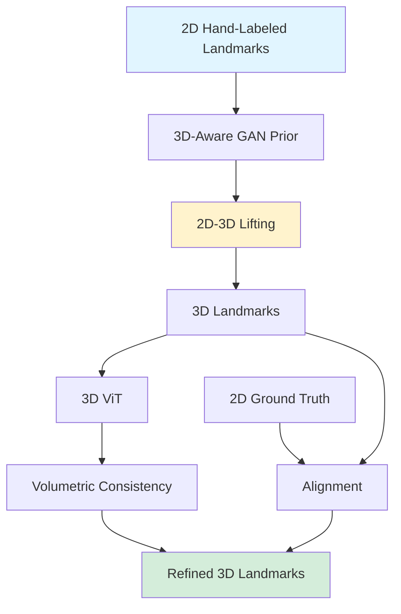



## FaceLift: New SOTA in 2D Landmarks

*Curiosity:* How can we learn 3D landmarks from 2D annotations without 3D datasets? What happens when we combine 3D-aware GANs with volumetric consistency?

**FaceLift** is Flawless AI's novel semi-supervised approach that learns 3D landmarks by directly lifting hand-labeled 2D landmarks. This method ensures better definition alignment without needing 3D landmark datasets.

> **Resources**:
> - **📄 Paper**: <https://arxiv.org/pdf/2405.19646>
> - **🌐 Project Page**: <https://davidcferman.github.io/FaceLift/>
> - **💻 Code**: Not announced yet
{: .prompt-info}

### Key Highlights

*Retrieve:* FaceLift achieves SOTA performance through innovative techniques.

| Feature | Description | Benefit |
|:--------|:------------|:--------|
| **Semi-Supervised HQ 2D** | High-quality 2D landmarks | ⬆️ Annotation quality |
| **3D-Aware GAN Prior** | Tackles 2D-3D lifting | ⬆️ 3D accuracy |
| **Aligned 3D Landmarks** | Aligned with 2D ground truth | ⬆️ Consistency |
| **3D ViT** | Volumetric consistency | ⬆️ Spatial understanding |
| **SOTA Performance** | Best on 2D-3D face datasets | ⬆️ State-of-the-art |

### Architecture Overview

*Innovate:* FaceLift combines multiple techniques for accurate 3D landmark estimation.

### Method Details

*Retrieve:* FaceLift's approach to 3D landmark learning.

**Key Components**:
1. **Semi-Supervised Learning**: Uses 2D annotations without 3D data
2. **3D-Aware GAN**: Prior knowledge for 2D-3D lifting
3. **Volumetric Consistency**: 3D ViT ensures spatial coherence
4. **Alignment**: 3D landmarks aligned with 2D ground truth

**Advantages**:
- ✅ No 3D landmark datasets needed
- ✅ Better definition alignment
- ✅ SOTA performance
- ✅ Handles visible landmarks effectively

### Key Takeaways

*Retrieve:* FaceLift demonstrates that 3D landmarks can be learned from 2D annotations using 3D-aware GANs and volumetric consistency, achieving SOTA without 3D datasets.

*Innovate:* By combining semi-supervised learning, 3D-aware priors, and volumetric consistency, FaceLift enables accurate 3D landmark estimation from 2D annotations, opening new possibilities for face analysis.

*Curiosity → Retrieve → Innovation:* Start with curiosity about 3D landmark estimation, retrieve insights from FaceLift's approach, and innovate by applying these techniques to your face analysis applications.

**Next Steps**:
- Read the full paper
- Explore the project page
- Wait for code release
- Apply to face tracking/analysis

> 🧙Paper Authors: David Ferman Pablo Garrido Gaurav Bharaj
Flawless AI
- 1️⃣Read the Full Paper here: <https://arxiv.org/pdf/2405.19646>
- 2️⃣Project Page: <https://davidcferman.github.io/FaceLift/>
- 3️⃣Code: No code announced🥹
{: .prompt-info }

 Translate to Korean 

## 👉Flawless AI는 손으로 라벨링한 2D 랜드마크를 직접 들어 올려 3D 랜드마크를 학습하고 3D 랜드마크 데이터 세트 없이 더 나은 선명도 정렬을 보장하는 새로운 반지도 접근 방식을 공개합니다.

발표된🥹 코드 없음

하이라이트:
- ✅새로운 준감독 HQ 2D 랜드마크
- ✅2D-3D 리프팅을 다루기 전 3D 인식 GAN
- ✅2D GT에 맞춰 정렬된 정확한 3D 랜드마크
- ✅체적 일관성을 활용하는 3D ViT
- ✅2D-3D 얼굴 데이터 세트에 대한 새로운 SOTA

