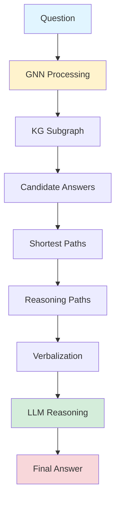

## GNN-RAG: Integrating Graphs into Modern RAG Workflows

*Curiosity:* How can we combine Knowledge Graphs with LLMs for better question answering? What happens when GNNs handle graph reasoning while LLMs handle language understanding?

**GNN-RAG** integrates Graph Neural Networks (GNNs) with Retrieval-Augmented Generation (RAG) to solve Knowledge Graph Question Answering (KGQA). The idea: GNN handles complex graph structure, while LLM leverages language understanding for final answers.

> **Resources**:
> - **📄 Paper**: <https://arxiv.org/abs/2405.20139>
> - **🌐 Project Page**: <https://medium.com/@techsachin/gnn-rag-combining-llms-language-abilities-with-gnns-reasoning-in-rag-style-d72200da376c>
> - **💻 Code**: <https://github.com/cmavro/GNN-RAG>
{: .prompt-info}

### The Challenge

*Retrieve:* Knowledge Graphs are powerful but challenging to query with natural language.

| Component | Strength | Limitation |
|:----------|:---------|:-----------|
| **Knowledge Graphs** | Powerful factual representation | ⚠️ Hard to query with NL |
| **GNNs** | Excel at graph reasoning | ⚠️ Limited language understanding |
| **LLMs** | Strong language understanding | ⚠️ Struggle with graph reasoning |

**Problem**: Vanilla RAG struggles with structured knowledge sources like KGs. 

### Why Vanilla RAG Struggles

*Retrieve:* Vanilla RAG's limitations with Knowledge Graphs.

**Issues**:
- Relies heavily on LLMs for retrieval
- LLMs not adept at handling complex graph information
- Suboptimal performance on multi-hop questions
- Struggles with multi-entity questions
- Requires traversing multiple relationships

**Impact**: Poor performance on structured knowledge sources.

### GNN-RAG Solution

*Innovate:* Combining GNNs and LLMs for optimal performance.

**Division of Labor**:
- **GNN**: Processes graph structures, reasons over dense KG subgraphs, retrieves answer candidates
- **LLM**: Leverages NLP abilities, reasons over GNN-provided information, generates final answers

### Workflow

*Retrieve:* GNN-RAG's step-by-step process.

**Steps**:
1. **GNN Processing**: Processes KG to identify candidate answers
2. **Path Extraction**: Extracts shortest paths connecting question entities to candidates
3. **Verbalization**: Converts paths to natural language
4. **LLM Reasoning**: Final reasoning and answer generation

### Performance

*Retrieve:* GNN-RAG achieves SOTA on major benchmarks.

**Benchmarks**:
- WebQSP
- ComplexWebQuestions (CWQ)

**Results**:
- ✅ State-of-the-art performance
- ✅ Outperforms GPT-4 in some cases
- ✅ Particularly strong on multi-hop questions
- ✅ Excellent on multi-entity questions

### Architecture Comparison

| Approach | Graph Reasoning | Language Understanding | Performance |
|:---------|:----------------|:----------------------|:------------|
| **Vanilla RAG** | ❌ Weak | ✅ Strong | ⚠️ Suboptimal |
| **GNN-RAG** | ✅ Strong | ✅ Strong | ✅ SOTA |

### Key Takeaways

*Retrieve:* GNN-RAG combines GNNs' graph reasoning with LLMs' language understanding, achieving SOTA on KGQA benchmarks by letting each component handle what it does best.

*Innovate:* By using GNNs for graph processing and LLMs for language understanding, GNN-RAG demonstrates how specialized components can work together to solve complex problems that neither can handle alone.

*Curiosity → Retrieve → Innovation:* Start with curiosity about Knowledge Graph Question Answering, retrieve insights from GNN-RAG's hybrid approach, and innovate by applying similar techniques to your structured knowledge applications.

**Next Steps**:
- Read the full paper
- Explore the code repository
- Try GNN-RAG on your KGs
- Adapt for your use cases 

*Curiosity:* What insights can we retrieve from this? How does this connect to innovation in the field?

> GNN-RAG achieves state-of-the-art results on two widely used KGQA benchmarks, WebQSP and ComplexWebQuestions (CWQ) and outperforms existing methods, including GPT-4, particularly on multi-hop and multi-entity questions.
{: .prompt-tip }

It particularly seems to shine on challenging multi-hop and multi-entity questions. 

> 🧙Paper Authors: Costas Mavromatis, George Karypis
1Minnesota University 
- 1️⃣Read the Full Paper here: <https://arxiv.org/abs/2405.20139>
- 2️⃣Project Page: <https://medium.com/@techsachin/gnn-rag-combining-llms-language-abilities-with-gnns-reasoning-in-rag-style-d72200da376c>
- 3️⃣Code: <https://github.com/cmavro/GNN-RAG>
{: .prompt-info }

{: .light .shadow .rounded-10 w='1212' h='668' }

 Translate to Korean 

##  RAG와 GNN의 만남: 그래프를 최신 워크플로우에 통합합니다.

지식 그래프(KG)는 사실에 입각한 지식을 표현하는 강력한 방법이지만 자연어로 쿼리하는 것은 어렵습니다. 

그리고 그래프 신경망(GNN)은 대규모 언어 모델(LLM)이 여전히 어려움을 겪고 있는 KG보다 추론하는 데 탁월합니다.

최근 이 두 가지 접근 방식을 결합하는 데 많은 작업이 있었지만 아직 올바른 레시피를 찾지 못한 것 같습니다. 

GNN-RAG는 인기 있는 RAG(Retrieval-augmented Generation) 추세에 기대어 이를 바꾸려고 합니다.

> 아이디어는 GNN이 복잡한 그래프 구조를 처리하는 반면, LLM은 언어 이해를 활용하여 최종 답변을 생성하는 것입니다. 

## 🤔 Vanilla-RAG는 지식 그래프와 같은 구조화된 지식 소스로 어려움을 겪고 있습니다. GNN-RAG는 이 문제를 해결하기 위한 매우 깔끔한 아이디어입니다!

### ⛳ Vanilla-RAG는 KG에 내재된 복잡한 그래프 정보를 처리하는 데 능숙하지 않은 LLM에 크게 의존하기 때문에 KG와 같은 구조화된 입력에 어려움을 겪습니다. 이로 인해 성능이 최적화되지 않으며, 특히 그래프에서 여러 관계를 순회해야 하는 다중 홉 및 다중 엔터티 질문에서 성능이 저하됩니다.

### ⛳ GNN-RAG는 이 문제를 해결하기 위해 LLM과 그래프 신경망(GNN)의 강점을 통합합니다.
- 💡 GNN: 그래프 구조에 대한 처리 및 추론에 탁월합니다. 조밀한 KG 하위 그래프를 통해 추론하여 주어진 질문에 대한 답변 후보를 검색합니다.
- 💡LLM: 자연어 처리 기능을 활용하여 GNN에서 제공하는 정보를 추가로 추론합니다.

👉 워크플로는 다음과 같습니다.
- 🔺 GNN은 KG를 처리하여 후보 답변을 식별하고 검색합니다.
- 🔺KG의 후보자에게 답변하기 위해 질문 엔터티를 연결하는 최단 경로가 추출되어 추론 경로를 나타냅니다.
- 🔺이러한 경로는 언어화되어 최종 추론 및 답변 생성을 위해 LLM에 입력으로 제공됩니다.

### GNN-RAG는 두 가지 주요 KGQA 벤치마크에서 최첨단 성능을 달성하며 경우에 따라 GPT-4를 능가하기도 합니다. 

> GNN-RAG는 널리 사용되는 두 가지 KGQA 벤치마크인 WebQSP 및 ComplexWebQuestions(CWQ)에서 최첨단 결과를 달성하고 특히 다중 홉 및 다중 엔터티 질문에서 GPT-4를 포함한 기존 방법을 능가합니다.
{: .prompt-tip }

특히 도전적인 다중 홉 및 다중 엔터티 질문에 빛을 발하는 것 같습니다. 

