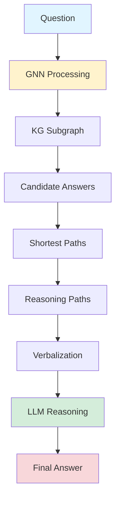

## GNN-RAG: Integrating Graphs into Modern RAG Workflows

*Curiosity:* How can we combine Knowledge Graphs with LLMs for better question answering? What happens when GNNs handle graph reasoning while LLMs handle language understanding?

**GNN-RAG** integrates Graph Neural Networks (GNNs) with Retrieval-Augmented Generation (RAG) to solve Knowledge Graph Question Answering (KGQA). The idea: GNN handles complex graph structure, while LLM leverages language understanding for final answers.

> **Resources**:
> - **📄 Paper**: <https://arxiv.org/abs/2405.20139>
> - **🌐 Project Page**: <https://medium.com/@techsachin/gnn-rag-combining-llms-language-abilities-with-gnns-reasoning-in-rag-style-d72200da376c>
> - **💻 Code**: <https://github.com/cmavro/GNN-RAG>
{: .prompt-info}

### The Challenge

*Retrieve:* Knowledge Graphs are powerful but challenging to query with natural language.

| Component | Strength | Limitation |
|:----------|:---------|:-----------|
| **Knowledge Graphs** | Powerful factual representation | ⚠️ Hard to query with NL |
| **GNNs** | Excel at graph reasoning | ⚠️ Limited language understanding |
| **LLMs** | Strong language understanding | ⚠️ Struggle with graph reasoning |

**Problem**: Vanilla RAG struggles with structured knowledge sources like KGs. 

### Why Vanilla RAG Struggles

*Retrieve:* Vanilla RAG's limitations with Knowledge Graphs.

**Issues**:
- Relies heavily on LLMs for retrieval
- LLMs not adept at handling complex graph information
- Suboptimal performance on multi-hop questions
- Struggles with multi-entity questions
- Requires traversing multiple relationships

**Impact**: Poor performance on structured knowledge sources.

### GNN-RAG Solution

*Innovate:* Combining GNNs and LLMs for optimal performance.

**Division of Labor**:
- **GNN**: Processes graph structures, reasons over dense KG subgraphs, retrieves answer candidates
- **LLM**: Leverages NLP abilities, reasons over GNN-provided information, generates final answers

### Workflow

*Retrieve:* GNN-RAG's step-by-step process.

```mermaid
graph TB
    A[Question] --> B[GNN Processing]
    B --> C[KG Subgraph]
    C --> D[Candidate Answers]
    D --> E[Shortest Paths]
    E --> F[Reasoning Paths]
    F --> G[Verbalization]
    G --> H[LLM Reasoning]
    H --> I[Final Answer]
    
    style A fill:#e1f5ff
    style B fill:#fff3cd
    style H fill:#d4edda
    style I fill:#f8d7da
```

**Steps**:
1. **GNN Processing**: Processes KG to identify candidate answers
2. **Path Extraction**: Extracts shortest paths connecting question entities to candidates
3. **Verbalization**: Converts paths to natural language
4. **LLM Reasoning**: Final reasoning and answer generation

### Performance

*Retrieve:* GNN-RAG achieves SOTA on major benchmarks.

**Benchmarks**:
- WebQSP
- ComplexWebQuestions (CWQ)

**Results**:
- ✅ State-of-the-art performance
- ✅ Outperforms GPT-4 in some cases
- ✅ Particularly strong on multi-hop questions
- ✅ Excellent on multi-entity questions

### Architecture Comparison

| Approach | Graph Reasoning | Language Understanding | Performance |
|:---------|:----------------|:----------------------|:------------|
| **Vanilla RAG** | ❌ Weak | ✅ Strong | ⚠️ Suboptimal |
| **GNN-RAG** | ✅ Strong | ✅ Strong | ✅ SOTA |

### Key Takeaways

*Retrieve:* GNN-RAG combines GNNs' graph reasoning with LLMs' language understanding, achieving SOTA on KGQA benchmarks by letting each component handle what it does best.

*Innovate:* By using GNNs for graph processing and LLMs for language understanding, GNN-RAG demonstrates how specialized components can work together to solve complex problems that neither can handle alone.

*Curiosity → Retrieve → Innovation:* Start with curiosity about Knowledge Graph Question Answering, retrieve insights from GNN-RAG's hybrid approach, and innovate by applying similar techniques to your structured knowledge applications.

**Next Steps**:
- Read the full paper
- Explore the code repository
- Try GNN-RAG on your KGs
- Adapt for your use cases 

*Curiosity:* What insights can we retrieve from this? How does this connect to innovation in the field?

> GNN-RAG achieves state-of-the-art results on two widely used KGQA benchmarks, WebQSP and ComplexWebQuestions (CWQ) and outperforms existing methods, including GPT-4, particularly on multi-hop and multi-entity questions.
{: .prompt-tip }

It particularly seems to shine on challenging multi-hop and multi-entity questions. 

> 🧙Paper Authors: Costas Mavromatis, George Karypis
1Minnesota University 
- 1️⃣Read the Full Paper here: <https://arxiv.org/abs/2405.20139>
- 2️⃣Project Page: <https://medium.com/@techsachin/gnn-rag-combining-llms-language-abilities-with-gnns-reasoning-in-rag-style-d72200da376c>
- 3️⃣Code: <https://github.com/cmavro/GNN-RAG>
{: .prompt-info }

{: .light .shadow .rounded-10 w='1212' h='668' }

 Translate to Korean 

## Where RAG Meets GNN: Integrating Graphs into Modern Workflows.

Knowledge Graphs (KGs) are a powerful way to represent factual knowledge, but querying them in natural language is difficult. 

And Graph Neural Networks (GNNs) excel at reasoning over KGs where large language models (LLMs) still struggle.

There has been a lot of work recently on combining these two approaches, but the right recipe has yet to be found. 

GNN-RAG aims to change this by leaning into the popular Retrieval-Augmented Generation (RAG) trend.

> The idea is that the GNN handles the complex graph structure, while the LLM leverages language understanding to generate the final answer. 

## 🤔 Vanilla-RAG struggles with structured knowledge sources like knowledge graphs. GNN-RAG is a very clean idea to address this problem!

### ⛳ Vanilla-RAG struggles with structured inputs like KGs because it heavily relies on LLMs that are not proficient at processing the complex graph information inherent in KGs. This leads to suboptimal performance, especially on multi-hop and multi-entity questions that require traversing multiple relationships in the graph.

### ⛳ GNN-RAG integrates the strengths of LLMs and Graph Neural Networks (GNNs) to address this issue.
- 💡 GNN: Excels at processing and reasoning over graph structures. It reasons through dense KG subgraphs to retrieve answer candidates for a given question.
- 💡 LLM: Leverages its natural language processing capabilities to further reason over the information provided by the GNN.

👉 The workflow is as follows.
- 🔺 The GNN processes the KG to identify and retrieve candidate answers.
- 🔺 The shortest paths connecting question entities to answer candidates in the KG are extracted, representing reasoning paths.
- 🔺 These paths are verbalized and provided as input to the LLM for final reasoning and answer generation.

### GNN-RAG achieves state-of-the-art performance on two major KGQA benchmarks, even outperforming GPT-4 in some cases. 

> GNN-RAG achieves state-of-the-art results on two widely used KGQA benchmarks, WebQSP and ComplexWebQuestions (CWQ), outperforming existing methods including GPT-4, especially on multi-hop and multi-entity questions.
{: .prompt-tip }

It seems to particularly shine on the challenging multi-hop and multi-entity questions. 

