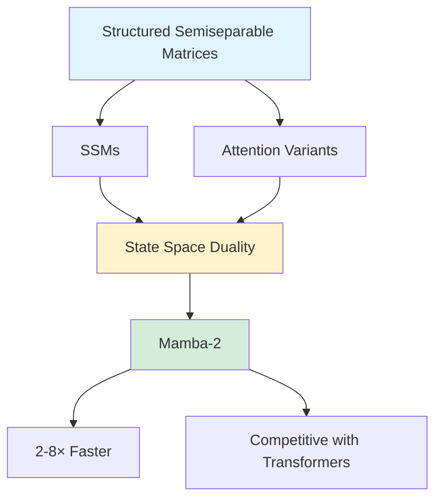

## Transformers are SSMs: State Space Duality Framework

*Curiosity:* Are Transformers and State Space Models fundamentally different? What happens when we discover their deep theoretical connections?

**This paper** reveals that Transformers and State Space Models (SSMs) are closely related through structured semiseparable matrices. The State Space Duality (SSD) framework enables Mamba-2, which is 2-8× faster than Mamba while remaining competitive with Transformers.

> **Resources**:
> - **📄 Paper**: <https://arxiv.org/abs/2405.21060>
> - **🌐 Project Page**: <https://huggingface.co/papers/2405.21060>
> - **💻 Code**: Coming soon
{: .prompt-info}

### The Discovery

*Retrieve:* Transformers and SSMs are more related than previously thought.

**Key Finding**: These model families are closely related through:
- Structured semiseparable matrices
- Various decomposition methods
- Theoretical connections between SSMs and attention variants

### Performance Context

*Retrieve:* SSMs like Mamba have shown strong performance.

| Model Type | Performance | Scale |
|:-----------|:------------|:-----|
| **Transformers** | Main architecture | All scales |
| **SSMs (Mamba)** | Match/outperform | Small-medium scale |

**Question**: How are they related?

### State Space Duality Framework

*Innovate:* SSD framework reveals deep connections.

### Mamba-2 Architecture

*Retrieve:* Mamba-2 improvements enabled by SSD framework.

**Core Layer**: Refinement of Mamba's selective SSM

**Improvements**:
- **2-8× faster** than Mamba
- Remains competitive with Transformers
- Better theoretical understanding
- Unified framework

### Theoretical Connections

*Innovate:* Rich framework connecting SSMs and attention.

**Connections Through**:
- Structured semiseparable matrices
- Various decomposition methods
- Attention variants
- State space representations

**Impact**: Unified understanding of both architectures.

### Key Takeaways

*Retrieve:* The State Space Duality framework reveals that Transformers and SSMs are closely related through structured semiseparable matrices, enabling better architectures like Mamba-2.

*Innovate:* By understanding the theoretical connections between SSMs and attention, we can design more efficient architectures that combine the best of both worlds—Mamba-2 achieves 2-8× speedup while maintaining competitive performance.

*Curiosity → Retrieve → Innovation:* Start with curiosity about model architectures, retrieve insights from the SSD framework, and innovate by applying these theoretical connections to design better models.

**Next Steps**:
- Read the full paper
- Understand SSD framework
- Explore Mamba-2
- Apply to your models

> 🧙Paper Authors: Tri Dao∗1 and Albert Gu∗2
 1Department of Computer Science, Princeton University
 2Machine Learning Department, Carnegie Mellon University
- 1️⃣Read the Full Paper here: <https://arxiv.org/abs/2405.21060>
- 2️⃣Project Page: <https://huggingface.co/papers/2405.21060>
- 3️⃣Code: Coming 🔜
{: .prompt-info }

{: .light .shadow .rounded-10 w='1212' h='668' }

 Translate to Korean 

##  구조화된 상태공간 이중성을 통한 일반화된 모델과 효율적인 알고리즘

트랜스포머는 언어 모델링에서 딥 러닝의 성공을 뒷받침하는 주요 아키텍처였지만, 최근에는 Mamba와 같은 상태 공간 모델(SSM)이 중소 규모에서 트랜스포머와 동등하거나 더 우수한 것으로 나타났습니다. 우리는 이러한 모델 계열이 실제로 매우 밀접하게 관련되어 있음을 보여주며, 잘 연구된 구조화된 반분리 가능한 행렬 클래스의 다양한 분해를 통해 연결된 SSM과 주의 변형 간의 이론적 연결에 대한 풍부한 프레임워크를 개발합니다. 상태 공간 이중성(SSD) 프레임워크를 통해 핵심 계층이 2-8배 더 빠른 Mamba의 선택적 SSM을 개선한 새로운 아키텍처(Mamba-2)를 설계하는 동시에 언어 모델링에서 Transformers와 계속 경쟁할 수 있습니다.

