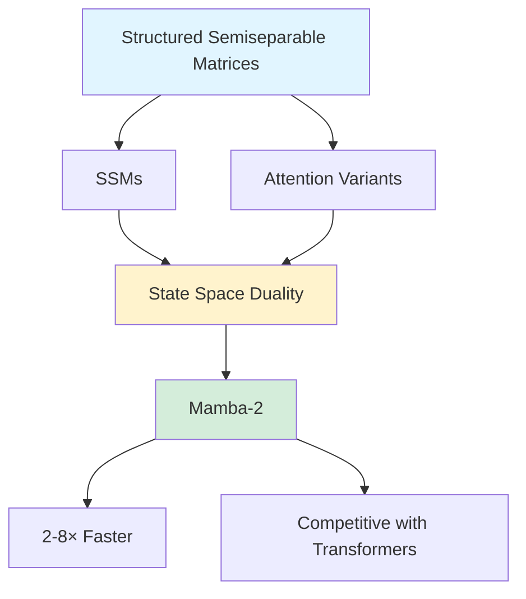

## Transformers are SSMs: State Space Duality Framework

*Curiosity:* Are Transformers and State Space Models fundamentally different? What happens when we discover their deep theoretical connections?

**This paper** reveals that Transformers and State Space Models (SSMs) are closely related through structured semiseparable matrices. The State Space Duality (SSD) framework enables Mamba-2, which is 2-8× faster than Mamba while remaining competitive with Transformers.

> **Resources**:
> - **📄 Paper**: <https://arxiv.org/abs/2405.21060>
> - **🌐 Project Page**: <https://huggingface.co/papers/2405.21060>
> - **💻 Code**: Coming soon
{: .prompt-info}

### The Discovery

*Retrieve:* Transformers and SSMs are more related than previously thought.

**Key Finding**: These model families are closely related through:
- Structured semiseparable matrices
- Various decomposition methods
- Theoretical connections between SSMs and attention variants

### Performance Context

*Retrieve:* SSMs like Mamba have shown strong performance.

| Model Type | Performance | Scale |
|:-----------|:------------|:-----|
| **Transformers** | Main architecture | All scales |
| **SSMs (Mamba)** | Match/outperform | Small-medium scale |

**Question**: How are they related?

### State Space Duality Framework

*Innovate:* SSD framework reveals deep connections.

```mermaid
graph TB
    A[Structured Semiseparable Matrices] --> B[SSMs]
    A --> C[Attention Variants]
    B --> D[State Space Duality]
    C --> D
    D --> E[Mamba-2]
    E --> F[2-8× Faster]
    E --> G[Competitive with Transformers]
    
    style A fill:#e1f5ff
    style D fill:#fff3cd
    style E fill:#d4edda
```

### Mamba-2 Architecture

*Retrieve:* Mamba-2 improvements enabled by SSD framework.

**Core Layer**: Refinement of Mamba's selective SSM

**Improvements**:
- **2-8× faster** than Mamba
- Remains competitive with Transformers
- Better theoretical understanding
- Unified framework

### Theoretical Connections

*Innovate:* Rich framework connecting SSMs and attention.

**Connections Through**:
- Structured semiseparable matrices
- Various decomposition methods
- Attention variants
- State space representations

**Impact**: Unified understanding of both architectures.

### Key Takeaways

*Retrieve:* The State Space Duality framework reveals that Transformers and SSMs are closely related through structured semiseparable matrices, enabling better architectures like Mamba-2.

*Innovate:* By understanding the theoretical connections between SSMs and attention, we can design more efficient architectures that combine the best of both worlds—Mamba-2 achieves 2-8× speedup while maintaining competitive performance.

*Curiosity → Retrieve → Innovation:* Start with curiosity about model architectures, retrieve insights from the SSD framework, and innovate by applying these theoretical connections to design better models.

**Next Steps**:
- Read the full paper
- Understand SSD framework
- Explore Mamba-2
- Apply to your models

> 🧙Paper Authors: Tri Dao∗1 and Albert Gu∗2
 1Department of Computer Science, Princeton University
 2Machine Learning Department, Carnegie Mellon University
- 1️⃣Read the Full Paper here: <https://arxiv.org/abs/2405.21060>
- 2️⃣Project Page: <https://huggingface.co/papers/2405.21060>
- 3️⃣Code: Coming 🔜
{: .prompt-info }

{: .light .shadow .rounded-10 w='1212' h='668' }

 Translate to Korean 

## Generalized Models and Efficient Algorithms via Structured State Space Duality

Transformers have been the dominant architecture driving deep learning success in language modeling, but recently State Space Models (SSMs) like Mamba have shown comparable or superior performance at small-to-medium scale. We show that these model families are in fact closely related, and develop a rich framework for theoretical connections between SSMs and attention variants connected through various decompositions of a well-studied class of structured semiseparable matrices. Through the State Space Duality (SSD) framework, we design a new architecture (Mamba-2) that improves upon Mamba's selective SSM with a core layer that is 2-8x faster, while remaining competitive with Transformers in language modeling.

