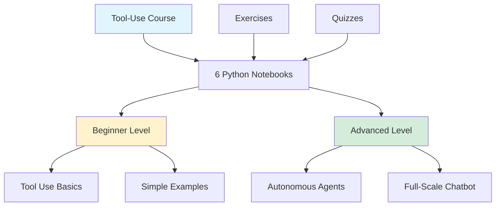
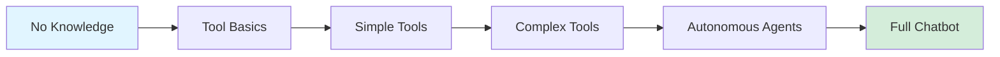

## Anthropic's Tool-Use Course: Building Smarter LLM Agents

*Curiosity:* How can LLMs autonomously use external tools and APIs? What makes tool-use essential for building intelligent agents?

**Anthropic's tool-use course** is a comprehensive, free resource for building smarter LLM agents. If you're planning to build intelligent agents that can interact with external tools, this course is essential.

### What is Tool Use?

*Retrieve:* Anthropic has enabled tool use, allowing Claude models to call external tools or APIs to solve specific tasks.

**Capabilities**:
- 🔧 Call external APIs
- 📊 Perform calculations
- 🌤️ Retrieve real-time data (weather, etc.)
- 🔍 Access databases
- 🛠️ Execute complex workflows

**When to Use**:
- When the model lacks necessary information
- For real-time data retrieval
- For complex computations
- For interacting with external systems

### Course Overview



### Course Structure

| Module | Content | Learning Outcome |
|:-------|:--------|:-----------------|
| **1. Introduction** | Tool use basics | Understand concepts |
| **2. Simple Tools** | Basic tool calling | Implement simple tools |
| **3. Complex Tools** | Advanced integrations | Build complex workflows |
| **4. Autonomous Agents** | Self-directed tool use | Create autonomous agents |
| **5. Full Chatbot** | Complete application | Build production chatbot |
| **6. Best Practices** | Optimization tips | Production-ready code |

### Course Features

| Feature | Description | Benefit |
|:--------|:------------|:--------|
| **6 Notebooks** | Structured learning path | ⬆️ Progressive learning |
| **Hands-On** | Practical exercises | ⬆️ Real experience |
| **Quizzes** | Knowledge reinforcement | ⬆️ Retention |
| **Free** | No cost | ⬆️ Accessibility |
| **Well-Structured** | Clear progression | ⬆️ Easy to follow |

### Learning Path

*Innovate:* The course guides you from zero knowledge to building autonomous agents.

**Progression**:



### Example: Tool Use Implementation

```python
# Example: Weather tool use
from anthropic import Anthropic

client = Anthropic()

# Define tool
weather_tool = {
    "name": "get_weather",
    "description": "Get current weather for a location",
    "input_schema": {
        "type": "object",
        "properties": {
            "location": {"type": "string"}
        }
    }
}

# Use tool in conversation
response = client.messages.create(
    model="claude-3-opus-20240229",
    max_tokens=1024,
    tools=[weather_tool],
    messages=[{
        "role": "user",
        "content": "What's the weather in San Francisco?"
    }]
)

# Claude can now call the weather tool
```

### Why This Course Matters

*Retrieve:* Tool use is essential for building practical LLM applications.

**Benefits**:
- ✅ Real-world data access
- ✅ Dynamic information retrieval
- ✅ Complex task execution
- ✅ Production-ready applications

### Key Takeaways

*Retrieve:* Anthropic's tool-use course provides a structured path from basics to building autonomous agents that can use external tools and APIs.

*Innovate:* By mastering tool use, you can build LLM agents that interact with real-world systems, access live data, and execute complex workflows autonomously.

*Curiosity → Retrieve → Innovation:* Start with curiosity about tool use, retrieve knowledge from the course, and innovate by building intelligent agents for your specific use cases.

> **Course Link**: <https://github.com/anthropics/courses/tree/master/ToolUse>
{: .prompt-info}

**Next Steps**:
- Start with the first notebook
- Complete exercises and quizzes
- Build your own tool-use applications
- Create autonomous agents


{: .light .w-75 .shadow .rounded-10 w='1212' h='668' }


<details markdown="1">
<summary style= "font-size:24px; line-height:24px; font-weight:bold; cursor:pointer;" > Translate to Korean </summary>

## 더 똑똑한 LLM 에이전트를 구축할 계획이라면 반드시 확인해야 합니다. 완전 무료입니다!

Anthropic은 최근 도구 사용을 가능하게 하여 Claude 모델이 필요한 정보가 부족할 때 계산 또는 일기 예보 검색과 같은 특정 작업을 해결하기 위해 외부 도구 또는 API를 호출할 수 있도록 했습니다. 

이 주제에 대한 그들의 과정은 빠르고 매우 잘 구성되어 있으며 주말 동안 시간을 보냈으며 수강하는 것이 좋습니다

링크는 다음과 같습니다 https://lnkd.in/eu_TYtxP

- ⛳ 이 과정은 6개의 파이썬 노트북으로 구성되어 있습니다
- ⛳ 도구 사용에 대한 지식이 없는 상태에서 자율적으로 도구를 사용할 수 있는 본격적인 챗봇을 구축하도록 안내합니다. 
- ⛳과정을 진행하면서 학습을 강화하기 위한 연습과 퀴즈가 포함되어 있습니다.

꼭 봐 주세요!

</details>