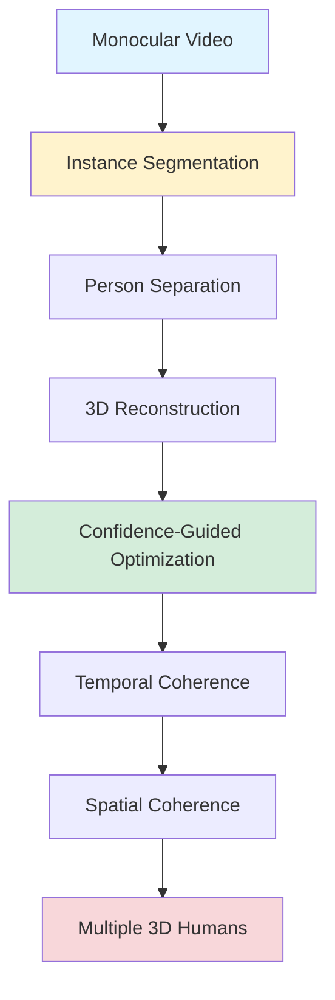



## MultiPly: Multiple People 3D Reconstruction from Monocular Videos

*Curiosity:* How can we reconstruct multiple people in 3D from single-camera in-the-wild videos? What techniques enable clean separation and accurate reconstruction?

**MultiPly** is ETH Zurich and Microsoft's novel framework for reconstructing multiple detailed 3D humans from monocular in-the-wild videos. It achieves SOTA on public datasets and real-world videos.

> **Resources**:
> - **📄 Paper**: <https://arxiv.org/pdf/2406.01595>
> - **🌐 Project Page**: <https://eth-ait.github.io/MultiPly/>
> - **💻 Code**: Coming soon (<https://github.com/eth-ait/MultiPly>)
{: .prompt-info}

### Key Highlights

*Retrieve:* MultiPly's innovative features for multi-person 3D reconstruction.

| Feature | Description | Benefit |
|:--------|:------------|:--------|
| **Multiple 3D Humans** | Detailed reconstruction | ⬆️ Multi-person scenes |
| **Robust Segmentation** | Novel instance segmentation | ⬆️ Person separation |
| **Clean Separation** | Interacting people separated | ⬆️ Accuracy |
| **Confidence-Guided** | Accurate optimization | ⬆️ Quality |
| **Temporal/Spatial Coherence** | Consistent reconstructions | ⬆️ Stability |

### Architecture Overview

*Innovate:* MultiPly's approach to multi-person 3D reconstruction.

### Technical Innovations

*Retrieve:* Key technical contributions of MultiPly.

**1. Robust Instance Segmentation**:
- Novel approach for person detection
- Handles occlusions and interactions
- Clean separation between people

**2. Confidence-Guided Optimization**:
- Accurate 3D reconstruction
- Handles uncertainty
- Better quality results

**3. Temporal/Spatial Coherence**:
- Consistent across frames
- Smooth reconstructions
- Stable over time

### Performance

*Retrieve:* MultiPly achieves SOTA performance.

**Results**:
- ✅ New SOTA on public datasets
- ✅ SOTA on in-the-wild videos
- ✅ Handles multiple interacting people
- ✅ High-quality 3D reconstructions

### Use Cases

*Innovate:* Applications enabled by MultiPly.

**Potential Applications**:
- Sports analysis
- Crowd monitoring
- AR/VR applications
- Motion capture
- Video editing

### Key Takeaways

*Retrieve:* MultiPly demonstrates that multiple people can be accurately reconstructed in 3D from monocular videos using robust segmentation, confidence-guided optimization, and temporal/spatial coherence.

*Innovate:* By combining novel instance segmentation with confidence-guided optimization and coherence constraints, MultiPly enables high-quality multi-person 3D reconstruction from single-camera videos, opening new possibilities for video analysis.

*Curiosity → Retrieve → Innovation:* Start with curiosity about multi-person 3D reconstruction, retrieve insights from MultiPly's approach, and innovate by applying these techniques to your video analysis applications.

**Next Steps**:
- Read the full paper
- Explore the project page
- Wait for code release
- Apply to your videos

> 🧙Paper Authors: Zeren Jiang∗1 Chen Guo∗1 Manuel Kaufmann1 Tianjian Jiang1 Julien Valentin2 Otmar Hilliges1 Jie Song1
 1ETH Zurich 2Microsoft
- 1️⃣Read the Full Paper here: <https://arxiv.org/pdf/2406.01595>
- 2️⃣Project Page: <https://eth-ait.github.io/MultiPly/>
- 3️⃣Code: Coming 🔜 (<https://github.com/eth-ait/MultiPly>)
{: .prompt-info }

 Translate to Korean 

## 👉ETH(+해시태그#Microsoft )는 단안 비디오에서 여러 사람을 3D로 재구성하는 새로운 프레임워크인 MultiPly를 발표했습니다. 

공개적으로 사용 가능한 데이터 세트와 야생 비디오에 대한 새로운 SOTA입니다. 소스 코드 발표 예정💙

하이라이트:
- ✅야생에서 온 여러 개의 상세한 3D 인간
- ✅새롭고 강력한 인스턴스 세분화 접근 방식 
- ✅상호 작용하는 사람들 간의 깨끗한 분리
- ✅정확한 신뢰도 기반 최적화
- ✅시간적/공간적 일관성 있는 3D 재구성

