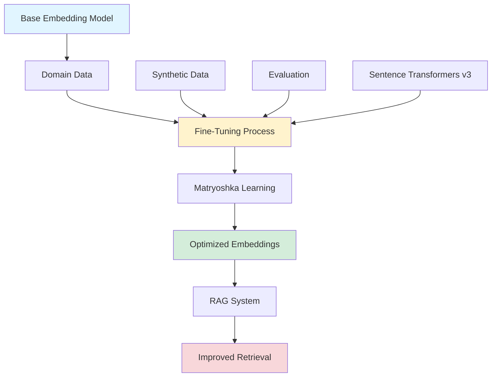

# RAG or Fine Tuning? A simple feature comparision to decide which technique you should use!

For customizing LLMs, in addition to RAG, another optimization technique is fine-tuning.

> **𝗥𝗔𝗚** is akin to providing a textbook to the model, allowing it to retrieve information based on specific queries. This approach is suitable for scenarios where the model needs to address particular information retrieval tasks. However, RAG is not suitable for teaching the model to understand broad domains or learn new languages, formats, or styles.
{: .prompt-info }

> **𝗙𝗶𝗻𝗲-𝘁𝘂𝗻𝗶𝗻𝗴** is similar to enabling students to internalize knowledge through extensive learning. Fine-tuning can enhance the performance of non-fine-tuned models and make interactions more efficient. It is particularly suitable for emphasizing existing knowledge in the base model, modifying or customizing the model’s output, and providing complex directives to the model. 
{: .prompt-info }

Sometimes it may not seem straightforward to choose one approach or the other, that's why this guide will help you to differentiate which technique fits better your use case!

{: .light .shadow .rounded-10 w='1212' h='668' }

# RAG in Production: The importance of a Solid Data Strategy 💥

Retrieval-Augmented Generation (RAG) has become one of the hottest topics in Generative AI, providing powerful ways to enhance model responses with real-world data. But let’s be honest, without a solid data strategy, you’re setting yourself up for a meme-worthy fail. 😂

📈 𝗪𝗵𝘆 𝗥𝗔𝗚 𝗡𝗲𝗲𝗱𝘀 𝗮 𝗗𝗮𝘁𝗮 𝗦𝘁𝗿𝗮𝘁𝗲𝗴𝘆: 

1. 𝗗𝗮𝘁𝗮 𝗤𝘂𝗮𝗹𝗶𝘁𝘆: Garbage in, garbage out. Your model is only as good as the data it retrieves.
2. 𝗥𝗲𝗹𝗲𝘃𝗮𝗻𝗰𝗲: Ensure your data is relevant to your use case.
3. 𝗦𝗰𝗮𝗹𝗮𝗯𝗶𝗹𝗶𝘁𝘆: Manage and scale your data efficiently to keep up with growing demands.

Remember, a well-thought-out data strategy is the backbone of any successful RAG implementation.

🚀 𝗖𝗼𝗻𝗰𝗹𝘂𝘀𝗶𝗼𝗻: Don’t let your RAG use case fall flat. Invest in your data strategy and watch your AI soar! 🌟

## Fine-Tuning Embedding Models for RAG: Significant Performance Gains

*Retrieve:* How can we improve RAG performance through embedding model fine-tuning? What techniques enable domain-specific optimization?

**Embedding models** are crucial for RAG applications, but general models often fall short of domain-specific tasks. Fine-tuning embedding models can significantly boost retrieval performance, as demonstrated in a comprehensive study using financial RAG applications.

### Performance Improvements

| Metric | Improvement | Impact |
|:-------|:------------|:-------|
| **Overall Performance** | 7.4% to 22.55% boost | ⬆️ Significant |
| **Training Samples** | Only 6.3k samples needed | ⬇️ Efficient |
| **Training Time** | ~5 minutes on consumer GPUs | ⚡ Fast |
| **Model Size** | 6x smaller with Matryoshka | ⬇️ Efficient |
| **Dimension Efficiency** | 128-dim > 768-dim baseline | ⬆️ Better |

### Fine-Tuning Workflow


```mermaid
graph TB
    A[Base Embedding Model] --> B[Domain Data]
    B --> C[Fine-Tuning Process]
    C --> D[Matryoshka Learning]
    D --> E[Optimized Embeddings]
    
    F[Synthetic Data] --> C
    G[Evaluation] --> C
    H[Sentence Transformers v3] --> C
    
    E --> I[RAG System]
    I --> J[Improved Retrieval]
    
    style A fill:#e1f5ff
    style C fill:#fff3cd
    style E fill:#d4edda
    style J fill:#f8d7da
```

### Key Techniques

#### 1. Matryoshka Representation Learning (MRL)

*Innovate:* MRL enables variable-dimension embeddings that maintain performance at smaller sizes.

```python
from sentence_transformers import SentenceTransformer, losses
from sentence_transformers.training_args import BatchSamplers

# Initialize model
model = SentenceTransformer('sentence-transformers/all-MiniLM-L6-v2')

# Matryoshka loss enables variable dimensions
train_loss = losses.MultipleNegativesRankingLoss(model)

# Training with Matryoshka
model.fit(
    train_objectives=[(train_dataloader, train_loss)],
    epochs=3,
    output_path='./fine-tuned-embedding-model'
)

# Use different dimensions
embeddings_128 = model.encode(texts, output_value='sentence_embedding', 
                              convert_to_numpy=True)[:, :128]
embeddings_256 = model.encode(texts, output_value='sentence_embedding',
                              convert_to_numpy=True)[:, :256]
```

**Benefits**:
- 🪆 99% performance at 6x smaller size
- 📈 128-dim model outperforms 768-dim baseline by 6.51%
- 💾 Reduced storage and compute requirements

#### 2. Synthetic Data Generation

*Retrieve:* Generate training data automatically for fine-tuning:

```python
from sentence_transformers import InputExample
import random

def generate_synthetic_pairs(base_texts, num_pairs=1000):
    """Generate synthetic query-document pairs"""
    pairs = []
    for _ in range(num_pairs):
        # Create variations
        query = create_query_variation(random.choice(base_texts))
        document = find_relevant_document(query, base_texts)
        pairs.append(InputExample(texts=[query, document], label=1.0))
    return pairs

# Use synthetic data for fine-tuning
synthetic_pairs = generate_synthetic_pairs(financial_documents, num_pairs=6300)
```

#### 3. Baseline Creation & Evaluation

**During Training**:
- ✅ Continuous evaluation
- ✅ Performance tracking
- ✅ Early stopping
- ✅ Best model selection

### Implementation Example

```python
from sentence_transformers import SentenceTransformer, losses, evaluation
from sentence_transformers.datasets import NoDuplicatesDataLoader

# Load base model
model = SentenceTransformer('sentence-transformers/all-MiniLM-L6-v2')

# Prepare training data
train_examples = [
    InputExample(texts=["Query about revenue", "Document about financial revenue"]),
    # ... more examples
]

train_dataloader = NoDuplicatesDataLoader(train_examples, batch_size=16)
train_loss = losses.MultipleNegativesRankingLoss(model)

# Evaluation during training
evaluator = evaluation.InformationRetrievalEvaluator(
    queries=test_queries,
    corpus=test_corpus,
    relevant_docs=test_relevant_docs
)

# Fine-tune
model.fit(
    train_objectives=[(train_dataloader, train_loss)],
    epochs=3,
    warmup_steps=100,
    evaluator=evaluator,
    evaluation_steps=500,
    output_path='./financial-embedding-model'
)
```

### Results Summary

| Dimension | Performance | vs. Baseline | Storage |
|:----------|:------------|:-------------|:--------|
| **128-dim** | 6.51% better | Outperforms 768-dim | 6x smaller |
| **256-dim** | Near-optimal | 99% of full performance | 3x smaller |
| **512-dim** | Optimal | Full performance | 1.5x smaller |
| **768-dim** | Baseline | Reference | Full size |

### Use Case: Financial RAG

**Dataset**: NVIDIA's 2023 SEC Filing dataset

**Results**:
- 🚀 7.4% to 22.55% performance improvement
- ⏱️ Fast training (5 minutes on consumer GPUs)
- 🧬 Synthetic data generation
- 🪆 Matryoshka efficiency

### Resources

**👉 Original Article**: <https://www.philschmid.de/fine-tune-embedding-model-for-rag>

**👉 Code Repository**: <https://github.com/philschmid/deep-learning-pytorch-huggingface/blob/main/training/fine-tune-embedding-model-for-rag.ipynb>

**👉 Hugging Face RAG Documentation**: <https://huggingface.co/docs/transformers/model_doc/rag>
{: .prompt-info}

### Key Takeaways

*Retrieve:* Fine-tuning embedding models with domain-specific data can boost RAG performance by 7-22%, even with small datasets (6.3k samples).

*Innovate:* Techniques like Matryoshka Representation Learning enable efficient embeddings that maintain performance at smaller sizes, reducing computational requirements while improving results.

*Curiosity → Retrieve → Innovation:* Start with curiosity about improving RAG performance, retrieve knowledge about embedding fine-tuning techniques, and innovate by applying these methods to your specific domain.

**Next Steps**:
- Explore the implementation code
- Fine-tune embeddings for your domain
- Experiment with Matryoshka learning
- Measure performance improvements


# How to Select an Embedding Model for Your RAG Application?

Embeddings form the foundation for achieving precise and contextually relevant LLM outputs across different tasks.

Which encoder you select to generate embeddings is a critical decision, hugely impacting the overall success of the RAG system. Low quality embeddings lead to poor retrieval.

When selecting an embedding model, consider the vector dimension, average retrieval performance, and model size.

Companies such as OpenAI, Cohere, and Voyage consistently release enhanced embedding models.

Different types of embeddings are designed to address unique challenges and requirements in different domains.

{: .light .shadow .rounded-10 w='1212' h='668' }

### ⮕ Dense embeddings are continuous, real-valued vectors that represent information in a high-dimensional space. 

*Curiosity:* In the context of RAG applications, dense embeddings, such as those generated by models like OpenAI’s Ada or sentence transformers, contain non-zero values for every element.


### ⮕ Sparse embeddings, on the other hand, are representations where most values are zero, emphasizing only relevant information. 
In RAG applications, sparse vectors are essential for scenarios with many rare keywords or specialized terms. 

### ⮕ Multi-vector embedding models like ColBERT feature late interaction, where the interaction between query and document representations occurs late in the process, after both have been independently encoded. 

### ⮕ Long documents have always posed a particular challenge for embedding models. 
The limitation on maximum sequence lengths, often rooted in architectures like BERT, leads to practitioners segmenting documents into smaller chunks. Unfortunately, this segmentation can result in fragmented semantic meanings and misrepresentation of entire paragraphs. 

### ⮕ Variable dimension embeddings are a unique concept built on Matryoshka Representation Learning (MRL).
 MRL learns lower-dimensional embeddings that are nested into the original embedding, akin to a series of Matryoshka Dolls. 

### ⮕ Code embeddings are a recent development used to integrate AI-powered capabilities into Integrated Development Environments (IDEs), fundamentally transforming how developers interact with codebases. 

*Curiosity:* What insights can we retrieve from this? How does this connect to innovation in the field?

There are several factors that need to be considered while selecting an embedding model.

> Know more about embeddings and models in this article: <https://www.rungalileo.io/blog/mastering-rag-how-to-select-an-embedding-model>
{: .prompt-info}


<details markdown="1">
<summary style= "font-size:24px; line-height:24px; font-weight:bold; cursor:pointer;" > Translate to Korean </summary>

## RAG or Fine-Tuning? A simple capability comparison to help you decide which technique to use!

In addition to RAG, another optimization technique for customizing LLMs is fine-tuning.

> **RAG** is analogous to giving the model a textbook so it can retrieve information based on specific queries. This method is suitable for scenarios where the model needs to handle specific information retrieval tasks. However, RAG is not well-suited for training the model to understand broad domains or learn new languages, formats, or styles.
{: .prompt-info }

> **Fine-tuning** is analogous to allowing students to internalize knowledge through extensive study. Fine-tuning can improve the performance of non-fine-tuned models and make interactions more efficient. It is particularly well-suited for emphasizing the base model's existing knowledge, modifying or customizing the model's output, and providing the model with complex instructions. 
{: .prompt-info }

Sometimes choosing one approach over the other may not seem straightforward, so this guide will help you distinguish which technique is better suited for your use case!

## RAG in Production: The Importance of a Solid Data Strategy 💥

Retrieval-Augmented Generation (RAG) has become one of the most popular topics in generative AI, offering a powerful way to enhance model responses with real-world data. But honestly, without a solid data strategy, you are heading for a meme-worthy failure. 😂

📈 Why RAG needs a data strategy:

1. Data Quality: Garbage in, garbage out. The model is only as good as the data it retrieves.
2. Relevance: Ensure the data is relevant to your use case.
3. Scalability: Manage and scale your data efficiently to keep up with growing demand.

Remember that a thoughtful data strategy is the backbone of a successful RAG implementation.

🚀 Conclusion: Don't let your RAG use case fail. Invest in your data strategy and watch your AI soar! 🌟

## Fine-tuning can significantly boost retrieval speed. 👀

Embedding models are crucial for RAG (Retrieval-Augmented Generation) applications, but general models often fall short on domain-specific tasks. 

I am happy to share a new blog on how to fine-tune an embedding model for financial RAG applications using recent research like Matryoshka Representation Learning and NVIDIA's 2023 SEC Filing dataset.

- 🚀 Fine-tuning boosts performance from 7.4% to 22.55% with just 6.3k samples
- ✅ Baseline generation + evaluation during training
- 🧬 Generated synthetic data used for fine-tuning
- ⏱️ Training for ~10,000 steps in just 5 minutes on a consumer GPU
- 🪆 Matryoshka retains 99% of performance at 6x smaller size
- 📈 Fine-tuned 128-dim model outperforms the baseline 768-dim by 6.51%
- 🆕 Uses new Sentence Transformers v3

Go build! 🤗

</details>
