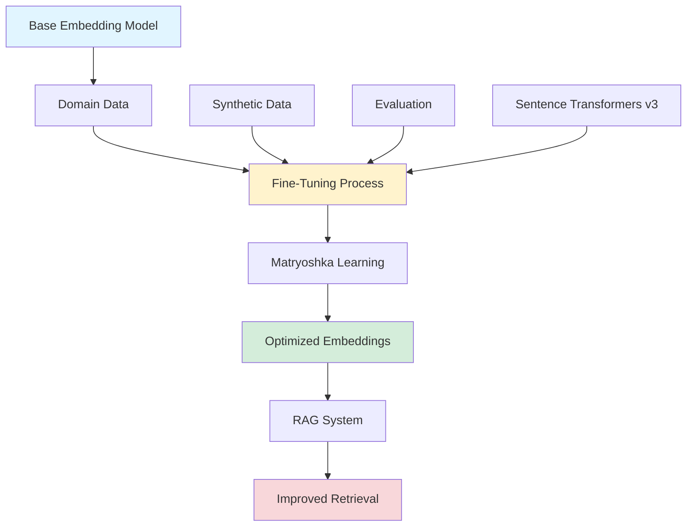

# RAG or Fine Tuning? A simple feature comparision to decide which technique you should use!

For customizing LLMs, in addition to RAG, another optimization technique is fine-tuning.

> **𝗥𝗔𝗚** is akin to providing a textbook to the model, allowing it to retrieve information based on specific queries. This approach is suitable for scenarios where the model needs to address particular information retrieval tasks. However, RAG is not suitable for teaching the model to understand broad domains or learn new languages, formats, or styles.
{: .prompt-info }

> **𝗙𝗶𝗻𝗲-𝘁𝘂𝗻𝗶𝗻𝗴** is similar to enabling students to internalize knowledge through extensive learning. Fine-tuning can enhance the performance of non-fine-tuned models and make interactions more efficient. It is particularly suitable for emphasizing existing knowledge in the base model, modifying or customizing the model’s output, and providing complex directives to the model. 
{: .prompt-info }

Sometimes it may not seem straightforward to choose one approach or the other, that's why this guide will help you to differentiate which technique fits better your use case!

{: .light .shadow .rounded-10 w='1212' h='668' }

# RAG in Production: The importance of a Solid Data Strategy 💥

Retrieval-Augmented Generation (RAG) has become one of the hottest topics in Generative AI, providing powerful ways to enhance model responses with real-world data. But let’s be honest, without a solid data strategy, you’re setting yourself up for a meme-worthy fail. 😂

📈 𝗪𝗵𝘆 𝗥𝗔𝗚 𝗡𝗲𝗲𝗱𝘀 𝗮 𝗗𝗮𝘁𝗮 𝗦𝘁𝗿𝗮𝘁𝗲𝗴𝘆: 

1. 𝗗𝗮𝘁𝗮 𝗤𝘂𝗮𝗹𝗶𝘁𝘆: Garbage in, garbage out. Your model is only as good as the data it retrieves.
2. 𝗥𝗲𝗹𝗲𝘃𝗮𝗻𝗰𝗲: Ensure your data is relevant to your use case.
3. 𝗦𝗰𝗮𝗹𝗮𝗯𝗶𝗹𝗶𝘁𝘆: Manage and scale your data efficiently to keep up with growing demands.

Remember, a well-thought-out data strategy is the backbone of any successful RAG implementation.

🚀 𝗖𝗼𝗻𝗰𝗹𝘂𝘀𝗶𝗼𝗻: Don’t let your RAG use case fall flat. Invest in your data strategy and watch your AI soar! 🌟

## Fine-Tuning Embedding Models for RAG: Significant Performance Gains

*Retrieve:* How can we improve RAG performance through embedding model fine-tuning? What techniques enable domain-specific optimization?

**Embedding models** are crucial for RAG applications, but general models often fall short of domain-specific tasks. Fine-tuning embedding models can significantly boost retrieval performance, as demonstrated in a comprehensive study using financial RAG applications.

### Performance Improvements

| Metric | Improvement | Impact |
|:-------|:------------|:-------|
| **Overall Performance** | 7.4% to 22.55% boost | ⬆️ Significant |
| **Training Samples** | Only 6.3k samples needed | ⬇️ Efficient |
| **Training Time** | ~5 minutes on consumer GPUs | ⚡ Fast |
| **Model Size** | 6x smaller with Matryoshka | ⬇️ Efficient |
| **Dimension Efficiency** | 128-dim > 768-dim baseline | ⬆️ Better |

### Fine-Tuning Workflow



### Key Techniques

#### 1. Matryoshka Representation Learning (MRL)

*Innovate:* MRL enables variable-dimension embeddings that maintain performance at smaller sizes.

```python
from sentence_transformers import SentenceTransformer, losses
from sentence_transformers.training_args import BatchSamplers

# Initialize model
model = SentenceTransformer('sentence-transformers/all-MiniLM-L6-v2')

# Matryoshka loss enables variable dimensions
train_loss = losses.MultipleNegativesRankingLoss(model)

# Training with Matryoshka
model.fit(
    train_objectives=[(train_dataloader, train_loss)],
    epochs=3,
    output_path='./fine-tuned-embedding-model'
)

# Use different dimensions
embeddings_128 = model.encode(texts, output_value='sentence_embedding', 
                              convert_to_numpy=True)[:, :128]
embeddings_256 = model.encode(texts, output_value='sentence_embedding',
                              convert_to_numpy=True)[:, :256]
```

**Benefits**:
- 🪆 99% performance at 6x smaller size
- 📈 128-dim model outperforms 768-dim baseline by 6.51%
- 💾 Reduced storage and compute requirements

#### 2. Synthetic Data Generation

*Retrieve:* Generate training data automatically for fine-tuning:

```python
from sentence_transformers import InputExample
import random

def generate_synthetic_pairs(base_texts, num_pairs=1000):
    """Generate synthetic query-document pairs"""
    pairs = []
    for _ in range(num_pairs):
        # Create variations
        query = create_query_variation(random.choice(base_texts))
        document = find_relevant_document(query, base_texts)
        pairs.append(InputExample(texts=[query, document], label=1.0))
    return pairs

# Use synthetic data for fine-tuning
synthetic_pairs = generate_synthetic_pairs(financial_documents, num_pairs=6300)
```

#### 3. Baseline Creation & Evaluation

**During Training**:
- ✅ Continuous evaluation
- ✅ Performance tracking
- ✅ Early stopping
- ✅ Best model selection

### Implementation Example

```python
from sentence_transformers import SentenceTransformer, losses, evaluation
from sentence_transformers.datasets import NoDuplicatesDataLoader

# Load base model
model = SentenceTransformer('sentence-transformers/all-MiniLM-L6-v2')

# Prepare training data
train_examples = [
    InputExample(texts=["Query about revenue", "Document about financial revenue"]),
    # ... more examples
]

train_dataloader = NoDuplicatesDataLoader(train_examples, batch_size=16)
train_loss = losses.MultipleNegativesRankingLoss(model)

# Evaluation during training
evaluator = evaluation.InformationRetrievalEvaluator(
    queries=test_queries,
    corpus=test_corpus,
    relevant_docs=test_relevant_docs
)

# Fine-tune
model.fit(
    train_objectives=[(train_dataloader, train_loss)],
    epochs=3,
    warmup_steps=100,
    evaluator=evaluator,
    evaluation_steps=500,
    output_path='./financial-embedding-model'
)
```

### Results Summary

| Dimension | Performance | vs. Baseline | Storage |
|:----------|:------------|:-------------|:--------|
| **128-dim** | 6.51% better | Outperforms 768-dim | 6x smaller |
| **256-dim** | Near-optimal | 99% of full performance | 3x smaller |
| **512-dim** | Optimal | Full performance | 1.5x smaller |
| **768-dim** | Baseline | Reference | Full size |

### Use Case: Financial RAG

**Dataset**: NVIDIA's 2023 SEC Filing dataset

**Results**:
- 🚀 7.4% to 22.55% performance improvement
- ⏱️ Fast training (5 minutes on consumer GPUs)
- 🧬 Synthetic data generation
- 🪆 Matryoshka efficiency

### Resources

**👉 Original Article**: <https://www.philschmid.de/fine-tune-embedding-model-for-rag>

**👉 Code Repository**: <https://github.com/philschmid/deep-learning-pytorch-huggingface/blob/main/training/fine-tune-embedding-model-for-rag.ipynb>

**👉 Hugging Face RAG Documentation**: <https://huggingface.co/docs/transformers/model_doc/rag>
{: .prompt-info}

### Key Takeaways

*Retrieve:* Fine-tuning embedding models with domain-specific data can boost RAG performance by 7-22%, even with small datasets (6.3k samples).

*Innovate:* Techniques like Matryoshka Representation Learning enable efficient embeddings that maintain performance at smaller sizes, reducing computational requirements while improving results.

*Curiosity → Retrieve → Innovation:* Start with curiosity about improving RAG performance, retrieve knowledge about embedding fine-tuning techniques, and innovate by applying these methods to your specific domain.

**Next Steps**:
- Explore the implementation code
- Fine-tune embeddings for your domain
- Experiment with Matryoshka learning
- Measure performance improvements


# How to Select an Embedding Model for Your RAG Application?

Embeddings form the foundation for achieving precise and contextually relevant LLM outputs across different tasks.

Which encoder you select to generate embeddings is a critical decision, hugely impacting the overall success of the RAG system. Low quality embeddings lead to poor retrieval.

When selecting an embedding model, consider the vector dimension, average retrieval performance, and model size.

Companies such as OpenAI, Cohere, and Voyage consistently release enhanced embedding models.

Different types of embeddings are designed to address unique challenges and requirements in different domains.

{: .light .shadow .rounded-10 w='1212' h='668' }

### ⮕ Dense embeddings are continuous, real-valued vectors that represent information in a high-dimensional space. 

*Curiosity:* In the context of RAG applications, dense embeddings, such as those generated by models like OpenAI’s Ada or sentence transformers, contain non-zero values for every element.


### ⮕ Sparse embeddings, on the other hand, are representations where most values are zero, emphasizing only relevant information. 
In RAG applications, sparse vectors are essential for scenarios with many rare keywords or specialized terms. 

### ⮕ Multi-vector embedding models like ColBERT feature late interaction, where the interaction between query and document representations occurs late in the process, after both have been independently encoded. 

### ⮕ Long documents have always posed a particular challenge for embedding models. 
The limitation on maximum sequence lengths, often rooted in architectures like BERT, leads to practitioners segmenting documents into smaller chunks. Unfortunately, this segmentation can result in fragmented semantic meanings and misrepresentation of entire paragraphs. 

### ⮕ Variable dimension embeddings are a unique concept built on Matryoshka Representation Learning (MRL).
 MRL learns lower-dimensional embeddings that are nested into the original embedding, akin to a series of Matryoshka Dolls. 

### ⮕ Code embeddings are a recent development used to integrate AI-powered capabilities into Integrated Development Environments (IDEs), fundamentally transforming how developers interact with codebases. 

*Curiosity:* What insights can we retrieve from this? How does this connect to innovation in the field?

There are several factors that need to be considered while selecting an embedding model.

> Know more about embeddings and models in this article: <https://www.rungalileo.io/blog/mastering-rag-how-to-select-an-embedding-model>
{: .prompt-info}


<details markdown="1">
<summary style= "font-size:24px; line-height:24px; font-weight:bold; cursor:pointer;" > Translate to Korean </summary>

## RAG 또는 미세 조정? 어떤 기술을 사용해야 하는지 결정하기 위한 간단한 기능 비교!

LLM을 커스터마이징하기 위해 RAG 외에도 또 다른 최적화 기술이 미세 조정입니다.

> **RAG는** 모델에 교과서를 제공하는 것과 유사하여 특정 쿼리를 기반으로 정보를 검색할 수 있습니다. 이 방법은 모델이 특정 정보 검색 작업을 처리해야 하는 시나리오에 적합합니다. 그러나 RAG는 모델이 광범위한 도메인을 이해하거나 새로운 언어, 형식 또는 스타일을 학습하도록 학습시키는 데는 적합하지 않습니다.
{: .prompt-info }

> **미세 조정은** 학생들이 광범위한 학습을 통해 지식을 내면화할 수 있도록 하는 것과 유사합니다. 미세 조정은 미세 조정되지 않은 모델의 성능을 향상시키고 상호 작용을 보다 효율적으로 만들 수 있습니다. 기본 모델의 기존 지식을 강조하고, 모델의 출력을 수정하거나 사용자 지정하고, 모델에 복잡한 지시문을 제공하는 데 특히 적합합니다. 
{: .prompt-info }

때로는 한 가지 접근 방식 또는 다른 접근 방식을 선택하는 것이 간단하지 않은 것처럼 보일 수 있으므로 이 가이드는 사용 사례에 더 적합한 기술을 구별하는 데 도움이 될 것입니다!

## 생산 현장에서의 RAG: 견고한 데이터 전략💥의 중요성

RAG(Retrieval-Augmented Generation)는 제너레이티브 AI에서 가장 인기 있는 주제 중 하나가 되었으며, 실제 데이터로 모델 응답을 향상시킬 수 있는 강력한 방법을 제공합니다. 그러나 솔직히 말해서 견고한 데이터 전략이 없으면 밈에 어울리는 실패를 맞이하게 됩니다. 😂

📈 RAG에 데이터 전략이 필요한 이유:

1. 데이터 품질: 쓰레기 유입, 쓰레기 배출. 모델은 검색하는 데이터만큼만 우수합니다.
2. 관련성: 데이터가 사용 사례와 관련이 있는지 확인합니다.
3. 확장성: 증가하는 수요를 따라잡기 위해 데이터를 효율적으로 관리하고 확장합니다.

신중한 데이터 전략은 성공적인 RAG 구현의 중추라는 점을 기억하십시오.

🚀 결론: RAG 사용 사례가 실패하지 않도록 하십시오. 데이터 전략에 투자하고 AI가 급증하는 것을 지켜보십시오! 🌟

##  미세 조정은 검색 속도를 크게 높일 수 있습니다. 👀

임베딩 모델은 RAG(Retrieval-Augmented Generation) 애플리케이션에 매우 중요하지만 일반 모델은 도메인별 작업에 미치지 못하는 경우가 많습니다. 

Matryoshka Representation Learning과 같은 최신 연구를 사용하여 NVIDIA의 2023 SEC Filing 데이터 세트를 사용하여 금융 RAG 애플리케이션용 임베딩 모델을 미세 조정하는 방법에 대한 새로운 블로그를 공유하게 되어 기쁩니다.

- 🚀 미세 조정으로 단 6.3k 샘플로 7.4%에서 22.55%까지 성능 향상
- ✅ 기준 생성 + 학습 중 평가
- 🧬 미세 조정에 사용되는 생성된 합성 데이터
- ⏱️ ~10,000에 대한 교육, 소비자용 GPU에서 단 5분
- 🪆 Matryoshka는 6배 더 작은 크기로 99%의 성능을 유지합니다.
- 📈 미세 조정된 128-dim 모델은 기준 768-dim보다 6.51% 더 우수합니다.
- 🆕 새로운 문장 변환기 v3 사용

빌드하러 가세요! 🤗

</details>