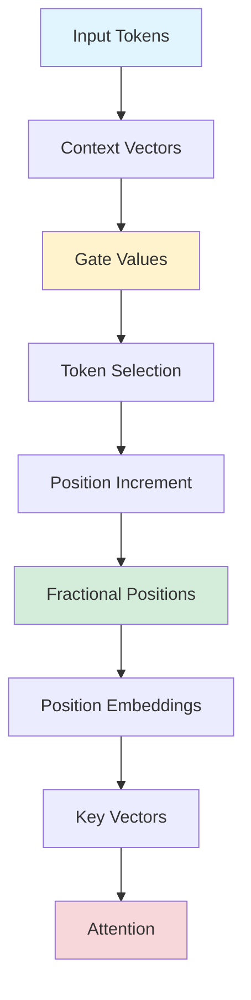

## CoPE: Meta's Contextual Position Encoding

*Curiosity:* How can we improve positional encoding to handle higher levels of abstraction? What happens when we integrate context with position addressing?

**Meta's CoPE (Contextual Position Encoding)** introduces an innovative approach that utilizes context during positional encoding. This research could significantly improve state-of-the-art LLMs.

> **Paper**: <https://arxiv.org/pdf/2405.18719>
{: .prompt-info}

### The Problem with Traditional PE

*Retrieve:* Traditional positional encoding limitations.

| Issue | Description | Impact |
|:------|:------------|:-------|
| **Token Counting** | Uses token counts for position | ⚠️ Limited abstraction |
| **Generalization** | Can't generalize to sentences | ⚠️ Higher-level failure |
| **Rigidity** | Fixed position representation | ⚠️ Inflexible |

**Limitation**: Traditional PE methods can't represent various levels of position abstraction simultaneously.

### CoPE Solution

*Innovate:* Contextual Position Encoding overcomes these limitations.

### Key Features

*Retrieve:* CoPE's innovative approach.

| Feature | Description | Benefit |
|:--------|:------------|:--------|
| **Context Integration** | Context with position addressing | ⬆️ Multiple abstraction levels |
| **Conditional Increment** | Position only on selected tokens | ⬆️ Flexible addressing |
| **Gate Values** | Context vectors determine counting | ⬆️ Smart selection |
| **Fractional Positions** | Aggregated gate values | ⬆️ Fine-grained control |
| **Interpolation** | Position embeddings for fractions | ⬆️ Smooth transitions |

### How CoPE Works

*Innovate:* Step-by-step process.

**Process**:
1. **Context Vectors**: Determine which tokens to count
2. **Gate Values**: Computed for each previous token relative to current
3. **Aggregation**: Gate values aggregated to determine relative position
4. **Fractional Values**: Positions can take fractional values
5. **Interpolation**: Position embeddings interpolated for fractions
6. **Integration**: Added to key vectors for attention

**Key Innovation**: Positions conditioned on context, enabling:
- Attending to i-th particular word
- Attending to i-th noun
- Attending to i-th sentence

### Performance

*Retrieve:* CoPE excels where traditional PE fails.

**Tasks Where CoPE Excels**:
- ✅ Selective copying
- ✅ Counting
- ✅ Flip-Flop task

**Real-World Improvements**:
- ✅ Better perplexity on language modeling
- ✅ Better perplexity on coding tasks
- ✅ Demonstrates practical applicability

### Comparison

| Method | Abstraction Levels | Flexibility | Performance |
|:-------|:-------------------|:------------|:------------|
| **Traditional PE** | Single (tokens) | ❌ Rigid | ⚠️ Limited |
| **CoPE** | Multiple (words, nouns, sentences) | ✅ Flexible | ✅ Strong |

### Key Takeaways

*Retrieve:* CoPE integrates context with position addressing, enabling representation of various abstraction levels and improving performance on challenging tasks.

*Innovate:* By conditioning positions on context and using gate values to determine token counting, CoPE enables more flexible and powerful positional encoding that could significantly improve LLM capabilities.

*Curiosity → Retrieve → Innovation:* Start with curiosity about positional encoding limitations, retrieve insights from CoPE's approach, and innovate by applying contextual position encoding to improve your LLM models.

**Next Steps**:
- Read the full paper
- Understand CoPE mechanism
- Experiment with implementation
- Apply to your models

{: .light .shadow .rounded-10 w='1212' h='668' }

 Translate to Korean 

## Meta의 최신 "CoPE" 논문은 마땅히 받아야 할 관심을 받지 못하고 있습니다! 저자는 위치 인코딩 중에 컨텍스트를 활용하는 정말 혁신적인 접근 방식을 소개합니다.

다음은 간단한 요약입니다.
- ⛳ 기존의 PE(위치 인코딩) 방법은 토큰 수를 사용하여 위치를 파생하므로 문장과 같은 더 높은 수준의 추상화로 일반화하는 기능을 제한합니다.
- ⛳ CoPE는 컨텍스트를 위치 주소 지정과 통합하여 다양한 수준의 위치 추상화를 동시에 표현할 수 있도록 함으로써 이를 극복합니다.
- ⛳ CoPE(Contextual Position Encoding)를 사용하면 모델에 의해 결정된 특정 토큰에 대해서만 위치를 증가시켜 컨텍스트에 따라 위치를 조건화할 수 있습니다. 이렇게 하면 i번째 특정 단어, 명사 또는 문장에 주의를 기울이는 것과 같은 보다 일반적인 위치 주소 지정이 가능합니다.
- ⛳ CoPE는 컨텍스트 벡터를 사용하여 계산할 토큰을 결정하고 현재 토큰을 기준으로 각 이전 토큰에 대한 게이트 값을 계산합니다. 이러한 게이트 값은 분수 값을 사용할 수 있는 상대적 위치를 결정하기 위해 집계됩니다. 위치 임베딩은 이러한 소수 값에 대해 보간되고 어텐션 작업에 사용하기 위해 키 벡터에 추가됩니다.
- ⛳CoPE는 선택적 복사, 카운팅 및 Flip-Flop 작업과 같이 널리 사용되는 PE 방법이 실패하는 작업에 탁월합니다. 또한 언어 모델링 및 코딩 작업의 복잡성을 개선하여 실제 적용 가능성을 보여줍니다.

솔직히 말해서 이것은 SoTA LLM을 개선하는 데 도움이 될 수 있는 매우 깔끔하고 기능적인 연구 작업이라고 생각합니다!

