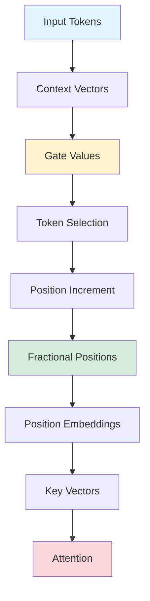

## CoPE: Meta's Contextual Position Encoding

*Curiosity:* How can we improve positional encoding to handle higher levels of abstraction? What happens when we integrate context with position addressing?

**Meta's CoPE (Contextual Position Encoding)** introduces an innovative approach that utilizes context during positional encoding. This research could significantly improve state-of-the-art LLMs.

> **Paper**: <https://arxiv.org/pdf/2405.18719>
{: .prompt-info}

### The Problem with Traditional PE

*Retrieve:* Traditional positional encoding limitations.

| Issue | Description | Impact |
|:------|:------------|:-------|
| **Token Counting** | Uses token counts for position | ⚠️ Limited abstraction |
| **Generalization** | Can't generalize to sentences | ⚠️ Higher-level failure |
| **Rigidity** | Fixed position representation | ⚠️ Inflexible |

**Limitation**: Traditional PE methods can't represent various levels of position abstraction simultaneously.

### CoPE Solution

*Innovate:* Contextual Position Encoding overcomes these limitations.

```mermaid
graph TB
    A[Input Tokens] --> B[Context Vectors]
    B --> C[Gate Values]
    C --> D[Token Selection]
    D --> E[Position Increment]
    E --> F[Fractional Positions]
    F --> G[Position Embeddings]
    G --> H[Key Vectors]
    H --> I[Attention]
    
    style A fill:#e1f5ff
    style C fill:#fff3cd
    style F fill:#d4edda
    style I fill:#f8d7da
```

### Key Features

*Retrieve:* CoPE's innovative approach.

| Feature | Description | Benefit |
|:--------|:------------|:--------|
| **Context Integration** | Context with position addressing | ⬆️ Multiple abstraction levels |
| **Conditional Increment** | Position only on selected tokens | ⬆️ Flexible addressing |
| **Gate Values** | Context vectors determine counting | ⬆️ Smart selection |
| **Fractional Positions** | Aggregated gate values | ⬆️ Fine-grained control |
| **Interpolation** | Position embeddings for fractions | ⬆️ Smooth transitions |

### How CoPE Works

*Innovate:* Step-by-step process.

**Process**:
1. **Context Vectors**: Determine which tokens to count
2. **Gate Values**: Computed for each previous token relative to current
3. **Aggregation**: Gate values aggregated to determine relative position
4. **Fractional Values**: Positions can take fractional values
5. **Interpolation**: Position embeddings interpolated for fractions
6. **Integration**: Added to key vectors for attention

**Key Innovation**: Positions conditioned on context, enabling:
- Attending to i-th particular word
- Attending to i-th noun
- Attending to i-th sentence

### Performance

*Retrieve:* CoPE excels where traditional PE fails.

**Tasks Where CoPE Excels**:
- ✅ Selective copying
- ✅ Counting
- ✅ Flip-Flop task

**Real-World Improvements**:
- ✅ Better perplexity on language modeling
- ✅ Better perplexity on coding tasks
- ✅ Demonstrates practical applicability

### Comparison

| Method | Abstraction Levels | Flexibility | Performance |
|:-------|:-------------------|:------------|:------------|
| **Traditional PE** | Single (tokens) | ❌ Rigid | ⚠️ Limited |
| **CoPE** | Multiple (words, nouns, sentences) | ✅ Flexible | ✅ Strong |

### Key Takeaways

*Retrieve:* CoPE integrates context with position addressing, enabling representation of various abstraction levels and improving performance on challenging tasks.

*Innovate:* By conditioning positions on context and using gate values to determine token counting, CoPE enables more flexible and powerful positional encoding that could significantly improve LLM capabilities.

*Curiosity → Retrieve → Innovation:* Start with curiosity about positional encoding limitations, retrieve insights from CoPE's approach, and innovate by applying contextual position encoding to improve your LLM models.

**Next Steps**:
- Read the full paper
- Understand CoPE mechanism
- Experiment with implementation
- Apply to your models

{: .light .shadow .rounded-10 w='1212' h='668' }

 Translate to Korean 

## Meta's latest "CoPE" paper is not getting the attention it deserves! The authors introduce a truly innovative approach to leveraging context during positional encoding.

Here is a quick summary.
- ⛳ Traditional PE (Positional Encoding) methods use token counts to derive positions, limiting their ability to generalize to higher-level abstractions like sentences.
- ⛳ CoPE overcomes this by integrating context with positional addressing, enabling simultaneous representation of various levels of positional abstraction.
- ⛳ CoPE (Contextual Position Encoding) allows conditioning positions on context by incrementing positions only for specific tokens as determined by the model. This enables more general positional addressing, such as attending to the i-th specific word, noun, or sentence.
- ⛳ CoPE uses context vectors to determine which tokens to count and computes gate values for each previous token relative to the current token. These gate values are aggregated to determine relative positions, which can take fractional values. Position embeddings are interpolated for these fractional values and added to key vectors for use in the attention operation.
- ⛳ CoPE excels at tasks where widely used PE methods fail, such as selective copying, counting, and Flip-Flop tasks. It also improves perplexity in language modeling and coding tasks, demonstrating real-world applicability.

Honestly, I think this is a very clean and functional research work that could help improve SoTA LLMs!

