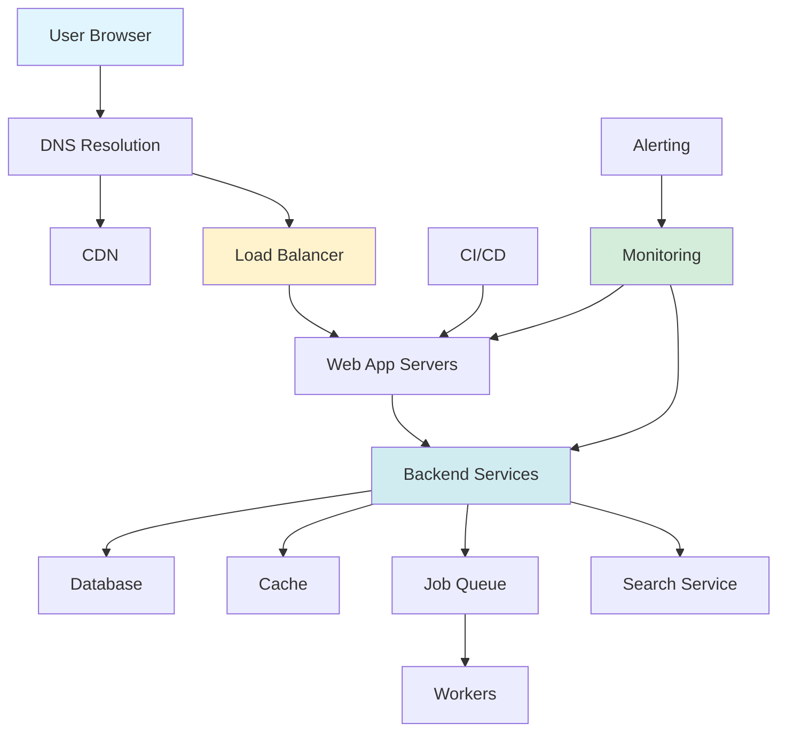

## 10 Essential Components of a Production Web Application

*Curiosity:* What components are essential for building production-ready web applications? How do these components work together to create scalable, reliable systems?

**Production web applications** require multiple components working together to handle user requests, process data, and ensure reliability. Here are the 10 essential components.

### The 10 Essential Components

*Retrieve:* Complete architecture overview.

| # | Component | Description | Tools/Examples |
|:--|:----------|:------------|:---------------|
| **1** | **CI/CD Pipelines** | Deploy code to server instances | Jenkins, GitHub Actions |
| **2** | **User Requests** | Originate from web browser, DNS resolution | Browser, DNS |
| **3** | **Load Balancers** | Distribute requests evenly | Nginx, HAProxy |
| **4** | **CDN** | Serve requests from edge locations | CloudFlare, AWS CloudFront |
| **5** | **API Communication** | Web app communicates with backend | REST, GraphQL |
| **6** | **Database/Cache** | Data storage and retrieval | PostgreSQL, Redis |
| **7** | **Job Queue** | Handle resource-intensive tasks | RabbitMQ, Celery |
| **8** | **Full-Text Search** | Support search functionality | Elasticsearch, Solr |
| **9** | **Monitoring** | Store logs and analyze data | Sentry, Grafana, Prometheus |
| **10** | **Alerting** | Notify developers of issues | Slack, PagerDuty |

### Architecture Overview

*Innovate:* How components interact.

### Detailed Components

*Retrieve:* Understanding each component.

**1. CI/CD Pipelines**:
- Deploy code to server instances
- Tools: Jenkins, GitHub Actions
- Purpose: Automated deployment

**2. User Requests**:
- Originate from web browser
- DNS resolution
- Reach app servers

**3. Load Balancers & Reverse Proxies**:
- Distribute requests evenly
- Tools: Nginx, HAProxy
- Purpose: High availability

**4. Content Delivery Network (CDN)**:
- Serve requests from edge locations
- Reduce latency
- Improve performance

**5. API Communication**:
- Web app communicates with backend
- REST, GraphQL
- Service-to-service communication

**6. Database & Cache**:
- Database servers for persistent data
- Distributed caches for fast access
- Tools: PostgreSQL, Redis

**7. Job Queue**:
- Handle resource-intensive tasks
- Long-running operations
- Tools: RabbitMQ, Celery

**8. Full-Text Search**:
- Support search functionality
- Tools: Elasticsearch, Apache Solr
- Fast text search

**9. Monitoring**:
- Store logs
- Analyze data
- Tools: Sentry, Grafana, Prometheus
- Ensure everything works

**10. Alerting**:
- Notify developers of issues
- Platforms: Slack, PagerDuty
- Quick resolution

### Component Categories

*Innovate:* Grouping by function.

| Category | Components | Purpose |
|:---------|:-----------|:--------|
| **Deployment** | CI/CD Pipelines | ⬆️ Automated delivery |
| **Request Handling** | Load Balancers, CDN | ⬆️ Distribution |
| **Application** | Web App, Backend Services | ⬆️ Business logic |
| **Data** | Database, Cache, Search | ⬆️ Data management |
| **Background** | Job Queue, Workers | ⬆️ Async processing |
| **Observability** | Monitoring, Alerting | ⬆️ Reliability |

### Key Takeaways

*Retrieve:* Production web applications require 10 essential components: CI/CD, request handling (load balancers, CDN), application servers, backend services, databases/caches, job queues, search services, monitoring, and alerting.

*Innovate:* By implementing these components properly, you can build scalable, reliable web applications that handle user requests efficiently, process data effectively, and maintain high availability with proper monitoring and alerting.

*Curiosity → Retrieve → Innovation:* Start with curiosity about production architecture, retrieve insights from these essential components, and innovate by building web applications with all necessary components for scalability and reliability.

**Next Steps**:
- Design your architecture
- Implement each component
- Set up monitoring
- Configure alerting

{: .light .shadow .rounded-10 w='1212' h='668' }

 Translate to Korean 

## 프로덕션 웹 응용 프로그램의 10가지 필수 구성 요소

#### 1 - 모든 것은 서버 인스턴스에 코드를 배포하는 CI/CD 파이프라인으로 시작됩니다. Jenkins 및 GitHub와 같은 도구가 여기에 도움이 됩니다.
#### 2 - 사용자 요청이 웹 브라우저에서 시작됩니다. DNS 확인 후 요청은 앱 서버에 도달합니다.
#### 3 - 부하 분산 장치 및 역방향 프록시(예: Nginx 및 HAProxy)는 웹 애플리케이션 서버 간에 사용자 요청을 균등하게 분산합니다.
#### 4 - CDN(Content Delivery Network)에서도 요청을 처리할 수 있습니다.
#### 5 - 웹앱은 API를 통해 백 엔드 서비스와 통신합니다.
#### 6 - 백엔드 서비스는 데이터베이스 서버 또는 분산 캐시와 상호 작용하여 데이터를 제공합니다.
#### 7 - 리소스를 많이 사용하는 장기 실행 태스크는 작업 대기열을 사용하여 작업자에게 전송됩니다.
#### 8 - 전체 텍스트 검색 서비스가 검색 기능을 지원합니다. Elasticsearch 및 Apache Solr와 같은 도구가 도움이 될 수 있습니다.
#### 9 - 모니터링 도구(예: Sentry, Grafana 및 Prometheus)는 로그를 저장하고 데이터를 분석하여 모든 것이 제대로 작동하는지 확인합니다. 
#### 10 - 문제가 발생할 경우 알림 서비스는 빠른 해결을 위해 Slack과 같은 플랫폼을 통해 개발자에게 알립니다. 

여러분에게: 프로덕션 웹앱의 아키텍처에 추가할 다른 구성 요소는 무엇인가요?

