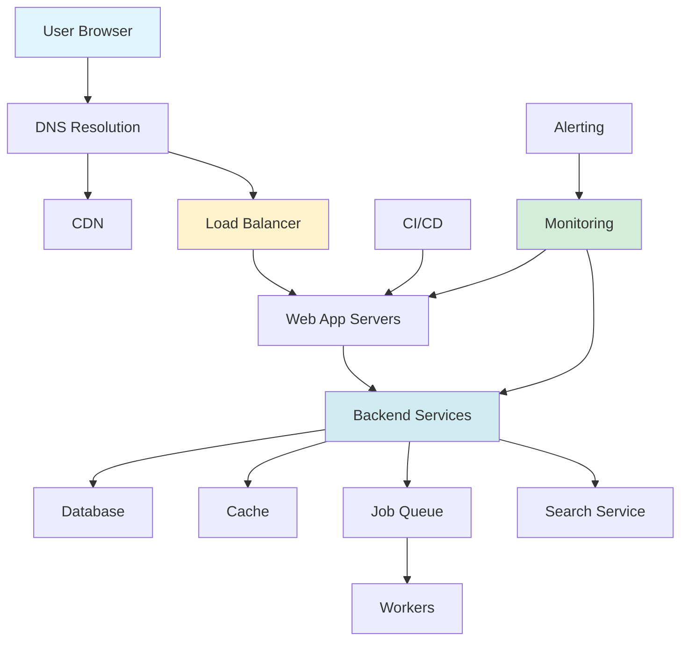

## 10 Essential Components of a Production Web Application

*Curiosity:* What components are essential for building production-ready web applications? How do these components work together to create scalable, reliable systems?

**Production web applications** require multiple components working together to handle user requests, process data, and ensure reliability. Here are the 10 essential components.

### The 10 Essential Components

*Retrieve:* Complete architecture overview.

| # | Component | Description | Tools/Examples |
|:--|:----------|:------------|:---------------|
| **1** | **CI/CD Pipelines** | Deploy code to server instances | Jenkins, GitHub Actions |
| **2** | **User Requests** | Originate from web browser, DNS resolution | Browser, DNS |
| **3** | **Load Balancers** | Distribute requests evenly | Nginx, HAProxy |
| **4** | **CDN** | Serve requests from edge locations | CloudFlare, AWS CloudFront |
| **5** | **API Communication** | Web app communicates with backend | REST, GraphQL |
| **6** | **Database/Cache** | Data storage and retrieval | PostgreSQL, Redis |
| **7** | **Job Queue** | Handle resource-intensive tasks | RabbitMQ, Celery |
| **8** | **Full-Text Search** | Support search functionality | Elasticsearch, Solr |
| **9** | **Monitoring** | Store logs and analyze data | Sentry, Grafana, Prometheus |
| **10** | **Alerting** | Notify developers of issues | Slack, PagerDuty |

### Architecture Overview

*Innovate:* How components interact.

```mermaid
graph TB
    A[User Browser] --> B[DNS Resolution]
    B --> C[CDN]
    B --> D[Load Balancer]
    D --> E[Web App Servers]
    E --> F[Backend Services]
    F --> G[Database]
    F --> H[Cache]
    F --> I[Job Queue]
    I --> J[Workers]
    F --> K[Search Service]
    
    L[CI/CD] --> E
    M[Monitoring] --> E
    M --> F
    N[Alerting] --> M
    
    style A fill:#e1f5ff
    style D fill:#fff3cd
    style F fill:#d1ecf1
    style M fill:#d4edda
```

### Detailed Components

*Retrieve:* Understanding each component.

**1. CI/CD Pipelines**:
- Deploy code to server instances
- Tools: Jenkins, GitHub Actions
- Purpose: Automated deployment

**2. User Requests**:
- Originate from web browser
- DNS resolution
- Reach app servers

**3. Load Balancers & Reverse Proxies**:
- Distribute requests evenly
- Tools: Nginx, HAProxy
- Purpose: High availability

**4. Content Delivery Network (CDN)**:
- Serve requests from edge locations
- Reduce latency
- Improve performance

**5. API Communication**:
- Web app communicates with backend
- REST, GraphQL
- Service-to-service communication

**6. Database & Cache**:
- Database servers for persistent data
- Distributed caches for fast access
- Tools: PostgreSQL, Redis

**7. Job Queue**:
- Handle resource-intensive tasks
- Long-running operations
- Tools: RabbitMQ, Celery

**8. Full-Text Search**:
- Support search functionality
- Tools: Elasticsearch, Apache Solr
- Fast text search

**9. Monitoring**:
- Store logs
- Analyze data
- Tools: Sentry, Grafana, Prometheus
- Ensure everything works

**10. Alerting**:
- Notify developers of issues
- Platforms: Slack, PagerDuty
- Quick resolution

### Component Categories

*Innovate:* Grouping by function.

| Category | Components | Purpose |
|:---------|:-----------|:--------|
| **Deployment** | CI/CD Pipelines | ⬆️ Automated delivery |
| **Request Handling** | Load Balancers, CDN | ⬆️ Distribution |
| **Application** | Web App, Backend Services | ⬆️ Business logic |
| **Data** | Database, Cache, Search | ⬆️ Data management |
| **Background** | Job Queue, Workers | ⬆️ Async processing |
| **Observability** | Monitoring, Alerting | ⬆️ Reliability |

### Key Takeaways

*Retrieve:* Production web applications require 10 essential components: CI/CD, request handling (load balancers, CDN), application servers, backend services, databases/caches, job queues, search services, monitoring, and alerting.

*Innovate:* By implementing these components properly, you can build scalable, reliable web applications that handle user requests efficiently, process data effectively, and maintain high availability with proper monitoring and alerting.

*Curiosity → Retrieve → Innovation:* Start with curiosity about production architecture, retrieve insights from these essential components, and innovate by building web applications with all necessary components for scalability and reliability.

**Next Steps**:
- Design your architecture
- Implement each component
- Set up monitoring
- Configure alerting

{: .light .shadow .rounded-10 w='1212' h='668' }

 Translate to Korean 

## 10 Essential Components of a Production Web Application

#### 1 - Everything starts with a CI/CD pipeline that deploys code to server instances. Tools like Jenkins and GitHub help here.
#### 2 - User requests originate from the web browser. After DNS resolution, the request reaches the app server.
#### 3 - Load balancers and reverse proxies (e.g., Nginx and HAProxy) evenly distribute user requests among web application servers.
#### 4 - A CDN (Content Delivery Network) can also handle requests.
#### 5 - The web app communicates with back-end services through APIs.
#### 6 - Backend services interact with database servers or distributed caches to serve data.
#### 7 - Long-running, resource-intensive tasks are sent to workers using job queues.
#### 8 - Full-text search services support search functionality. Tools like Elasticsearch and Apache Solr can help.
#### 9 - Monitoring tools (e.g., Sentry, Grafana, and Prometheus) store logs and analyze data to ensure everything is working properly. 
#### 10 - When issues arise, alerting services notify developers through platforms like Slack for quick resolution. 

To you: What other components would you add to the architecture of a production web app?

