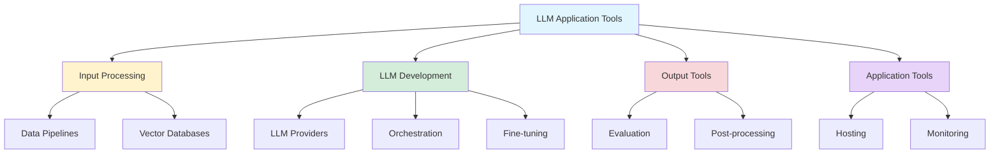
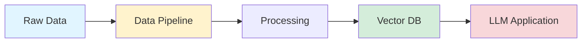
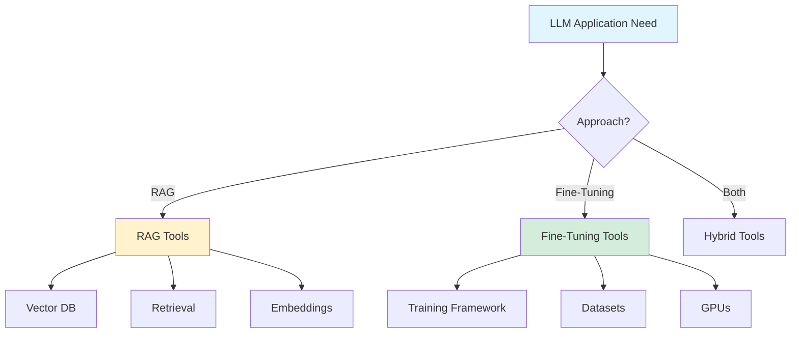

## Tools for Building LLM Applications: A Comprehensive Guide

*Curiosity:* What tools and frameworks are essential for building LLM applications? How do we navigate the rich landscape of available technologies?

**The LLM application landscape** is rich with diverse tools and technologies, each serving different needs and stages of development. Finding the right tools is crucial for building successful applications.

> **📖 Comprehensive Guide**: <https://github.com/aishwaryanr/awesome-generative-ai-guide/blob/main/free_courses/Applied_LLMs_Mastery_2024/week5_tools_for_LLM_apps.md>
{: .prompt-danger }

### Tool Categories Overview



### Four Main Tool Categories

| Category | Purpose | Key Tools | Use Case |
|:---------|:--------|:----------|:---------|
| **Input Processing** | Data ingestion & preparation | Pipelines, Vector DBs | RAG, Data prep |
| **LLM Development** | Model interaction & training | Providers, Orchestration | Development, Training |
| **Output Tools** | Post-processing & evaluation | Evaluation frameworks | Quality assessment |
| **Application Tools** | Hosting & monitoring | Deployment, Monitoring | Production |

### 1. Input Processing Tools

*Retrieve:* Handle data ingestion and prepare inputs for LLM applications.

**Purpose**: Process and prepare data for LLM consumption

**Components**:
- **Data Pipelines**: ETL, data transformation
- **Vector Databases**: Embedding storage and retrieval
- **Data Preprocessing**: Cleaning, formatting

**Tools**:
- **Vector DBs**: Pinecone, Weaviate, Chroma, Qdrant
- **Data Pipelines**: Apache Airflow, Prefect
- **ETL Tools**: dbt, Apache Spark

**Use Cases**:
- RAG applications
- Data preparation
- Embedding storage
- Document processing

**Architecture**:



### 2. LLM Development Tools

*Innovate:* Tools for interacting with, fine-tuning, and orchestrating LLMs.

**Purpose**: Develop and interact with Large Language Models

**Subcategories**:

| Subcategory | Tools | Purpose |
|:------------|:------|:--------|
| **LLM Providers** | OpenAI, Anthropic, Cohere | Model access |
| **Orchestration** | LangChain, LlamaIndex | Workflow management |
| **Fine-tuning** | Hugging Face, LLaMA-Factory | Model customization |
| **Experimentation** | Weights & Biases, MLflow | Experiment tracking |

**LLM Providers**:
- **OpenAI**: GPT-4, GPT-3.5
- **Anthropic**: Claude
- **Cohere**: Command models
- **Open Source**: Hugging Face, Ollama

**Orchestration Platforms**:
- **LangChain**: General-purpose framework
- **LlamaIndex**: RAG-focused
- **Haystack**: End-to-end NLP
- **Semantic Kernel**: Microsoft's framework

**Fine-tuning Tools**:
- **Hugging Face**: Transformers library
- **LLaMA-Factory**: Easy fine-tuning
- **Unsloth**: Fast fine-tuning
- **Axolotl**: Efficient training

### 3. Output Tools

*Retrieve:* Post-processing and evaluation tools for LLM outputs.

**Purpose**: Manage and refine LLM application outputs

**Tools**:
- **Evaluation Frameworks**: TruEra, RAGas, LangSmith
- **Output Processing**: Post-processing pipelines
- **Quality Assessment**: Metrics and scoring

**Evaluation Metrics**:
- Accuracy
- Relevance
- Coherence
- Factual correctness
- User satisfaction

**Example**:

```python
# Evaluation example
from ragas import evaluate
from datasets import Dataset

# Evaluate RAG system
results = evaluate(
    dataset=dataset,
    metrics=[
        "faithfulness",
        "answer_relevancy",
        "context_precision"
    ]
)
```

### 4. Application Tools

*Retrieve:* Tools for hosting, monitoring, and managing LLM applications.

**Purpose**: Production deployment and operations

**Components**:
- **Hosting**: Cloud platforms, containers
- **Monitoring**: Performance, errors, usage
- **Scaling**: Auto-scaling, load balancing

**Tools**:
- **Hosting**: AWS, GCP, Azure, Vercel
- **Monitoring**: LangSmith, Weights & Biases
- **APIs**: FastAPI, Flask
- **Containers**: Docker, Kubernetes

### RAG vs. Fine-Tuning Tools

*Innovate:* Different tools are needed for RAG versus fine-tuning approaches.

| Approach | Key Tools | Focus |
|:---------|:----------|:------|
| **RAG** | Vector DBs, Retrievers, Embeddings | Data retrieval |
| **Fine-Tuning** | Training frameworks, Datasets, GPUs | Model training |

**RAG Tools**:
- Vector databases
- Embedding models
- Retrieval frameworks
- Chunking tools

**Fine-Tuning Tools**:
- Training frameworks
- Dataset preparation
- GPU resources
- Experiment tracking

### Tool Selection Guide



### Key Takeaways

*Retrieve:* LLM application tools fall into four categories: input processing, LLM development, output tools, and application tools, each serving different stages of development.

*Innovate:* By understanding tool categories and their purposes, you can select the right tools for RAG, fine-tuning, or hybrid approaches, building efficient LLM applications.

*Curiosity → Retrieve → Innovation:* Start with curiosity about LLM tools, retrieve insights from comprehensive guides, and innovate by selecting and combining tools for your specific use cases.

**Note**: This guide provides an overview of popular tools. For comprehensive coverage, explore the full guide linked above.

**Next Steps**:
- Review the comprehensive guide
- Identify tools for your use case
- Experiment with different tools
- Build your LLM application stack

{: .light .shadow .rounded-10 w='1212' h='668' }

<details markdown="1">
<summary style= "font-size:24px; line-height:24px; font-weight:bold; cursor:pointer;" > Translate to Korean </summary>

* * * 

## 🥁 LLM 어플리케이션 구축을 위한 가장 인기 있는 툴과 프레임워크에 대한 포괄적인 가이드를 확인해 보세요.

- 👉 LLM 어플리케이션 구축을 위한 환경은 다양한 툴과 기술로 풍부하며, 각 툴과 기술은 서로 다른 요구와 프로세스 단계를 충족시킵니다. 

- 👉LLM 앱에 적합한 툴과 프레임워크를 찾고 선택하는 것이 핵심이며 시간이 걸립니다. 이제 막 시작하더라도 무엇이 있고 모든 것이 어떻게 함께 작동하는지 아는 것이 매우 중요합니다!

⛳ 의사 결정 과정을 단순화하기 위해, LLM 애플리케이션 개발에 사용할 수 있는 방대한 옵션 풀을 탐색하는 데 도움이 되는 자세한 가이드를 작성했습니다.

### 🔰 LLM 툴은 크게 네 가지 범주로 분류할 수 있습니다.

- ⛳ 입력 처리 도구: 이러한 도구는 데이터 수집을 처리하고 애플리케이션에 대한 다양한 입력을 준비하도록 설계되었습니다. 여기에는 LLM을 위한 데이터를 처리하고 준비하는 데 중요한 데이터 파이프라인과 벡터 데이터베이스가 포함됩니다.

- ⛳ LLM 개발 툴(LLM Development Tools): 이 카테고리에는 다음을 지원하는 툴이 포함됩니다.
대규모 언어 모델과 상호 작용합니다. 여기에는 LLM 호출, 미세 조정, 실험 수행, 오케스트레이션 관리를 위한 서비스가 포함됩니다. 예를 들어 LLM 공급자, 오케스트레이션 플랫폼, 컴퓨팅 및 실험 플랫폼이 있습니다.

- ⛳ 출력 툴(Output Tools): LLM 어플리케이션의 출력을 관리하고 다듬는 포스트 프로세싱 툴이 이 범주에 속합니다. LLM이 결과물을 생성한 후의 프로세스(예: 결과물의 품질과 관련성을 평가하는 평가 프레임워크)에 초점을 맞춥니다.

- ⛳ Application Tools: LLM 어플리케이션의 모든 측면을 관리하는 툴로, 호스팅, 모니터링 등을 포함합니다.

- 🎯 이 가이드에서는 이러한 유형의 도구, 다양한 옵션, 장점 및 단점에 대한 심층적인 통찰력을 제공하여 애플리케이션 빌드에 사용할 수 있는 항목과 이러한 리소스를 가장 잘 활용하는 방법에 대한 포괄적인 보기를 제공합니다.

🛑 이 가이드는 결코 포괄적이지 않으며 인기 있는 도구에 대한 개요만 제공하기 위한 것입니다! 

이러한 툴을 분류하는 것 외에도 RAG에 필요한 툴과 LLM을 미세 조정하는 데 필요한 툴을 구분했습니다.

</details>