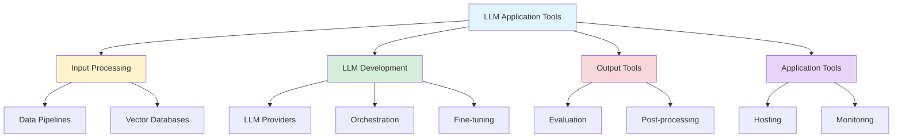
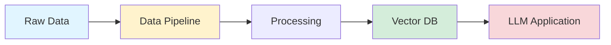
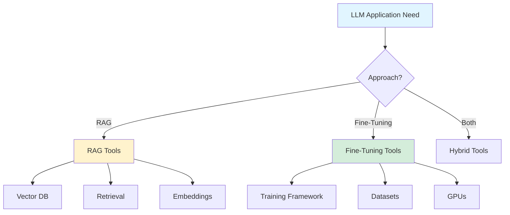

## Tools for Building LLM Applications: A Comprehensive Guide

*Curiosity:* What tools and frameworks are essential for building LLM applications? How do we navigate the rich landscape of available technologies?

**The LLM application landscape** is rich with diverse tools and technologies, each serving different needs and stages of development. Finding the right tools is crucial for building successful applications.

> **📖 Comprehensive Guide**: <https://github.com/aishwaryanr/awesome-generative-ai-guide/blob/main/free_courses/Applied_LLMs_Mastery_2024/week5_tools_for_LLM_apps.md>
{: .prompt-danger }

### Tool Categories Overview


```mermaid
graph TB
    A[LLM Application Tools] --> B[Input Processing]
    A --> C[LLM Development]
    A --> D[Output Tools]
    A --> E[Application Tools]
    
    B --> B1[Data Pipelines]
    B --> B2[Vector Databases]
    
    C --> C1[LLM Providers]
    C --> C2[Orchestration]
    C --> C3[Fine-tuning]
    
    D --> D1[Evaluation]
    D --> D2[Post-processing]
    
    E --> E1[Hosting]
    E --> E2[Monitoring]
    
    style A fill:#e1f5ff
    style B fill:#fff3cd
    style C fill:#d4edda
    style D fill:#f8d7da
    style E fill:#e7d4f8
```

### Four Main Tool Categories

| Category | Purpose | Key Tools | Use Case |
|:---------|:--------|:----------|:---------|
| **Input Processing** | Data ingestion & preparation | Pipelines, Vector DBs | RAG, Data prep |
| **LLM Development** | Model interaction & training | Providers, Orchestration | Development, Training |
| **Output Tools** | Post-processing & evaluation | Evaluation frameworks | Quality assessment |
| **Application Tools** | Hosting & monitoring | Deployment, Monitoring | Production |

### 1. Input Processing Tools

*Retrieve:* Handle data ingestion and prepare inputs for LLM applications.

**Purpose**: Process and prepare data for LLM consumption

**Components**:
- **Data Pipelines**: ETL, data transformation
- **Vector Databases**: Embedding storage and retrieval
- **Data Preprocessing**: Cleaning, formatting

**Tools**:
- **Vector DBs**: Pinecone, Weaviate, Chroma, Qdrant
- **Data Pipelines**: Apache Airflow, Prefect
- **ETL Tools**: dbt, Apache Spark

**Use Cases**:
- RAG applications
- Data preparation
- Embedding storage
- Document processing

**Architecture**:


```mermaid
graph LR
    A[Raw Data] --> B[Data Pipeline]
    B --> C[Processing]
    C --> D[Vector DB]
    D --> E[LLM Application]
    
    style A fill:#e1f5ff
    style B fill:#fff3cd
    style D fill:#d4edda
    style E fill:#f8d7da
```

### 2. LLM Development Tools

*Innovate:* Tools for interacting with, fine-tuning, and orchestrating LLMs.

**Purpose**: Develop and interact with Large Language Models

**Subcategories**:

| Subcategory | Tools | Purpose |
|:------------|:------|:--------|
| **LLM Providers** | OpenAI, Anthropic, Cohere | Model access |
| **Orchestration** | LangChain, LlamaIndex | Workflow management |
| **Fine-tuning** | Hugging Face, LLaMA-Factory | Model customization |
| **Experimentation** | Weights & Biases, MLflow | Experiment tracking |

**LLM Providers**:
- **OpenAI**: GPT-4, GPT-3.5
- **Anthropic**: Claude
- **Cohere**: Command models
- **Open Source**: Hugging Face, Ollama

**Orchestration Platforms**:
- **LangChain**: General-purpose framework
- **LlamaIndex**: RAG-focused
- **Haystack**: End-to-end NLP
- **Semantic Kernel**: Microsoft's framework

**Fine-tuning Tools**:
- **Hugging Face**: Transformers library
- **LLaMA-Factory**: Easy fine-tuning
- **Unsloth**: Fast fine-tuning
- **Axolotl**: Efficient training

### 3. Output Tools

*Retrieve:* Post-processing and evaluation tools for LLM outputs.

**Purpose**: Manage and refine LLM application outputs

**Tools**:
- **Evaluation Frameworks**: TruEra, RAGas, LangSmith
- **Output Processing**: Post-processing pipelines
- **Quality Assessment**: Metrics and scoring

**Evaluation Metrics**:
- Accuracy
- Relevance
- Coherence
- Factual correctness
- User satisfaction

**Example**:

```python
# Evaluation example
from ragas import evaluate
from datasets import Dataset

# Evaluate RAG system
results = evaluate(
    dataset=dataset,
    metrics=[
        "faithfulness",
        "answer_relevancy",
        "context_precision"
    ]
)
```

### 4. Application Tools

*Retrieve:* Tools for hosting, monitoring, and managing LLM applications.

**Purpose**: Production deployment and operations

**Components**:
- **Hosting**: Cloud platforms, containers
- **Monitoring**: Performance, errors, usage
- **Scaling**: Auto-scaling, load balancing

**Tools**:
- **Hosting**: AWS, GCP, Azure, Vercel
- **Monitoring**: LangSmith, Weights & Biases
- **APIs**: FastAPI, Flask
- **Containers**: Docker, Kubernetes

### RAG vs. Fine-Tuning Tools

*Innovate:* Different tools are needed for RAG versus fine-tuning approaches.

| Approach | Key Tools | Focus |
|:---------|:----------|:------|
| **RAG** | Vector DBs, Retrievers, Embeddings | Data retrieval |
| **Fine-Tuning** | Training frameworks, Datasets, GPUs | Model training |

**RAG Tools**:
- Vector databases
- Embedding models
- Retrieval frameworks
- Chunking tools

**Fine-Tuning Tools**:
- Training frameworks
- Dataset preparation
- GPU resources
- Experiment tracking

### Tool Selection Guide


```mermaid
graph TD
    A[LLM Application Need] --> B{Approach?}
    B -->|RAG| C[RAG Tools]
    B -->|Fine-Tuning| D[Fine-Tuning Tools]
    B -->|Both| E[Hybrid Tools]
    
    C --> C1[Vector DB]
    C --> C2[Retrieval]
    C --> C3[Embeddings]
    
    D --> D1[Training Framework]
    D --> D2[Datasets]
    D --> D3[GPUs]
    
    style A fill:#e1f5ff
    style C fill:#fff3cd
    style D fill:#d4edda
```

### Key Takeaways

*Retrieve:* LLM application tools fall into four categories: input processing, LLM development, output tools, and application tools, each serving different stages of development.

*Innovate:* By understanding tool categories and their purposes, you can select the right tools for RAG, fine-tuning, or hybrid approaches, building efficient LLM applications.

*Curiosity → Retrieve → Innovation:* Start with curiosity about LLM tools, retrieve insights from comprehensive guides, and innovate by selecting and combining tools for your specific use cases.

**Note**: This guide provides an overview of popular tools. For comprehensive coverage, explore the full guide linked above.

**Next Steps**:
- Review the comprehensive guide
- Identify tools for your use case
- Experiment with different tools
- Build your LLM application stack

{: .light .shadow .rounded-10 w='1212' h='668' }

<details markdown="1">
<summary style= "font-size:24px; line-height:24px; font-weight:bold; cursor:pointer;" > Translate to Korean </summary>

* * * 

## 🥁 Check out a comprehensive guide to the most popular tools and frameworks for building LLM applications.

- 👉 The landscape for building LLM applications is rich with various tools and technologies, each catering to different needs and process stages. 

- 👉 Finding and selecting the right tools and frameworks for your LLM app is key and takes time. Even if you are just starting out, it is very important to know what is out there and how everything works together!

⛳ To simplify the decision-making process, a detailed guide has been written to help navigate the vast pool of options available for LLM application development.

### 🔰 LLM tools can be broadly categorized into four categories.

- ⛳ Input Processing Tools: These tools are designed to handle data ingestion and prepare various inputs for the application. This includes data pipelines and vector databases, which are crucial for processing and preparing data for LLMs.

- ⛳ LLM Development Tools: This category includes tools that support
interacting with large language models. This includes services for calling LLMs, fine-tuning, conducting experiments, and managing orchestration. Examples include LLM providers, orchestration platforms, and computing and experimentation platforms.

- ⛳ Output Tools: Post-processing tools that manage and refine the output of LLM applications fall into this category. The focus is on processes after the LLM generates results, such as evaluation frameworks that assess the quality and relevance of the output.

- ⛳ Application Tools: Tools that manage all aspects of an LLM application, including hosting, monitoring, and more.

- 🎯 This guide provides in-depth insights into these types of tools, the various options, and their pros and cons, giving you a comprehensive view of what is available for building your application and how to best leverage these resources.

🛑 This guide is by no means comprehensive and is only intended to provide an overview of popular tools! 

In addition to categorizing these tools, a distinction has been made between the tools needed for RAG and those needed for fine-tuning LLMs.

</details>
