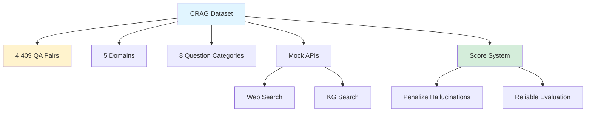

## CRAG: Comprehensive RAG Benchmark Dataset

*Curiosity:* How can we create a realistic benchmark for RAG systems? What makes CRAG more challenging than existing datasets?

**CRAG (Comprehensive RAG)** is a new benchmark dataset that provides robust and challenging test cases for evaluating RAG and QA systems. Even GPT-4 struggles, achieving less than 34% accuracy, highlighting the challenge.

> **Paper**: <https://arxiv.org/pdf/2406.04744>
{: .prompt-info}

### The Problem

*Retrieve:* Existing RAG datasets have limitations.

| Issue | Description | Impact |
|:------|:------------|:-------|
| **Lack of Diversity** | Limited question types | ⚠️ Incomplete evaluation |
| **Complexity Gap** | Don't represent real-world QA | ⚠️ Suboptimal assessment |
| **Evaluation Issues** | Poor performance metrics | ⚠️ Unreliable results |

**Result**: Suboptimal performance evaluation of RAG systems.

### CRAG Dataset Overview

*Innovate:* Comprehensive benchmark for RAG evaluation.

### Dataset Features

*Retrieve:* CRAG's comprehensive features.

| Feature | Details | Benefit |
|:--------|:--------|:--------|
| **QA Pairs** | 4,409 pairs | ⬆️ Large scale |
| **Domains** | 5 domains | ⬆️ Diversity |
| **Categories** | 8 question types | ⬆️ Coverage |
| **Complexity** | Simple facts to complex queries | ⬆️ Real-world |
| **Mock APIs** | Web and KG search | ⬆️ Realistic |
| **Score System** | Penalizes hallucinations | ⬆️ Reliable |

### Evaluation Tasks

*Innovate:* Comprehensive task coverage.

**Task Types**:
- **Web Retrieval**: Realistic web search scenarios
- **Structured Querying**: Knowledge Graph queries
- **Summarization**: Multi-document summarization

**Coverage**: From simple facts to complex multi-hop queries.

### Performance Results

*Retrieve:* CRAG reveals significant challenges.

| System | Accuracy | Notes |
|:-------|:---------|:------|
| **Advanced LLMs (GPT-4)** | <34% | Highlights challenge |
| **Direct RAG** | 44% | Needs improvement |
| **SOTA Industry RAG** | 63% | Without hallucination |

**Key Findings**:
- Even best LLMs struggle (<34%)
- Direct RAG only reaches 44%
- Industry solutions achieve 63% (best case)

### Score System Innovation

*Innovate:* Better evaluation through hallucination penalties.

**Key Feature**: Penalizes hallucinated answers more than missing answers

**Benefits**:
- ✅ Encourages accuracy over completeness
- ✅ Reduces false information
- ✅ More reliable evaluation
- ✅ Better reflects real-world needs

### Key Takeaways

*Retrieve:* CRAG provides a comprehensive benchmark with 4,409 QA pairs across 5 domains and 8 categories, including realistic retrieval scenarios and a score system that penalizes hallucinations.

*Innovate:* By creating a challenging benchmark that even GPT-4 struggles with (<34% accuracy), CRAG encourages development of more advanced RAG solutions, with industry SOTA reaching 63% accuracy.

*Curiosity → Retrieve → Innovation:* Start with curiosity about RAG evaluation, retrieve insights from CRAG's comprehensive approach, and innovate by building RAG systems that can handle the complexity and diversity of real-world QA tasks.

**Next Steps**:
- Read the full paper
- Test your RAG on CRAG
- Analyze performance gaps
- Improve your systems

{: .light .shadow .rounded-10 w='1212' h='668' }

 Translate to Korean 

* * * 

## 😉 다음은 RAG 파이프라인을 테스트할 수 있는 어려운 실제 벤치마크입니다! GPT-4와 같은 LLM조차도 34% 미만의 정확도를 달성하는 데 어려움을 겪고 있습니다.

기존 RAG 데이터 세트는 다양성이 부족하고 실제 QA 작업의 복잡성을 나타내지 못하여 성능 평가가 최적화되지 않습니다.

💡 CRAG(Comprehensive RAG)는 RAG 및 QA 시스템을 평가하기 위한 강력하고 도전적인 테스트 케이스를 제공하는 새로운 RAG 벤치마크 데이터 세트로, 신뢰할 수 있는 LLM 기반 질문 답변의 발전을 장려합니다.

- ⛳ CRAG에는 5개 도메인과 8개 질문 범주에 걸쳐 4,409개의 QA 쌍이 포함되어 있으며, 간단한 사실부터 복잡한 쿼리까지 다룹니다.
- ⛳ 웹 및 KG(Knowledge Graph) 검색을 위한 모의 API를 제공하여 현실적인 검색 시나리오를 제공합니다.
- ⛳ 미결 답변보다 환각에 걸린 답변에 더 많은 페널티를 주는 점수 시스템을 도입하여 신뢰할 수 있는 평가를 보장합니다.
- ⛳ 웹 검색, 구조적 쿼리 및 요약을 위한 작업을 제공하여 RAG 솔루션을 종합적으로 평가할 수 있습니다.

기여
- 👉 가장 진보된 LLM은 다음과 같은 성과를 거둡니다. <34% accuracy on CRAG, highlighting the challenge.
- 👉 Direct application of RAG improves accuracy to only 44%, indicating the need for more advanced solutions.
- 👉 State-of-the-art industry RAG solutions reach 63% accuracy without hallucination.

