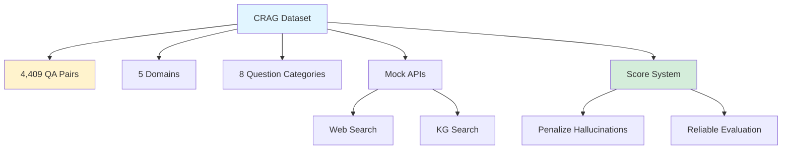

## CRAG: Comprehensive RAG Benchmark Dataset

*Curiosity:* How can we create a realistic benchmark for RAG systems? What makes CRAG more challenging than existing datasets?

**CRAG (Comprehensive RAG)** is a new benchmark dataset that provides robust and challenging test cases for evaluating RAG and QA systems. Even GPT-4 struggles, achieving less than 34% accuracy, highlighting the challenge.

> **Paper**: <https://arxiv.org/pdf/2406.04744>
{: .prompt-info}

### The Problem

*Retrieve:* Existing RAG datasets have limitations.

| Issue | Description | Impact |
|:------|:------------|:-------|
| **Lack of Diversity** | Limited question types | ⚠️ Incomplete evaluation |
| **Complexity Gap** | Don't represent real-world QA | ⚠️ Suboptimal assessment |
| **Evaluation Issues** | Poor performance metrics | ⚠️ Unreliable results |

**Result**: Suboptimal performance evaluation of RAG systems.

### CRAG Dataset Overview

*Innovate:* Comprehensive benchmark for RAG evaluation.

```mermaid
graph TB
    A[CRAG Dataset] --> B[4,409 QA Pairs]
    A --> C[5 Domains]
    A --> D[8 Question Categories]
    A --> E[Mock APIs]
    A --> F[Score System]
    
    E --> E1[Web Search]
    E --> E2[KG Search]
    
    F --> F1[Penalize Hallucinations]
    F --> F2[Reliable Evaluation]
    
    style A fill:#e1f5ff
    style B fill:#fff3cd
    style F fill:#d4edda
```

### Dataset Features

*Retrieve:* CRAG's comprehensive features.

| Feature | Details | Benefit |
|:--------|:--------|:--------|
| **QA Pairs** | 4,409 pairs | ⬆️ Large scale |
| **Domains** | 5 domains | ⬆️ Diversity |
| **Categories** | 8 question types | ⬆️ Coverage |
| **Complexity** | Simple facts to complex queries | ⬆️ Real-world |
| **Mock APIs** | Web and KG search | ⬆️ Realistic |
| **Score System** | Penalizes hallucinations | ⬆️ Reliable |

### Evaluation Tasks

*Innovate:* Comprehensive task coverage.

**Task Types**:
- **Web Retrieval**: Realistic web search scenarios
- **Structured Querying**: Knowledge Graph queries
- **Summarization**: Multi-document summarization

**Coverage**: From simple facts to complex multi-hop queries.

### Performance Results

*Retrieve:* CRAG reveals significant challenges.

| System | Accuracy | Notes |
|:-------|:---------|:------|
| **Advanced LLMs (GPT-4)** | <34% | Highlights challenge |
| **Direct RAG** | 44% | Needs improvement |
| **SOTA Industry RAG** | 63% | Without hallucination |

**Key Findings**:
- Even best LLMs struggle (<34%)
- Direct RAG only reaches 44%
- Industry solutions achieve 63% (best case)

### Score System Innovation

*Innovate:* Better evaluation through hallucination penalties.

**Key Feature**: Penalizes hallucinated answers more than missing answers

**Benefits**:
- ✅ Encourages accuracy over completeness
- ✅ Reduces false information
- ✅ More reliable evaluation
- ✅ Better reflects real-world needs

### Key Takeaways

*Retrieve:* CRAG provides a comprehensive benchmark with 4,409 QA pairs across 5 domains and 8 categories, including realistic retrieval scenarios and a score system that penalizes hallucinations.

*Innovate:* By creating a challenging benchmark that even GPT-4 struggles with (<34% accuracy), CRAG encourages development of more advanced RAG solutions, with industry SOTA reaching 63% accuracy.

*Curiosity → Retrieve → Innovation:* Start with curiosity about RAG evaluation, retrieve insights from CRAG's comprehensive approach, and innovate by building RAG systems that can handle the complexity and diversity of real-world QA tasks.

**Next Steps**:
- Read the full paper
- Test your RAG on CRAG
- Analyze performance gaps
- Improve your systems

{: .light .shadow .rounded-10 w='1212' h='668' }

 Translate to Korean 

* * * 

## 😉 Here is a challenging, real-world benchmark to test your RAG pipeline! Even LLMs like GPT-4 struggle to achieve less than 34% accuracy.

Existing RAG datasets lack diversity and fail to represent the complexity of real-world QA tasks, resulting in suboptimal performance evaluation.

💡 CRAG (Comprehensive RAG) is a new RAG benchmark dataset that provides robust and challenging test cases for evaluating RAG and QA systems, encouraging advances in reliable LLM-based question answering.

- ⛳ CRAG contains 4,409 QA pairs across 5 domains and 8 question categories, covering everything from simple facts to complex queries.
- ⛳ It provides mock APIs for web and KG (Knowledge Graph) retrieval to simulate realistic retrieval scenarios.
- ⛳ It introduces a scoring system that penalizes hallucinated answers more than unanswered ones, ensuring reliable evaluation.
- ⛳ It provides tasks for web search, structured querying, and summarization, enabling comprehensive evaluation of RAG solutions.

Contributions
- 👉 The most advanced LLMs achieve <34% accuracy on CRAG, highlighting the challenge.
- 👉 Direct application of RAG improves accuracy to only 44%, indicating the need for more advanced solutions.
- 👉 State-of-the-art industry RAG solutions reach 63% accuracy without hallucination.

