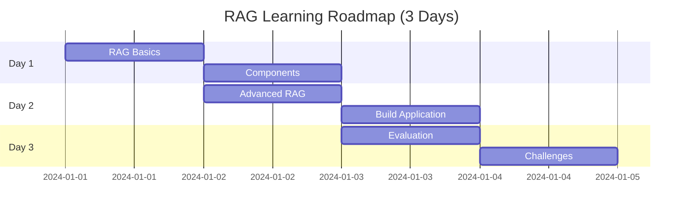
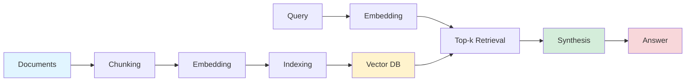
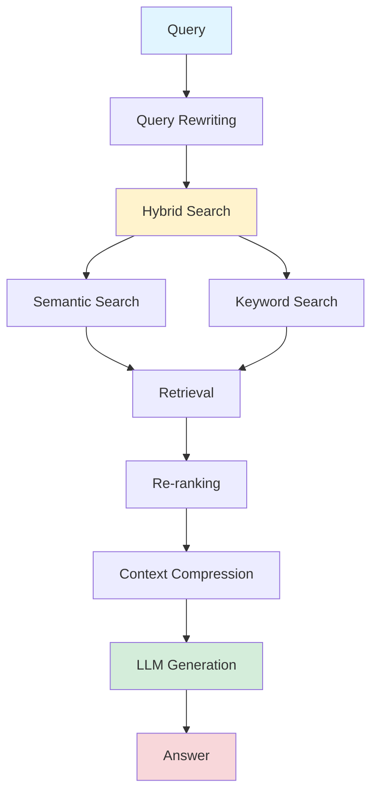
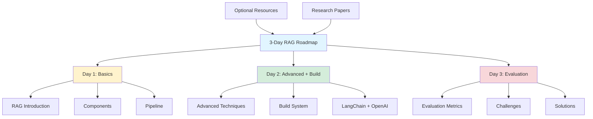

## Build Your RAG Application in 3 Days: A Hands-On Roadmap

*Curiosity:* How can we build a production-ready RAG application quickly? What's the fastest path from basics to advanced RAG implementation?

**RAG (Retrieval Augmented Generation)** has emerged as an extremely popular LLM application. Its appeal lies in its lightweight design and the simplicity of integrating it with any foundational LLM.

> **📖 Complete Roadmap**: <https://github.com/aishwaryanr/awesome-generative-ai-guide/blob/main/resources/RAG_roadmap.md>
{: .prompt-info}

### 3-Day Learning Path



**Time Commitment**: 2-3 hours per day

### Day 1: Introduction to RAG

*Retrieve:* Understand RAG fundamentals and core components.

**Learning Objectives**:
- ✅ What is Retrieval Augmented Generation?
- ✅ Key components: Ingestion, Retrieval, Synthesis
- ✅ Pipeline components: Chunking, Embedding, Indexing, Top-k Retrieval, Generation

**Topics Covered**:

| Topic | Description | Key Concepts |
|:------|:------------|:-------------|
| **RAG Basics** | What is RAG? | Retrieval + Generation |
| **Ingestion** | Data preparation | Document loading, preprocessing |
| **Retrieval** | Information retrieval | Vector search, similarity |
| **Synthesis** | Answer generation | LLM integration, context |

**RAG Pipeline**:



**Key Components**:
- **Chunking**: Split documents into manageable pieces
- **Embedding**: Convert text to vectors
- **Indexing**: Store in vector database
- **Top-k Retrieval**: Find most relevant chunks
- **Generation**: Create answer from context

### Day 2: Advanced RAG + Build Your Own System

*Innovate:* Learn advanced techniques and build a complete RAG application.

**Learning Objectives**:
- ✅ Advanced RAG optimizations
- ✅ Build RAG system with LangChain and OpenAI
- ✅ Implement advanced retrieval techniques

**Advanced Techniques**:

| Technique | Description | Benefit |
|:----------|:------------|:--------|
| **Self-Querying Retrieval** | LLM-generated queries | ⬆️ Better retrieval |
| **Parent Document Retriever** | Hierarchical retrieval | ⬆️ Context preservation |
| **Hybrid Search** | Semantic + keyword | ⬆️ Retrieval quality |
| **Compressors** | Context compression | ⬇️ Token usage |
| **HyDE** | Hypothetical documents | ⬆️ Query understanding |

**Building RAG System**:

```python
# Example: Building RAG with LangChain
from langchain.vectorstores import Chroma
from langchain.embeddings import OpenAIEmbeddings
from langchain.chains import RetrievalQA
from langchain.llms import OpenAI

# 1. Load and chunk documents
from langchain.text_splitter import RecursiveCharacterTextSplitter
text_splitter = RecursiveCharacterTextSplitter(chunk_size=1000, chunk_overlap=200)
documents = text_splitter.split_documents(load_documents())

# 2. Create embeddings and vector store
embeddings = OpenAIEmbeddings()
vectorstore = Chroma.from_documents(documents, embeddings)

# 3. Create retrieval chain
qa_chain = RetrievalQA.from_chain_type(
    llm=OpenAI(),
    chain_type="stuff",
    retriever=vectorstore.as_retriever(search_kwargs={"k": 3})
)

# 4. Query
result = qa_chain.run("What is RAG?")
print(result)
```

**Advanced RAG Architecture**:



### Day 3: RAG Evaluation and Challenges

*Retrieve:* Learn how to evaluate RAG systems and address common challenges.

**Learning Objectives**:
- ✅ Evaluation metrics (TruEra, RAGas)
- ✅ RAG pain points and solutions
- ✅ Production best practices

**Evaluation Metrics**:

| Metric | Framework | Purpose |
|:-------|:----------|:--------|
| **Faithfulness** | RAGas | Factual accuracy |
| **Answer Relevancy** | RAGas | Answer quality |
| **Context Precision** | RAGas | Retrieval quality |
| **Context Recall** | RAGas | Coverage |
| **TruEra Metrics** | TruEra | Comprehensive evaluation |

**Evaluation Example**:

```python
from ragas import evaluate
from datasets import Dataset

# Prepare evaluation dataset
dataset = Dataset.from_dict({
    "question": ["What is RAG?"],
    "contexts": [["RAG is retrieval augmented generation..."]],
    "answer": ["RAG combines retrieval and generation..."],
    "ground_truth": ["RAG is a technique that..."]
})

# Evaluate
results = evaluate(
    dataset=dataset,
    metrics=["faithfulness", "answer_relevancy", "context_precision"]
)
print(results)
```

**Common RAG Challenges**:

| Challenge | Description | Solution |
|:----------|:------------|:---------|
| **Poor Retrieval** | Irrelevant context | Better embeddings, hybrid search |
| **Context Window** | Limited tokens | Compression, summarization |
| **Hallucination** | Incorrect facts | Better retrieval, fact-checking |
| **Latency** | Slow responses | Caching, optimization |
| **Scalability** | Large datasets | Efficient indexing, sharding |

### Complete Roadmap Structure



### Additional Resources

**Optional Reading**:
- RAG research papers
- Advanced techniques
- Best practices
- Case studies

**2024 RAG Research Papers**:
- Latest RAG improvements
- Novel architectures
- Evaluation methods
- Production deployments

### Key Takeaways

*Retrieve:* This 3-day roadmap provides a structured path from RAG basics to building and evaluating production-ready applications.

*Innovate:* By following this roadmap, you'll learn advanced RAG techniques, build your own system, and understand how to evaluate and optimize RAG applications.

*Curiosity → Retrieve → Innovation:* Start with curiosity about RAG, retrieve knowledge through the structured roadmap, and innovate by building your own RAG applications.

**Next Steps**:
- Follow the 3-day roadmap
- Build your RAG system
- Evaluate and optimize
- Deploy to production

{: .light .shadow .rounded-10 w='1212' h='668' }

<details markdown="1">
<summary style= "font-size:24px; line-height:24px; font-weight:bold; cursor:pointer;" > Translate to Korean </summary>

* * * 

## RAG(Retrieval Augmented Generation)는 LLM 분야에서 매우 인기 있는 애플리케이션으로 부상했습니다. 

이 게임의 매력은 경량 설계와 기본 LLM과 통합할 수 없다는 점에 있습니다.

💡 이 3일 가이드를 사용하여 RAG의 진화하는 환경과 최신 개발에 대해 알아보세요! 매일 2-3 시간을 자원에 투자하십시오.

🥁 기본 사항부터 시작하여 고급 아이디어로 이동하고, LangChain을 사용하여 앱을 빌드하고, 평가하는 방법을 배웁니다. 또한 이 분야의 최신 연구를 따라잡을 수 있는 리소스도 추가했습니다.

### ⛳ 1일차: RAG 소개
- 👉 검색 증강 생성이란 무엇입니까?
- 👉 RAG의 핵심 구성 요소: Ingestion, Retrieval, Synthesis
- 👉 RAG 파이프라인 구성 요소: 청크, 임베딩, 인덱싱, Top-k 검색 및 생성

### ⛳ 2일차: 고급 RAG + 나만의 RAG 시스템 구축하기
- 👉 고급 RAG 최적화: Self Querying Retrieval, Parent Document 👉 Retriever, Hybrid Search, Compressors, HyDE 등
- 👉 LangChain 및 OpenAI로 자체 RAG 시스템 구축
고급 RAG 응용 프로그램 구축을 위한 리소스

### ⛳3일차: RAG 평가 및 과제
- 👉TruEra 및 RAGas에서 일반적으로 사용되는 평가 지표
- 👉RAG의 문제점 및 해결 방법

🥁🥁로드맵에는 다음 내용도 포함되어 있습니다: Optional Reading Resources & Top 2024 RAG research papers

</details>