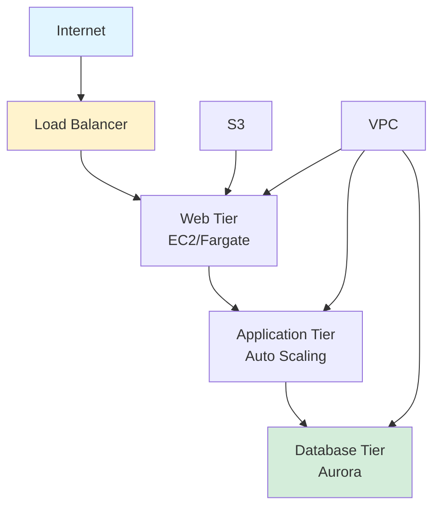

## Building Resilient 3-Tier Architecture on AWS

*Curiosity:* How can you gain practical AWS experience? What's better than building To-do apps for learning cloud architecture?

**Want to land that dream cloud job?** Stop building To-do apps. The best way to get practical hands-on experience with AWS is to build a 3-tier application. This architecture teaches you production-ready AWS skills.

{: .light .shadow .rounded-10 w='1212' h='668' }

### Architecture Overview

*Retrieve:* 3-tier architecture components and benefits.

### What You'll Learn

*Innovate:* Comprehensive AWS skills through hands-on practice.

| Category | Components | Skills Gained |
|:---------|:-----------|:--------------|
| **Network** | VPC, Subnets, Route tables | ⬆️ Network design |
| **Security** | Security groups, NACLs | ⬆️ Security configuration |
| **Application** | EC2/Fargate, Auto Scaling | ⬆️ Compute management |
| **Storage & Database** | S3, Amazon Aurora | ⬆️ Data management |

### Architecture Components

*Retrieve:* Detailed breakdown of each tier.

**1. Web Tier**:
- EC2 instances or Fargate containers
- Load balancer for distribution
- Auto Scaling for availability

**2. Application Tier**:
- Application servers
- Auto Scaling groups
- Health checks

**3. Database Tier**:
- Amazon Aurora
- Multi-AZ deployment
- Automated backups

**4. Network Layer**:
- VPC with public/private subnets
- Route tables for traffic routing
- Internet Gateway and NAT Gateway

**5. Security Layer**:
- Security groups (stateful)
- Network ACLs (stateless)
- IAM roles and policies

### Benefits of This Project

*Innovate:* Why this project matters for your career.

**Practical Skills**:
- ✅ Real-world architecture patterns
- ✅ Production-ready configurations
- ✅ AWS best practices
- ✅ Troubleshooting experience

**Portfolio Value**:
- ✅ Demonstrates AWS expertise
- ✅ Shows architecture understanding
- ✅ Proves hands-on experience
- ✅ Stands out from To-do apps

### Key Takeaways

*Retrieve:* Building a 3-tier application on AWS teaches practical skills in networking, security, application services, and storage/database management.

*Innovate:* By building this architecture instead of simple To-do apps, you gain production-ready AWS experience that demonstrates real expertise and helps land cloud jobs.

*Curiosity → Retrieve → Innovation:* Start with curiosity about AWS architecture, retrieve insights from building a 3-tier application, and innovate by applying these skills to real-world projects and your career.

**Next Steps**:
- Find 3-tier app workshop
- Build the architecture
- Document your learnings
- Add to your portfolio

