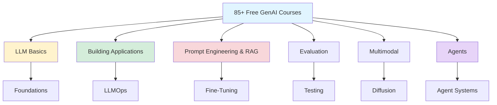
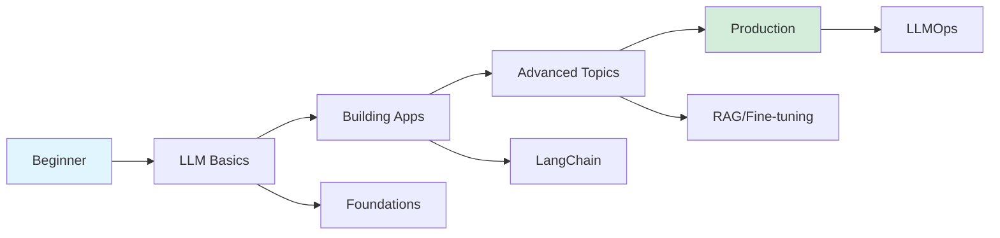



> Video Channel : <https://www.youtube.com/@aishwaryanr4606>

> 3 Days Course for RAG : <https://akillness.github.io/posts/rag-application-in-just-3-days/>
{: .prompt-info}

Due to character limits, I've included only about 30 courses in this post. You can find all courses and their URLs on GitHub repository: <https://github.com/aishwaryanr/awesome-generative-ai-guide?tab=readme-ov-file#book-list-of-free-genai-courses>

## 85+ Free GenAI Courses: Comprehensive Learning Resources

*Curiosity:* How can we systematically learn Generative AI? What are the best free resources for mastering LLMs, RAG, fine-tuning, and agentic applications?

**Updated with over 85 free GenAI courses**, including a dedicated section for Agents! This comprehensive collection covers everything from LLM basics to advanced applications.



> **Video Channel**: <https://www.youtube.com/@aishwaryanr4606>
> 
> **3-Day RAG Course**: <https://akillness.github.io/posts/rag-application-in-just-3-days/>
{: .prompt-info}

> **Complete Course List**: <https://github.com/aishwaryanr/awesome-generative-ai-guide?tab=readme-ov-file#book-list-of-free-genai-courses>
{: .prompt-tip}

### Prompt Engineering Report

*Retrieve:* The ultimate guide to prompt engineering with comprehensive coverage.

**Key Features**:
- 📚 Taxonomy of prompting techniques
- 📖 33 terms vocabulary
- 🔬 58 text-only techniques
- 🎨 40 multimodal techniques
- 📊 Meta-analysis of literature

**Link**: <https://arxiv.org/pdf/2406.06608>

### AutoRAG Framework

*Innovate:* Automated RAG hyperparameter tuning using multi-armed bandit approach.

**Key Features**:
- 🤖 AutoML principles
- 🔄 Online hyperparameter tuning
- 🎯 Multi-armed bandit formulation
- 📊 Hierarchical MAB (Hier-MAB)

**Considerations**:
- ⚠️ Implementation can be expensive
- ⏱️ Time-consuming setup
- ✅ Innovative approach

**Link**: <https://arxiv.org/pdf/2406.19251>

### Course Categories

### ⛳ LLM Basics and Foundations

*Retrieve:* Essential courses for understanding LLM fundamentals.

| Course | Provider | Focus |
|:-------|:---------|:------|
| **Large Language Models** | ETH Zurich | Core concepts |
| **Understanding LLMs** | Princeton | Deep understanding |
| **Transformers Course** | Hugging Face | Architecture |
| **NLP Course** | Hugging Face | NLP fundamentals |
| **CS324 - LLMs** | Stanford | Advanced topics |
| **GenAI with LLMs** | Coursera | Practical applications |
| **Introduction to GenAI** | Coursera | Basics |
| **GenAI Fundamentals** | Google Cloud | Cloud perspective |
| **Introduction to LLMs** | Google Cloud | Google's approach |
| **GenAI Concepts** | DataCamp | Comprehensive overview |

### ⛳ Building LLM Applications

*Innovate:* Courses for building production-ready LLM applications.

| Course | Provider | Focus |
|:-------|:---------|:------|
| **LLMOps** | Udacity | Production deployment |
| **Full Stack LLM Bootcamp** | FSDL | End-to-end development |
| **GenAI for Beginners** | Microsoft | Getting started |
| **LLMs: Application to Production** | Databricks | Production pipeline |
| **GenAI Foundations** | AWS | AWS ecosystem |
| **GenAI Community Course** | ineuron | Community-driven |
| **LLM University** | Cohere | Cohere's platform |
| **LLM Learning Lab** | Lightning AI | Hands-on learning |
| **Functions, Tools, Agents** | DeepLearning.AI | LangChain agents |
| **LangChain for LLM Apps** | DeepLearning.AI | LangChain framework |
| **LLMOps** | DeepLearning.AI | Operations |
| **Automated Testing for LLMOps** | DeepLearning.AI | Testing strategies |

### ⛳ Prompt Engineering, RAG, and Fine-Tuning

*Retrieve:* Advanced techniques for optimizing LLM performance.

| Course | Provider | Focus |
|:-------|:---------|:------|
| **LangChain & Vector DBs** | Activeloop | Production RAG |
| **RLHF** | DeepLearning.AI | Human feedback |
| **Building with Vector DBs** | DeepLearning.AI | Vector databases |
| **How Diffusion Models Work** | DeepLearning.AI | Diffusion models |
| **Finetuning LLMs** | DeepLearning.AI | Fine-tuning |
| **LangChain: Chat with Data** | DeepLearning.AI | RAG applications |
| **Building with ChatGPT API** | DeepLearning.AI | API integration |
| **ChatGPT Prompt Engineering** | DeepLearning.AI | Prompt engineering |

### ⛳ Evaluation

*Retrieve:* Courses for evaluating and debugging LLM applications.

| Course | Provider | Focus |
|:-------|:---------|:------|
| **Building & Evaluating RAG** | DeepLearning.AI | RAG evaluation |
| **Evaluating GenAI Models** | DeepLearning.AI | W&B evaluation |

### ⛳ Multimodal

*Innovate:* Courses covering multimodal AI applications.

| Course | Provider | Focus |
|:-------|:---------|:------|
| **How Diffusion Models Work** | DeepLearning.AI | Multimodal generation |

### Learning Path Recommendation

### Key Takeaways

*Retrieve:* Over 85 free GenAI courses covering LLM basics, application building, RAG, fine-tuning, evaluation, and multimodal AI.

*Innovate:* By following structured learning paths through these courses, you can systematically master Generative AI from fundamentals to production deployment.

*Curiosity → Retrieve → Innovation:* Start with curiosity about GenAI, retrieve knowledge from comprehensive courses, and innovate by building your own applications.

**Next Steps**:
- Explore the complete course list on GitHub
- Choose courses based on your level
- Follow structured learning paths
- Build projects as you learn

{: .light .shadow .rounded-10 w='1212' h='668' }

> AutoRAG 리뷰(야구로 이해해보자) : <https://velog.io/@autorag/AutoRAG-%ED%8C%80%EC%9D%98-AutoRAG-HP-%EB%85%BC%EB%AC%B8-%EB%A6%AC%EB%B7%B0-%EC%95%BC%EA%B5%AC%EB%A1%9C-%EC%9D%B4%ED%95%B4%ED%95%B4%EB%B3%B4%EC%9E%90>
{: .prompt-info}

### ⛳ LLM Basics and Foundations
- Large Language Models by ETH Zurich
- Understanding Large Language Models by Princeton
- Transformers course by Huggingface
- NLP course by Huggingface
- CS324 - Large Language Models by Stanford
- Generative AI with Large Language Models by Coursera
- Introduction to Generative AI by Coursera
- Generative AI Fundamentals by Google Cloud
- Introduction to Large Language Models by Google Cloud
- Introduction to Generative AI by Google Cloud
- Generative AI Concepts by DataCamp (Daniel Tedesco Data Lead @ Google)

### ⛳ Building LLM Applications
- LLMOps: Building Real-World Applications With Large Language Models by Udacity
- Full Stack LLM Bootcamp by FSDL
- Generative AI for beginners by Microsoft
- Large Language Models: Application through Production by Databricks
- Generative AI Foundations by AWS
- Introduction to Generative AI Community Course by ineuron
- LLM University by Cohere
- LLM Learning Lab by Lightning AI
- Functions, Tools and Agents with LangChain by DeeplearningAI
- LangChain for LLM Application Development by DeeplearningAI
- LLMOps by DeepLearning.AI
- Automated Testing for LLMOps by DeepLearningAI

### ⛳Prompt Engineering, RAG and Fine-Tuning
- LangChain & Vector Databases in Production by Activeloop
- Reinforcement Learning from Human Feedback by DeepLearningAI
- Building Applications with Vector Databases by DeepLearningAI
- How Diffusion Models Work by DeepLearningAI
- Finetuning Large Language Models by DeeplearningAI
- LangChain: Chat with Your Data by DeeplearningAI
- Building Systems with the ChatGPT API by DeeplearningAI
- Building Applications with Vector Databases by DeeplearningAI
- ChatGPT Prompt Engineering for Developers by DeeplearningAI

### ⛳ Evaluation
- Building and Evaluating Advanced RAG Applications by DeepLearningAI
- Evaluating and Debugging Generative AI Models Using Weights and Biases by DeeplearningAI

### ⛳Multimodal
How Diffusion Models Work by DeepLearning.AI

{: .light .shadow .rounded-10 w='1212' h='668' }

 Translate to Korean 

* * * 

글자 수 제한으로 인해 이 게시물에는 약 30개의 과정만 포함했습니다. GitHub 저장소에서 모든 과정과 해당 URL을 찾을 수 있습니다.

### ⛳ LLM 기초와 기초
- ETH Zurich의 대규모 언어 모델
- Princeton의 대규모 언어 모델 이해
- Huggingface의 트랜스포머 코스
- Huggingface의 NLP 과정
- CS324 - 스탠포드의 대규모 언어 모델
- Coursera의 대규모 언어 모델을 사용한 생성형 AI
- Coursera의 생성형 AI 소개
- Google Cloud의 생성형 AI 기초
- Google Cloud의 대규모 언어 모델 소개
- Google Cloud의 생성형 AI 소개
- DataCamp의 생성형 AI 개념(Daniel Tedesco 데이터 책임자 @ Google)

### ⛳ LLM 애플리케이션 구축하기
- LLMOps: Udacity의 대규모 언어 모델을 사용하여 실제 애플리케이션 구축
- FSDL의 풀스택 LLM 부트캠프
- Microsoft의 초보자를 위한 생성형 AI
- 대규모 언어 모델: Databricks의 프로덕션을 통한 애플리케이션
- AWS의 생성형 AI 기반
- ineuron의 생성형 AI 커뮤니티 강좌 소개
- LLM University by Cohere (코히어)
- Lightning AI의 LLM Learning Lab
- DeeplearningAI의 LangChain을 사용한 기능, 도구 및 에이전트
- DeeplearningAI를 이용한 LLM 애플리케이션 개발을 위한 LangChain
- LLMOps by DeepLearning.AI
- DeepLearningAI를 통한 LLMOps 자동화 테스트

### ⛳프롬프트 엔지니어링, RAG 및 미세 조정
- Activeloop의 생산에 사용되는 LangChain 및 벡터 데이터베이스
- DeepLearningAI의 인간 피드백을 통한 강화 학습
- DeepLearningAI의 벡터 데이터베이스로 애플리케이션 구축
- DeepLearningAI의 확산 모델 작동 방식
- DeeplearningAI를 통한 대규모 언어 모델 미세 조정
- LangChain: DeeplearningAI의 데이터와 채팅하기
- DeeplearningAI의 ChatGPT API로 시스템 구축
- DeeplearningAI의 벡터 데이터베이스를 이용한 애플리케이션 구축
- DeeplearningAI의 개발자를 위한 ChatGPT 프롬프트 엔지니어링

### ⛳ 평가
- DeepLearningAI를 이용한 고급 RAG 애플리케이션 구축 및 평가
- DeeplearningAI의 가중치와 편향을 사용하여 생성형 AI 모델 평가 및 디버깅

### ⛳복합
DeepLearning.AI 별 확산 모델의 작동 방식

