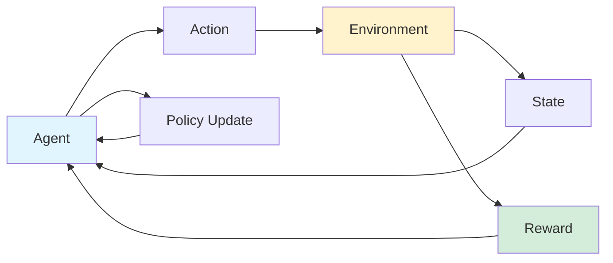

## Reinforcement Learning: Terms, Policies, Models, and Top 40 Libraries

*Curiosity:* What is reinforcement learning? How do agents learn to make better decisions through interaction with environments?

**Reinforcement Learning (RL)** is a type of machine learning where an agent interacts with an environment, receives feedback, and makes better decisions over time through trial and error.

### RL Overview

*Retrieve:* Understanding reinforcement learning fundamentals.

### Key Terms in RL

*Retrieve:* Essential RL terminology.

| Term | Symbol | Description | Purpose |
|:-----|:-------|:------------|:--------|
| **Environment** | - | System the agent interacts with | ⬆️ Learning context |
| **Agent** | - | Autonomous entity | ⬆️ Decision maker |
| **Feedback** | - | Rewards or penalties | ⬆️ Learning signal |
| **State** | S | Current situation | ⬆️ Context |
| **Policy** | π | Strategy for actions | ⬆️ Decision rule |
| **Value** | V | Expected long-term return | ⬆️ State evaluation |
| **Q-Value** | Q | Long-term return of action | ⬆️ Action evaluation |
| **Model** | - | Environment simulation | ⬆️ Planning | 

—————————

### Model/Policy Classifications

*Retrieve:* Different approaches to RL.

**Model-Free vs Model-Based**:

| Type | Description | Use Case |
|:-----|:------------|:---------|
| **Model-Based** | Uses environment model | ⬆️ When model available |
| **Model-Free** | Trial-and-error learning | ⬆️ When model unknown |

**On-Policy vs Off-Policy**:

| Type | Description | Learning Source |
|:-----|:------------|:----------------|
| **On-Policy** | Learns from current policy | ⬆️ Current actions |
| **Off-Policy** | Learns from different policy | ⬆️ Other policy data |

—————————

### Well-Known RL Models

*Retrieve:* Popular RL algorithms and their characteristics.

| Model | Type | Description | Advantage |
|:------|:-----|:------------|:----------|
| **Q-Learning** | Model-free | Q-table for best actions | ⬆️ Simple, effective |
| **SARSA** | Model-based | Updates based on next state-action | ⬆️ On-policy learning |
| **DQN** | Model-free | Deep networks for Q-function | ⬆️ Handles large states |
| **DDPG** | Model-free | Deep deterministic policy | ⬆️ Continuous actions |

**DDPG Advantage**: Handles complex environments and large state spaces better than traditional RL algorithms. 

—————————

### RL Applications

*Innovate:* Diverse applications of reinforcement learning.

| Category | Applications | Impact |
|:---------|:-------------|:-------|
| **Robotics** | Robot control, manipulation | ⬆️ Automation |
| **Transportation** | Autonomous vehicles, traffic control | ⬆️ Safety, efficiency |
| **Healthcare** | Treatment optimization | ⬆️ Patient outcomes |
| **Finance** | Trading, portfolio management | ⬆️ Returns |
| **Gaming** | Game AI, strategy | ⬆️ Entertainment |
| **Energy** | Smart grids, management | ⬆️ Efficiency |
| **Business** | Marketing, recommendations | ⬆️ Revenue |
| **Technology** | NLP, cybersecurity | ⬆️ Capabilities |
| **Industry** | Manufacturing, automation | ⬆️ Productivity |
| **Research** | Space exploration, agriculture | ⬆️ Innovation |

—————————

### Top 40 Python RL Libraries

*Retrieve:* Comprehensive list of reinforcement learning libraries.

| Library | Framework | Focus | Use Case |
|:--------|:----------|:------|:---------|
| **Gym** | OpenAI | Environments | ⬆️ Standard environments |
| **Stable-Baselines** | TensorFlow/PyTorch | Algorithms | ⬆️ Easy implementation |
| **Ray RLlib** | Ray | Distributed RL | ⬆️ Scalability |
| **TF-Agents** | TensorFlow | Agents | ⬆️ TensorFlow integration |
| **Acme** | JAX | Research | ⬆️ Advanced research |
| **Tianshou** | PyTorch | Algorithms | ⬆️ PyTorch ecosystem |
| **CleanRL** | PyTorch | Clean code | ⬆️ Learning |
| **PettingZoo** | Multi-agent | Multi-agent RL | ⬆️ Multi-agent |
| **Dopamine** | TensorFlow | Research | ⬆️ Google research |
| **MushroomRL** | Python | Algorithms | ⬆️ Research |

**Complete List** (40 libraries):
Gym, Baselines, Dopamine, TensorLayer, FinRL, Stable-Baselines, ReAgent, Acme, PARL, TF-Agents, TensorFlow, PyTorchRL, Keras-RL, Garage, TensorForce, RLax, Coach, RFRL, Rliable, ViZDoom, Ray RLlib, ReAgent (Horizon), ChainerRL, MushroomRL, TRFL, CleanRL, Tianshou, MAgent, rl-baselines3-zoo, PettingZoo, RLlib, RoboRL, H-baselines, DI-engine, and more.

### Key Takeaways

*Retrieve:* Reinforcement learning enables agents to learn through environment interaction, with various algorithms (Q-Learning, DQN, DDPG) and applications across robotics, gaming, finance, and more.

*Innovate:* By leveraging Python RL libraries like Gym, Stable-Baselines, and Ray RLlib, you can build RL systems for diverse applications, from game AI to autonomous vehicles, using proven algorithms and frameworks.

*Curiosity → Retrieve → Innovation:* Start with curiosity about reinforcement learning, retrieve insights from RL terms, models, and libraries, and innovate by building RL applications that solve real-world problems.

**Next Steps**:
- Choose an RL library
- Start with simple environments
- Implement basic algorithms
- Build your RL application

———————————————

⭆ 𝐑𝐞𝐠𝐢𝐬𝐭𝐞𝐫 𝐟𝐨𝐫 𝐅𝐫𝐞𝐞 𝐎𝐧𝐥𝐢𝐧𝐞 𝐇𝐚𝐧𝐝𝐬-𝐨𝐧 𝐃𝐚𝐭𝐚 𝐒𝐜𝐢𝐞𝐧𝐜𝐞 𝐓𝐮𝐭𝐨𝐫𝐢𝐚𝐥 (𝐄𝐧𝐝 𝐭𝐨 𝐄𝐧𝐝 𝐏𝐫𝐨𝐣𝐞𝐜𝐭): <https://www.maryammiradi.com/sonar>

{: .light .shadow .rounded-10 w='1212' h='668' }

 Translate to Korean 

* * * 

RL은 에이전트가 환경과 상호 작용하고, 피드백을 받고, 시간이 지남에 따라 더 나은 결정을 내릴 수 있도록 하는 기계 학습의 한 유형입니다.

—————————

## 📝 RL에서 사용되는 용어:

- ⌘ 환경: 에이전트가 상호 작용하는 시스템 또는 상황입니다. 

- ⌘ 에이전트(Agent): 환경과 상호 작용하는 자율적인 개체를 의미합니다.

- ⌘ 피드백: 에이전트가 조치(보상 또는 페널티)를 취한 후 환경에서 에이전트에게 제공하는 정보를 나타냅니다.

- ⌘ 상태(S): 환경에서 반환되는 현재 상황입니다.

- ⌘ 정책(π): 에이전트가 다음 행동을 결정하기 위해 사용하는 전략입니다.

- ⌘ 가치 (V) : 예상되는 장기 수익 

- ⌘ Q-Value (Q): 주어진 현재 행동의 장기 수익 

- ⌘ 모델: 환경 시뮬레이션을 의미합니다. 

—————————

## 📖 RL의 모델/정책:

모델 프리(Model-Free) vs 모델 기반(Model-Based):

- ๏ 상태 공간과 액션 공간이 커지는 모델 기반 작품
- ๏ Model-free 알고리즘은 지식을 업데이트하기 위해 시행착오에 의존합니다.

온-폴리시(On-Policy) vs 오프-폴리시(Off-Policy):

- ๏ On-policy 에이전트는 현재 정책에서 파생된 현재 작업을 기반으로 학습합니다. 
- ๏ Off-policy 카운터 파트는 다른 정책을 기반으로 학습합니다.

—————————

## 🤖 잘 알려진 RL 모델:

- ➊ Q-러닝:

Q-테이블을 사용하여 상태에 대한 최상의 작업을 저장하는 모델 없는 알고리즘입니다.

- ➋ 국가-행동-보상-국가-행동(SARSA):

보상 및 다음 상태-행동을 기반으로 상태-행동 값을 업데이트하는 모델 기반 알고리즘입니다.

- ➌ 딥 Q 네트워크(DQN):

심층 신경망을 사용하여 Q-function을 근사화하는 모델 없는 알고리즘입니다.

- ➍ 심층 결정론적 정책 그래디언트(DDPG):

DDPG는 심층 신경망을 사용하여 기존 RL 알고리즘보다 더 복잡한 환경과 대규모 상태 공간을 처리합니다. 

—————————

## 🛠️ 다음은 강화 학습(RL)의 몇 가지 응용 분야입니다.

- » 로보틱스
- » 자율 주행 차량
- » 헬스케어
- » 금융
- » 노름
- » 에너지 관리
- » 마케팅 및 광고
- » 자연어 처리
- » 제조업
- » 스마트 그리드
- » 공급망 최적화
- » 추천 시스템
- » 개인화 시스템
- » 교통 신호 제어
- » 교육 및 훈련
- » 농업
- » 산업 자동화
- » 우주 탐사
- » 사이버 보안
- » 가상 비서

