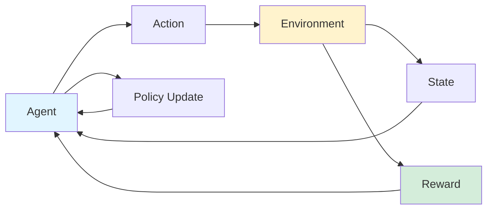

## Reinforcement Learning: Terms, Policies, Models, and Top 40 Libraries

*Curiosity:* What is reinforcement learning? How do agents learn to make better decisions through interaction with environments?

**Reinforcement Learning (RL)** is a type of machine learning where an agent interacts with an environment, receives feedback, and makes better decisions over time through trial and error.

### RL Overview

*Retrieve:* Understanding reinforcement learning fundamentals.

```mermaid
graph LR
    A[Agent] --> B[Action]
    B --> C[Environment]
    C --> D[State]
    C --> E[Reward]
    D --> A
    E --> A
    A --> F[Policy Update]
    F --> A
    
    style A fill:#e1f5ff
    style C fill:#fff3cd
    style E fill:#d4edda
```

### Key Terms in RL

*Retrieve:* Essential RL terminology.

| Term | Symbol | Description | Purpose |
|:-----|:-------|:------------|:--------|
| **Environment** | - | System the agent interacts with | ⬆️ Learning context |
| **Agent** | - | Autonomous entity | ⬆️ Decision maker |
| **Feedback** | - | Rewards or penalties | ⬆️ Learning signal |
| **State** | S | Current situation | ⬆️ Context |
| **Policy** | π | Strategy for actions | ⬆️ Decision rule |
| **Value** | V | Expected long-term return | ⬆️ State evaluation |
| **Q-Value** | Q | Long-term return of action | ⬆️ Action evaluation |
| **Model** | - | Environment simulation | ⬆️ Planning | 

—————————

### Model/Policy Classifications

*Retrieve:* Different approaches to RL.

**Model-Free vs Model-Based**:

| Type | Description | Use Case |
|:-----|:------------|:---------|
| **Model-Based** | Uses environment model | ⬆️ When model available |
| **Model-Free** | Trial-and-error learning | ⬆️ When model unknown |

**On-Policy vs Off-Policy**:

| Type | Description | Learning Source |
|:-----|:------------|:----------------|
| **On-Policy** | Learns from current policy | ⬆️ Current actions |
| **Off-Policy** | Learns from different policy | ⬆️ Other policy data |

—————————

### Well-Known RL Models

*Retrieve:* Popular RL algorithms and their characteristics.

| Model | Type | Description | Advantage |
|:------|:-----|:------------|:----------|
| **Q-Learning** | Model-free | Q-table for best actions | ⬆️ Simple, effective |
| **SARSA** | Model-based | Updates based on next state-action | ⬆️ On-policy learning |
| **DQN** | Model-free | Deep networks for Q-function | ⬆️ Handles large states |
| **DDPG** | Model-free | Deep deterministic policy | ⬆️ Continuous actions |

**DDPG Advantage**: Handles complex environments and large state spaces better than traditional RL algorithms. 

—————————

### RL Applications

*Innovate:* Diverse applications of reinforcement learning.

| Category | Applications | Impact |
|:---------|:-------------|:-------|
| **Robotics** | Robot control, manipulation | ⬆️ Automation |
| **Transportation** | Autonomous vehicles, traffic control | ⬆️ Safety, efficiency |
| **Healthcare** | Treatment optimization | ⬆️ Patient outcomes |
| **Finance** | Trading, portfolio management | ⬆️ Returns |
| **Gaming** | Game AI, strategy | ⬆️ Entertainment |
| **Energy** | Smart grids, management | ⬆️ Efficiency |
| **Business** | Marketing, recommendations | ⬆️ Revenue |
| **Technology** | NLP, cybersecurity | ⬆️ Capabilities |
| **Industry** | Manufacturing, automation | ⬆️ Productivity |
| **Research** | Space exploration, agriculture | ⬆️ Innovation |

—————————

### Top 40 Python RL Libraries

*Retrieve:* Comprehensive list of reinforcement learning libraries.

| Library | Framework | Focus | Use Case |
|:--------|:----------|:------|:---------|
| **Gym** | OpenAI | Environments | ⬆️ Standard environments |
| **Stable-Baselines** | TensorFlow/PyTorch | Algorithms | ⬆️ Easy implementation |
| **Ray RLlib** | Ray | Distributed RL | ⬆️ Scalability |
| **TF-Agents** | TensorFlow | Agents | ⬆️ TensorFlow integration |
| **Acme** | JAX | Research | ⬆️ Advanced research |
| **Tianshou** | PyTorch | Algorithms | ⬆️ PyTorch ecosystem |
| **CleanRL** | PyTorch | Clean code | ⬆️ Learning |
| **PettingZoo** | Multi-agent | Multi-agent RL | ⬆️ Multi-agent |
| **Dopamine** | TensorFlow | Research | ⬆️ Google research |
| **MushroomRL** | Python | Algorithms | ⬆️ Research |

**Complete List** (40 libraries):
Gym, Baselines, Dopamine, TensorLayer, FinRL, Stable-Baselines, ReAgent, Acme, PARL, TF-Agents, TensorFlow, PyTorchRL, Keras-RL, Garage, TensorForce, RLax, Coach, RFRL, Rliable, ViZDoom, Ray RLlib, ReAgent (Horizon), ChainerRL, MushroomRL, TRFL, CleanRL, Tianshou, MAgent, rl-baselines3-zoo, PettingZoo, RLlib, RoboRL, H-baselines, DI-engine, and more.

### Key Takeaways

*Retrieve:* Reinforcement learning enables agents to learn through environment interaction, with various algorithms (Q-Learning, DQN, DDPG) and applications across robotics, gaming, finance, and more.

*Innovate:* By leveraging Python RL libraries like Gym, Stable-Baselines, and Ray RLlib, you can build RL systems for diverse applications, from game AI to autonomous vehicles, using proven algorithms and frameworks.

*Curiosity → Retrieve → Innovation:* Start with curiosity about reinforcement learning, retrieve insights from RL terms, models, and libraries, and innovate by building RL applications that solve real-world problems.

**Next Steps**:
- Choose an RL library
- Start with simple environments
- Implement basic algorithms
- Build your RL application

———————————————

⭆ 𝐑𝐞𝐠𝐢𝐬𝐭𝐞𝐫 𝐟𝐨𝐫 𝐅𝐫𝐞𝐞 𝐎𝐧𝐥𝐢𝐧𝐞 𝐇𝐚𝐧𝐝𝐬-𝐨𝐧 𝐃𝐚𝐭𝐚 𝐒𝐜𝐢𝐞𝐧𝐜𝐞 𝐓𝐮𝐭𝐨𝐫𝐢𝐚𝐥 (𝐄𝐧𝐝 𝐭𝐨 𝐄𝐧𝐝 𝐏𝐫𝐨𝐣𝐞𝐜𝐭): <https://www.maryammiradi.com/sonar>

{: .light .shadow .rounded-10 w='1212' h='668' }

 Translate to Korean 

* * * 

RL is a type of machine learning where an agent interacts with an environment, receives feedback, and makes better decisions over time.

—————————

## 📝 Terms Used in RL:

- ⌘ Environment: The system or situation the agent interacts with. 

- ⌘ Agent: An autonomous entity that interacts with the environment.

- ⌘ Feedback: Information provided by the environment to the agent after taking an action (reward or penalty).

- ⌘ State (S): The current situation returned by the environment.

- ⌘ Policy (π): The strategy used by the agent to determine the next action.

- ⌘ Value (V): Expected long-term return 

- ⌘ Q-Value (Q): Long-term return of a given current action 

- ⌘ Model: Refers to environment simulation. 

—————————

## 📖 Models/Policies in RL:

Model-Free vs Model-Based:

- ๏ Model-based approaches work with growing state and action spaces
- ๏ Model-free algorithms rely on trial and error to update knowledge.

On-Policy vs Off-Policy:

- ๏ On-policy agents learn based on current actions derived from the current policy. 
- ๏ Off-policy counterparts learn based on a different policy.

—————————

## 🤖 Well-Known RL Models:

- ➊ Q-Learning:

A model-free algorithm that uses a Q-table to store the best actions for states.

- ➋ State-Action-Reward-State-Action (SARSA):

A model-based algorithm that updates state-action values based on rewards and next state-action pairs.

- ➌ Deep Q-Network (DQN):

A model-free algorithm that uses deep neural networks to approximate the Q-function.

- ➍ Deep Deterministic Policy Gradient (DDPG):

DDPG uses deep neural networks to handle more complex environments and large state spaces than traditional RL algorithms. 

—————————

## 🛠️ Here are some application areas of Reinforcement Learning (RL):

- » Robotics
- » Autonomous Vehicles
- » Healthcare
- » Finance
- » Gaming
- » Energy Management
- » Marketing and Advertising
- » Natural Language Processing
- » Manufacturing
- » Smart Grids
- » Supply Chain Optimization
- » Recommendation Systems
- » Personalization Systems
- » Traffic Signal Control
- » Education and Training
- » Agriculture
- » Industrial Automation
- » Space Exploration
- » Cybersecurity
- » Virtual Assistants

