{: .light .shadow .rounded-10 w='1212' h='668' }


## 🔥 Supercharge Your Productivity: Top 21 Must-Have AI Tools

*Curiosity:* How can AI tools transform our workflow and boost productivity? What tools should we retrieve to maximize efficiency across different domains?

**AI tools** have revolutionized how we work, create, and analyze. This curated list of 21 essential AI tools covers image generation, chatbots, video creation, SEO, voice synthesis, website building, and data analytics—everything you need to supercharge your productivity.

### Tool Categories Overview

```mermaid
graph TB
    A[AI Tools Ecosystem] --> B[🖼️ Image Generation]
    A --> C[🤖 AI Bots]
    A --> D[🎥 Video Creation]
    A --> E[🔍 SEO]
    A --> F[🗣️ Voice & Speech]
    A --> G[🌐 Website Building]
    A --> H[📊 Data Analytics]
    
    style A fill:#e1f5ff
    style B fill:#fff3cd
    style C fill:#d4edda
    style D fill:#f8d7da
    style E fill:#e7d4f8
    style F fill:#ffe5e5
    style G fill:#e5f3ff
    style H fill:#fff8e5
```



### 🖼️ Image Generation Tools

*Retrieve:* Transform text prompts into stunning visuals with AI-powered image generators.

| Tool | Description | Best For | Link |
|:-----|:------------|:---------|:-----|
| **Freepik** | AI image generator with extensive library | Stock images, design assets | [Link](https://www.freepik.com/ai/image-generator) |
| **Secta** | Advanced AI image creation | High-quality visuals | [Link](https://secta.ai/ko?via=genai) |
| **Leonardo** | Professional AI art generation | Creative projects, concept art | [Link](https://app.leonardo.ai/auth/login) |

**Use Case Example**:

```python
# Example: Using AI image generation API
import requests

def generate_image(prompt, style="realistic"):
    """Generate image using AI"""
    # API call to image generation service
    response = requests.post(
        "https://api.example.com/generate",
        json={"prompt": prompt, "style": style}
    )
    return response.json()["image_url"]

# Generate product image
product_image = generate_image(
    "Modern smartphone on white background, professional photography"
)
print(f"Generated image: {product_image}")
```

### 🤖 AI Bot & Chat Tools

*Innovate:* Build intelligent chatbots and conversational interfaces.

| Tool | Description | Best For | Link |
|:-----|:------------|:---------|:-----|
| **Quillbot** | Paraphrasing and writing assistant | Content rewriting, grammar | [Link](https://quillbot.com/paraphrasing-tool) |
| **Collect.chat** | Chatbot builder platform | Customer support, lead generation | [Link](https://collect.chat/) |
| **Botsify** | AI chatbot creation | Website chatbots, automation | [Link](https://app.botsify.com/register) |

**Chatbot Architecture**:


### 🎥 Video Creation Tools

*Retrieve:* Create professional videos with AI-powered tools.

| Tool | Description | Best For | Link |
|:-----|:------------|:---------|:-----|
| **Synthesia** | AI video generation with avatars | Training videos, presentations | [Link](https://www.synthesia.io/) |
| **Heygen** | AI video creation platform | Marketing videos, explainers | [Link](https://www.heygen.com/) |
| **Pictory** | Text-to-video conversion | Social media content, summaries | [Link](https://pictory.ai/) |

### 🔍 SEO Optimization Tools

*Innovate:* Optimize content for search engines with AI assistance.

| Tool | Description | Best For | Link |
|:-----|:------------|:---------|:-----|
| **Outranking** | SEO content optimization | Content strategy, ranking | [Link](https://www.outranking.io/) |
| **Scalenut** | AI-powered SEO writing | Blog posts, articles | [Link](https://www.scalenut.com/) |
| **GetGenie** | WordPress SEO assistant | On-page optimization | [Link](https://getgenie.ai/) |

### 🗣️ Text-to-Speech & Voiceover Tools

*Retrieve:* Convert text to natural-sounding speech.

| Tool | Description | Best For | Link |
|:-----|:------------|:---------|:-----|
| **Lovo** | AI voice generation | Narration, voiceovers | [Link](https://lovo.ai/) |
| **Vidnoz** | Video and voice creation | Multimedia content | [Link](https://www.vidnoz.com/) |
| **DupDub** | Voice cloning and TTS | Personalized voice content | [Link](https://www.dupdub.com/) |

**TTS Integration Example**:

```python
# Example: Text-to-Speech conversion
from gtts import gTTS
import os

def text_to_speech(text, language='en', output_file='output.mp3'):
    """Convert text to speech"""
    tts = gTTS(text=text, lang=language, slow=False)
    tts.save(output_file)
    return output_file

# Generate voiceover
audio_file = text_to_speech(
    "Welcome to our AI-powered productivity tools guide",
    language='en'
)
print(f"Audio file created: {audio_file}")
```

### 🌐 Website Builder Tools

*Innovate:* Build websites quickly with AI assistance.

| Tool | Description | Best For | Link |
|:-----|:------------|:---------|:-----|
| **10Web** | AI website builder | WordPress sites, e-commerce | [Link](https://10web.io/) |
| **Cloudlink** | Page builder platform | Landing pages, portfolios | [Link](https://www.pagecloud.com/) |
| **Quick Creator** | AI-powered site creation | Fast website deployment | [Link](https://quickcreator.io/) |

### 📊 Data Analytics Tools

*Retrieve:* Analyze data and gain insights with AI-powered analytics.

| Tool | Description | Best For | Link |
|:-----|:------------|:---------|:-----|
| **Boodlebox** | AI data analysis platform | Business intelligence | [Link](https://boodlebox.referral-factory.com/) |
| **Windsor** | Marketing analytics | Campaign performance | [Link](https://windsor.ai/) |
| **SpeakAI** | Conversational analytics | Voice data analysis | [Link](https://speakai.co/) |

### Tool Selection Matrix

| Use Case | Recommended Tools | Priority |
|:---------|:------------------|:---------|
| **Content Creation** | Freepik, Quillbot, Pictory | High |
| **Customer Support** | Collect.chat, Botsify | Medium |
| **SEO Optimization** | Outranking, Scalenut | High |
| **Video Production** | Synthesia, Heygen | Medium |
| **Website Building** | 10Web, Quick Creator | High |
| **Data Analysis** | Boodlebox, Windsor | Medium |

### Integration Workflow


### Key Takeaways

*Retrieve:* These 21 AI tools cover the entire content creation and productivity pipeline—from ideation to analytics.

*Innovate:* By combining multiple tools, you can create efficient workflows that automate repetitive tasks and enhance creativity.

*Curiosity → Retrieve → Innovation:* Start with curiosity about AI tools, retrieve knowledge about their capabilities, and innovate by building integrated workflows that boost productivity.

**🎯 All AI Tools in One Place**: <https://genai.works/applications>

**Next Steps**:
- Identify your primary use cases
- Select 3-5 tools to start with
- Build integrated workflows
- Measure productivity improvements
