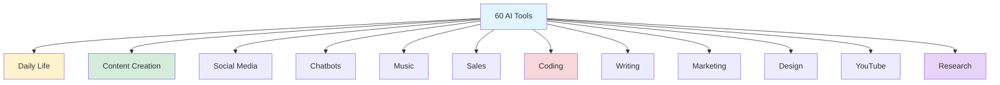
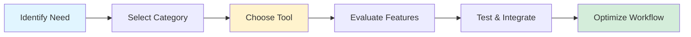

## 60 Most Useful AI Tools: Comprehensive Guide

*Curiosity:* How can AI tools transform our daily work and creative processes? What tools should we retrieve to maximize productivity across different domains?

**AI tools** have revolutionized how we work, create, and interact. This comprehensive guide covers 60 essential AI tools across 12 categories, helping you unlock the full potential of AI in your professional and personal life.

{: .light .shadow .rounded-10 w='1212' h='668' }

### AI Tools Ecosystem Overview

### Tool Categories

*Retrieve:* Comprehensive breakdown of AI tools by category.

| Category | Tools Count | Primary Use | Impact |
|:---------|:------------|:------------|:-------|
| **Daily Life** | 5 tools | Organization, productivity | ⬆️ Efficiency |
| **Content Creation** | 5 tools | Creative content generation | ⬆️ Creativity |
| **Twitter/X** | 5 tools | Social media management | ⬆️ Engagement |
| **ChatGPT Bots** | 5 tools | Conversational AI | ⬆️ Automation |
| **Music** | 5 tools | AI-generated music | ⬆️ Innovation |
| **Sales** | 5 tools | Sales optimization | ⬆️ Revenue |
| **Coding** | 5 tools | Development assistance | ⬆️ Productivity |
| **Writing** | 5 tools | Writing enhancement | ⬆️ Quality |
| **Marketing** | 5 tools | Digital marketing | ⬆️ Reach |
| **Design** | 5 tools | Visual design | ⬆️ Aesthetics |
| **YouTube** | 5 tools | Video content | ⬆️ Growth |
| **Research** | 5 tools | Academic research | ⬆️ Knowledge |

### 📱 Daily Life Tools

*Retrieve:* Tools for organizing and enhancing daily productivity.

| Tool | Purpose | Key Features |
|:-----|:--------|:-------------|
| **Replika** | AI companion | Personal conversations, emotional support |
| **Youper** | Mental health | AI therapy, mood tracking |
| **DeepL** | Translation | High-quality language translation |
| **Krisp** | Audio enhancement | Noise cancellation, clear calls |
| **Notion AI** | Productivity | Writing assistance, task management |

**Use Cases**: Personal organization, mental wellness, communication, productivity

### 🎨 Content Creation Tools

*Innovate:* Unleash creativity with AI-powered content generation.

| Tool | Purpose | Key Features |
|:-----|:--------|:-------------|
| **Jasper** | Content writing | Blog posts, marketing copy |
| **Midjourney** | Image generation | AI art, visual content |
| **DALL-E 3** | Image creation | Text-to-image generation |
| **Writesonic** | Copywriting | Marketing content, ads |
| **RunwayML** | Video editing | AI-powered video creation |

**Use Cases**: Marketing content, visual assets, creative projects

### 🐦 Twitter/X Tools

*Retrieve:* Elevate your social media presence.

| Tool | Purpose | Key Features |
|:-----|:--------|:-------------|
| **Thread.it** | Thread creation | Long-form Twitter content |
| **TweetHunter** | Content curation | Tweet discovery, scheduling |
| **Circleboom** | Account management | Twitter analytics, automation |
| **HypeAuditor** | Influencer analytics | Audience analysis |
| **Missinglettr** | Content scheduling | Social media automation |

**Use Cases**: Social media management, content scheduling, analytics

### 💬 ChatGPT Bots

*Innovate:* Engage in intelligent conversations.

| Tool | Purpose | Key Features |
|:-----|:--------|:-------------|
| **ManyChat** | Chatbot builder | Facebook Messenger automation |
| **Drift** | Conversational marketing | Sales chatbots |
| **LaMDA** | Dialogue system | Google's conversational AI |
| **Rasa** | Open-source chatbot | Custom chatbot development |
| **Dialogflow** | NLP platform | Google Cloud chatbot framework |

**Use Cases**: Customer support, lead generation, automation

### 🎵 Music Tools

*Retrieve:* Dive into AI-generated music.

| Tool | Purpose | Key Features |
|:-----|:--------|:-------------|
| **Jukebox** | Music generation | OpenAI's music AI |
| **MuseNet** | Composition | Musical composition AI |
| **Amper Music** | Music creation | Royalty-free music generation |
| **Mubert** | Streaming music | AI-generated music streams |
| **Melómano** | Music analysis | Music discovery and analysis |

**Use Cases**: Background music, composition, music discovery

### 💼 Sales Tools

*Innovate:* Optimize your sales strategy.

| Tool | Purpose | Key Features |
|:-----|:--------|:-------------|
| **Clari** | Revenue operations | Sales forecasting, analytics |
| **Chorus.ai** | Conversation intelligence | Call analysis, insights |
| **Groove** | Sales engagement | Email automation, tracking |
| **Gong** | Revenue intelligence | Sales call analysis |
| **Outreach.io** | Sales execution | Outreach automation |

**Use Cases**: Sales forecasting, call analysis, pipeline management

### 💻 Coding Tools

*Retrieve:* Transform your coding experience.

| Tool | Purpose | Key Features |
|:-----|:--------|:-------------|
| **GitHub Copilot** | Code completion | AI pair programmer |
| **Tabnine** | Code suggestions | AI code completion |
| **Kite** | Code autocomplete | Intelligent code completion |
| **DeepAI** | AI APIs | Various AI capabilities |
| **Codota** | Code examples | Code snippet suggestions |

**Use Cases**: Code completion, debugging, learning

### ✍️ Writing Tools

*Innovate:* Refine your writing.

| Tool | Purpose | Key Features |
|:-----|:--------|:-------------|
| **Grammarly** | Grammar checking | Writing enhancement, corrections |
| **QuillBot** | Paraphrasing | Text rewriting, summarization |
| **ProWritingAid** | Writing analysis | Style checking, editing |
| **ShortlyAI** | Content generation | AI writing assistant |
| **Hemingway Editor** | Readability | Writing clarity improvement |

**Use Cases**: Content editing, grammar checking, style improvement

### 📊 Marketing Tools

*Retrieve:* Navigate the digital landscape.

| Tool | Purpose | Key Features |
|:-----|:--------|:-------------|
| **Brand24** | Social listening | Brand monitoring, mentions |
| **Meltwater** | Media monitoring | PR and social media tracking |
| **Sprout Social** | Social management | Social media management |
| **Hootsuite** | Social scheduling | Content scheduling, analytics |
| **Buzzsumo** | Content research | Content discovery, analysis |

**Use Cases**: Social media management, brand monitoring, content research

### 🎨 Design Tools

*Innovate:* Craft visually stunning designs.

| Tool | Purpose | Key Features |
|:-----|:--------|:-------------|
| **Figma** | Design collaboration | UI/UX design, prototyping |
| **Canva** | Graphic design | Template-based design |
| **Adobe XD** | Experience design | UI/UX prototyping |
| **Sketch** | Vector graphics | Mac-based design tool |
| **InVision** | Prototyping | Interactive prototypes |

**Use Cases**: UI/UX design, graphics, prototyping

### 📺 YouTube Tools

*Retrieve:* Maximize your YouTube presence.

| Tool | Purpose | Key Features |
|:-----|:--------|:-------------|
| **VidIQ** | SEO optimization | Video SEO, analytics |
| **TubeBuddy** | Channel management | YouTube optimization |
| **Lumen5** | Video creation | Text-to-video generation |
| **InVideo** | Video editing | Online video editor |
| **Headliner** | Audio visualization | Podcast video creation |

**Use Cases**: Video optimization, content creation, analytics

### 🔬 Research Tools

*Innovate:* Simplify your research.

| Tool | Purpose | Key Features |
|:-----|:--------|:-------------|
| **Research Rabbit** | Literature discovery | Academic paper discovery |
| **Elicit** | Research assistant | Paper summarization, extraction |
| **Scholarcy** | Article summarization | Research paper summaries |
| **Scite** | Citation analysis | Smart citations, verification |
| **Trinka** | Academic writing | Grammar for academic writing |

**Use Cases**: Academic research, paper discovery, citation management

### Tool Selection Workflow

### Key Takeaways

*Retrieve:* These 60 AI tools span 12 categories, covering everything from daily productivity to specialized professional tasks.

*Innovate:* By strategically selecting and integrating AI tools from different categories, you can significantly enhance productivity, creativity, and efficiency across all aspects of your work and life.

*Curiosity → Retrieve → Innovation:* Start with curiosity about AI capabilities, retrieve knowledge about available tools, and innovate by building optimized workflows that leverage the best tools for your specific needs.

**Next Steps**:
- Identify your primary use cases
- Select 3-5 tools to start with
- Test and evaluate effectiveness
- Build integrated workflows
- Share your discoveries with your network

**Unlock More AI Goodies!** If this content helps, repost this ♻️ to your network and follow Dirk Zee.

