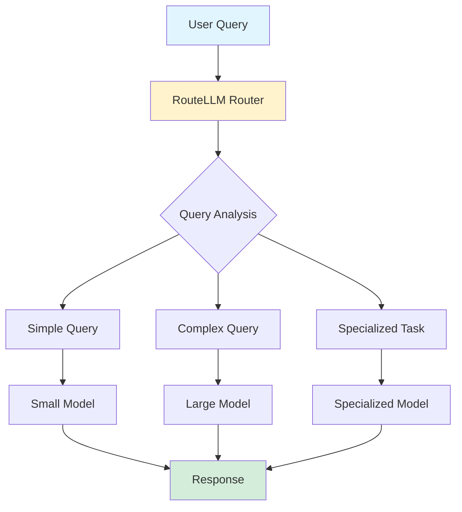

## RouteLLM: The Real Battle is in Query Routing

*Curiosity:* What if the best LLM isn't a single model, but intelligent routing to the right model? How can we achieve massive cost savings without sacrificing quality?

**The LLM landscape is heating up**, but the real game-changer isn't just which model is "best". UC Berkeley researchers have unveiled **RouteLLM**, an open-source framework that routes queries to the right model for the job.

> **Resources**:
> - **🎮 Demo**: <https://lnkd.in/gnjfB9vf>
> - **💻 Code**: <https://github.com/lm-sys/RouteLLM>
> - **📄 Paper**: <https://arxiv.org/abs/2406.18665>
> - **🤗 Hugging Face**: <https://huggingface.co/routellm>
{: .prompt-info}

### The Innovation

*Retrieve:* RouteLLM's intelligent query routing approach.

**Key Benefit**: **Massive cost savings (85%+)** without sacrificing quality.

**Impact**: Time to rethink LLM deployment and prioritize intelligent routing.

### RouteLLM Architecture

*Innovate:* How RouteLLM routes queries intelligently.

### Why Query Routing Matters

*Retrieve:* The case for intelligent routing.

| Approach | Cost | Quality | Efficiency |
|:---------|:-----|:--------|:-----------|
| **Single Large Model** | ❌ High | ✅ High | ⚠️ Overkill for simple tasks |
| **RouteLLM** | ✅ 85%+ savings | ✅ Maintained | ✅ Optimal |

**Key Insight**: Not every query needs the most powerful model.

### Benefits

*Innovate:* Advantages of intelligent routing.

**Cost Savings**:
- ✅ 85%+ cost reduction
- ✅ Use right model for each task
- ✅ Avoid over-provisioning

**Quality**:
- ✅ Maintains expected quality
- ✅ Routes complex queries to capable models
- ✅ Optimizes for each use case

**Efficiency**:
- ✅ Faster responses for simple queries
- ✅ Better resource utilization
- ✅ Scalable architecture

### Key Takeaways

*Retrieve:* RouteLLM demonstrates that intelligent query routing can achieve 85%+ cost savings while maintaining quality, proving that the real battle in LLM deployment is routing, not just model selection.

*Innovate:* By implementing intelligent routing with RouteLLM, you can optimize LLM costs and performance, using the right model for each query rather than over-provisioning with expensive models for all tasks.

*Curiosity → Retrieve → Innovation:* Start with curiosity about LLM cost optimization, retrieve insights from RouteLLM's routing approach, and innovate by implementing intelligent query routing in your LLM applications.

**Next Steps**:
- Read the paper
- Try the demo
- Explore the code
- Implement routing in your systems

{: .light .shadow .rounded-10 w='1212' h='668' }

 Translate to Korean 

* * * 

## 오픈 소스 RouteLLM은 실제 전투가 쿼리 라우팅에 있음을 보여줍니다.

LLM 환경이 뜨거워지고 있지만 진정한 판도를 바꾸는 것은 어떤 모델이 "최고"인지 뿐만이 아닙니다.

UC Berkeley 연구원들은 쿼리를 작업에 적합한 모델로 교묘하게 라우팅하는 오픈 소스 프레임워크인 RouteLLM을 공개했습니다.

이는 기대하는 품질을 저하시키지 않으면서 엄청난 비용 절감(85% 이상)을 의미합니다. 이제 LLM을 배포하고 지능형 라우팅의 우선순위를 지정하는 방법을 다시 생각해 볼 때입니다.

논문을 자세히 살펴보고 데모를 시도하여 오픈 소스가 어떻게 보다 효율적인 AI 미래를 선도하는지 알아보세요.

