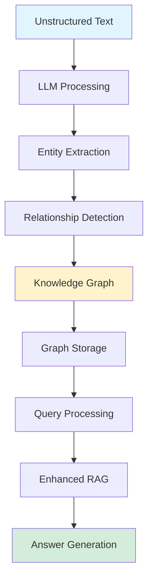

## GraphRAG is Now Open Source!

*Curiosity:* How can we extract meaningful, structured data from unstructured text? What happens when we combine knowledge graphs with RAG?

**GraphRAG** is Microsoft's open-source data pipeline and transformation suite designed to extract meaningful, structured data from unstructured text using LLMs. It creates knowledge graphs to enhance LLM reasoning about private data.

> **Microsoft Research Blog**: <https://www.microsoft.com/en-us/research/blog/graphrag-unlocking-llm-discovery-on-narrative-private-data/>
{: .prompt-info}

### What is GraphRAG?

*Retrieve:* Understanding GraphRAG's capabilities.

**GraphRAG** is an AI-based content interpretation and search capability that:
- Uses LLMs to parse data
- Creates knowledge graphs from unstructured text
- Answers questions about private datasets
- Enhances LLM reasoning capabilities

> **Documentation**: <https://github.com/microsoft/graphrag/blob/main/RAI_TRANSPARENCY.md#what-is-graphrag>
{: .prompt-info}

### GraphRAG Architecture

*Innovate:* How GraphRAG transforms unstructured data.

### What is RAG?

*Retrieve:* Understanding RAG fundamentals.

**The Problem**: LLMs have static knowledge limited to training data, which rapidly becomes outdated.

**RAG Solution**: Retrieval Augmented Generation tackles two challenges:
1. **Keeping knowledge up-to-date**: Retrieves current information
2. **Providing accurate sources**: Supports responses with evidence

> **RAG Deep Dive**: <https://www.linkedin.com/pulse/what-rag-lets-dive-deeper-time-alex-wang-ln6dc/>
{: .prompt-info}

### GraphRAG vs. Traditional RAG

*Innovate:* Advantages of graph-based RAG.

| Feature | Traditional RAG | GraphRAG |
|:--------|:----------------|:---------|
| **Data Structure** | Vector embeddings | Knowledge graph |
| **Relationships** | ❌ Limited | ✅ Explicit |
| **Reasoning** | ⚠️ Basic | ⬆️ Enhanced |
| **Private Data** | ⚠️ Challenging | ✅ Optimized |

**Key Advantage**: GraphRAG creates structured knowledge graphs that enable better reasoning about relationships and context.

### GraphRAG Workflow

*Retrieve:* Step-by-step process.

**1. Data Ingestion**:
- Input unstructured text
- Process with LLMs

**2. Graph Construction**:
- Extract entities
- Detect relationships
- Build knowledge graph

**3. Query Processing**:
- Parse user questions
- Traverse knowledge graph
- Retrieve relevant context

**4. Answer Generation**:
- Use retrieved context
- Generate accurate answers
- Provide source references

### Use Cases

*Innovate:* Applications of GraphRAG.

**Ideal For**:
- Private document analysis
- Research paper understanding
- Corporate knowledge bases
- Narrative data exploration
- Complex relationship queries

### Key Takeaways

*Retrieve:* GraphRAG is an open-source framework that uses LLMs to create knowledge graphs from unstructured text, enabling enhanced RAG capabilities for private datasets.

*Innovate:* By combining knowledge graphs with RAG, GraphRAG enables better reasoning about relationships and context, making it ideal for analyzing narrative private data and answering complex questions.

*Curiosity → Retrieve → Innovation:* Start with curiosity about extracting structured data from unstructured text, retrieve insights from GraphRAG's approach, and innovate by applying graph-based RAG to your private data analysis needs.

**Next Steps**:
- Explore the GitHub repository
- Read the Microsoft Research blog
- Try GraphRAG on your data
- Build knowledge graphs

{: .light .shadow .rounded-10 w='1212' h='668' }
