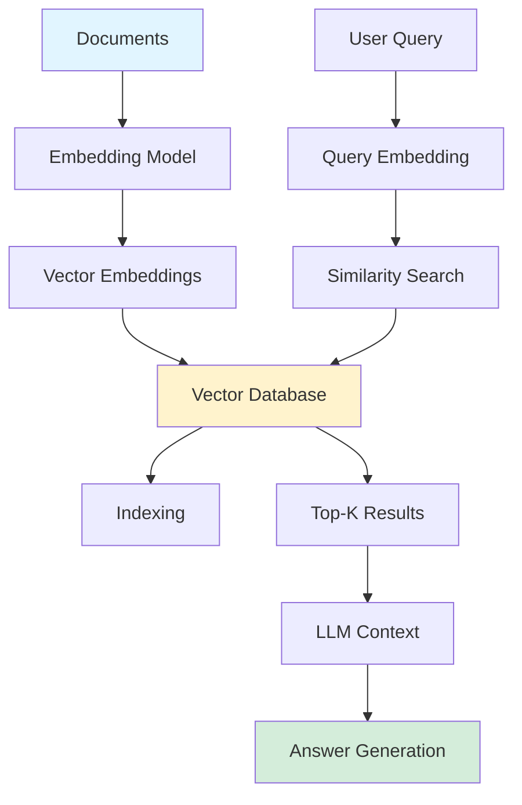

## Choosing the Right Vector Database for LLM Applications

*Curiosity:* How does vector database choice impact LLM application performance? What factors should we consider when selecting a vector database?

**Vector databases** store and index high-dimensional vectors representing embeddings of text, images, or other data in numerical format that captures semantic meaning. The choice of database significantly impacts LLM application performance.

{: .light .shadow .rounded-10 w='1212' h='668' }

> **Image Credit**: <https://neptune.ai/blog/building-llm-applications-with-vector-databases>
{: .prompt-info}

### Impact of Vector Database Choice

*Retrieve:* Key factors affected by database selection.

> **Reference**: <https://arxiv.org/html/2402.01763v1>
{: .prompt-info}

| Factor | Impact | Importance |
|:-------|:-------|:-----------|
| **Search Speed** | Query latency | ⬆️ User experience |
| **Similarity Accuracy** | Retrieval quality | ⬆️ Answer quality |
| **Scalability** | Handle growth | ⬆️ Production readiness |
| **Memory Usage** | Resource efficiency | ⬇️ Costs |

### Vector Database Architecture

*Innovate:* How vector databases work in LLM applications.

{: .light .shadow .rounded-10 w='1212' h='668' }

{: .light .shadow .rounded-10 w='1212' h='668' }

### Use Case Examples

*Retrieve:* Real-world vector database selection scenarios.

#### 1. Real-Time Product Recommendations

*Scenario*: Online retailer needs real-time product recommendations based on browsing history.

**DB Choice**: **PINECONE**

| Requirement | Why Pinecone | Benefit |
|:------------|:-------------|:--------|
| **High Speed** | Optimized query performance | ⬆️ Real-time responses |
| **Scalability** | Handles large catalogs | ⬆️ Growth support |
| **User Experience** | Fast retrieval | ⬆️ Engagement |

#### 2. Semantic Text Search

*Scenario*: Research organization needs to search through large corpus of scientific papers.

**DB Choice**: **MILVUS**

| Requirement | Why Milvus | Benefit |
|:------------|:-----------|:--------|
| **Robust Indexing** | Advanced indexing algorithms | ⬆️ Search accuracy |
| **Scalability** | Billions of embeddings | ⬆️ Large datasets |
| **Efficiency** | Optimized for research | ⬆️ Performance |

#### 3. Voice Assistant

*Scenario*: Voice assistant needs instant query processing and responses.

**DB Choice**: **FAISS**

| Requirement | Why FAISS | Benefit |
|:------------|:----------|:--------|
| **Low Latency** | Optimized for speed | ⬆️ Instant responses |
| **Fast Retrieval** | Efficient similarity search | ⬆️ User experience |
| **Performance** | Facebook's optimization | ⬆️ Reliability |

-------------------------------------

If you are building a Vector DB, optimize the chunk size and consider how you turn chunks into embeddings.

AND, there is NO BEST CHUNK SIZE. 
To find the appropriate chunk size for your system, embed your documents using different chunk sizes and evaluate which chunk size yields the best retrieval results. 

Also, You are not forced to stick to the (chunk embedding, chunk) pairs. You can modify the embeddings you use as the index for retrieval.

You can summarize your chunks using an LLM before running it through the embedding model. 
These summaries will be much shorter and contain less meaningless filler text, which might “confuse” or “distract” your embedding model.

----------------------------------------

Choosing, optimizing, or building an efficient Vector DB is a multi-step process. 

You can significantly enhance the speed, accuracy, and scalability of your LLM-based system, leading to better overall performance and user experience following the right approach. 

## Text-to-SQL: Next-Generation Database Interface

*Retrieve:* Comprehensive survey on LLM-based Text-to-SQL systems.

**Text-to-SQL** is one of the most prevalent enterprise applications of LLMs. This comprehensive survey report is essential reading for anyone in this space.

> **Paper**: <https://arxiv.org/pdf/2406.08426>
{: .prompt-danger}

### Survey Contents

*Retrieve:* What the paper covers.

| Section | Content | Value |
|:--------|:--------|:------|
| **Datasets & Benchmarks** | Common datasets, characteristics, challenges | ⬆️ Evaluation framework |
| **Evaluation Metrics** | Accuracy, exactness, execution correctness | ⬆️ Performance assessment |
| **Methods & Models** | In-context learning, fine-tuning paradigms | ⬆️ Implementation guidance |
| **Future Directions** | Challenges, limitations, opportunities | ⬆️ Research roadmap |

**Key Topics**:
- Dataset characteristics and complexity
- Evaluation metric advantages/limitations
- Implementation details and adaptations
- Real-world robustness and efficiency
- Data privacy and extensions

 {: .light .shadow .rounded-10 w='1212' h='668' }

 Explain How to use Vector Embeeding 

### Let's create VectorEmbeddings for free. [Hands-On Tutorial]



Vector embeddings carry the contextual meaning of the objects that machines can easily understand. 

Using Cohere & Hugging Face, you can create vector embeddings for free.

Here is my complete tutorial on creating vector embeddings using different platforms

