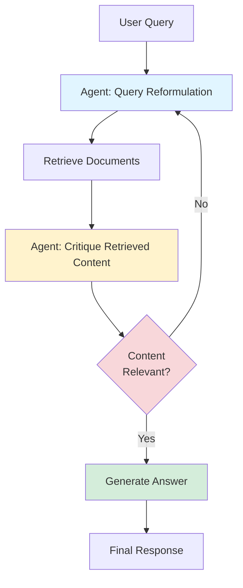

## Agentic RAG Cookbook: Improving RAG with Agent Systems

*Curiosity:* What if RAG systems could think more like humans—questioning their own retrievals, reformulating queries, and iterating until they find the right answer? What happens when we give RAG the ability to retrieve, critique, and retrieve again?

**A new cookbook** demonstrates how to easily improve RAG with an agent system using Transformers Agents. This approach addresses key limitations of vanilla RAG by making systems more intelligent and self-correcting.

### Vanilla RAG Limitations

*Retrieve:* Vanilla RAG systems have fundamental limitations that impact performance.

**Key Limitations**:

| Limitation | Description | Impact |
|:-----------|:------------|:-------|
| **Single Retrieval** | Retrieves documents only once | ⚠️ Poor quality if initial retrieval fails |
| **Suboptimal Similarity** | Uses user query as reference | ⚠️ Questions vs. statements mismatch |
| **No Self-Correction** | Cannot refine or re-retrieve | ❌ No improvement mechanism |

**Problem Details**:
- User queries are typically questions
- Relevant documents use affirmative statements
- Similarity scores are downgraded
- No opportunity for improvement

### Vanilla RAG vs. Agentic RAG

| Aspect | Vanilla RAG | Agentic RAG |
|:-------|:------------|:-------------|
| **Retrieval Strategy** | Single retrieval pass | Iterative retrieval with critique |
| **Query Handling** | Direct user query | Query reformulation & optimization |
| **Self-Correction** | ❌ No | ✅ Yes - can re-retrieve if needed |
| **Performance** | Baseline (70.0%) | Improved (+8.5% = 78.5%) |
| **Latency** | Lower (1 LLM call) | Higher (multiple LLM calls) |
| **Quality** | ⚠️ Limited | ⬆️ Better |

### Agentic RAG Solution

*Innovate:* Making a RAG agent—simply, an agent armed with a retriever tool—alleviates both problems!

**Key Capabilities**:
- ✅ **Query Reformulation**: Agent formulates optimized queries
- ✅ **Self-Query**: Agent critiques content and re-retrieves if needed

**Architecture**:



### Performance Comparison

*Retrieve:* Evaluation with LLM-as-a-judge (Llama-3-70B) shows significant improvement.

| Metric | Vanilla RAG | Agentic RAG | Improvement |
|:-------|:------------|:-------------|:------------|
| **Accuracy Score** | 70.0% | 78.5% | **+8.5%** 💪 |
| **LLM Calls** | 1 | 3-5 | Higher latency |
| **Self-Correction** | ❌ | ✅ | Better quality |
| **Query Optimization** | ❌ | ✅ | Better retrieval |

**Trade-offs**:
- ⬆️ Better quality (+8.5%)
- ⚠️ Higher latency (multiple LLM calls)
- ⚖️ Balance quality vs. speed needed

### Sample Agentic RAG Implementation

```python
from transformers import pipeline
from langchain.agents import create_react_agent
from langchain.tools import Tool

# Create retrieval tool
retrieval_tool = Tool(
    name="retrieve_documents",
    func=vector_store.similarity_search,
    description="Retrieves relevant documents for a query"
)

# Create agent with retrieval tool
agent = create_react_agent(
    llm=llm,
    tools=[retrieval_tool],
    prompt=agent_prompt
)

# Agent workflow
def agentic_rag(query):
    # Step 1: Query reformulation
    reformulated_query = agent.run(
        f"Reformulate this query for better retrieval: {query}"
    )
    
    # Step 2: Retrieve documents
    docs = retrieval_tool.run(reformulated_query)
    
    # Step 3: Critique and potentially re-retrieve
    critique = agent.run(
        f"Critique these documents for relevance to: {query}\n{docs}"
    )
    
    if "not relevant" in critique.lower():
        # Re-retrieve with different strategy
        docs = retrieval_tool.run(query, k=10)  # Get more docs
    
    # Step 4: Generate answer
    answer = llm.generate(
        context=docs,
        question=query
    )
    
    return answer
```

𝗗𝗶𝘀𝗰𝗼𝘃𝗲𝗿 𝘁𝗵𝗲 𝗰𝗼𝗼𝗸𝗯𝗼𝗼𝗸 👇
- <https://huggingface.co/learn/cookbook/agent_rag>


## 𝗔𝗴𝗲𝗻𝘁𝗶𝗰 𝗗𝗮𝘁𝗮 𝗮𝗻𝗮𝗹𝘆𝘀𝘁: 𝗱𝗿𝗼𝗽 𝘆𝗼𝘂𝗿 𝗱𝗮𝘁𝗮 𝗳𝗶𝗹𝗲, 𝗹𝗲𝘁 𝘁𝗵𝗲 𝗟𝗟𝗠 𝗱𝗼 𝘁𝗵𝗲 𝗮𝗻𝗮𝗹𝘆𝘀𝗶𝘀 📊⚙️

Need to make quick exploratory data analysis? ➡️ Get help from an agent.

I was impressed by Llama-3.1's capacity to derive insights from data. Given a csv file, it makes quick work of exploratory data analysis and can derive interesting insights.

On the data from the Kaggle titanic challenge, that records which passengers survived the Titanic wreckage, it was able by itself to derive interesting trends like "passengers that paid higher fares were more likely to survive" or "survival rate was much higher for women than men".

The cookbook even lets the agent built its own submission to the challenge, and it ranks under 3,000 out of 17,000 submissions: 👏 not bad at all!

> - Try it for yourself in this Space demo 👉 https://lnkd.in/gzaqQ3rT
> - Read the cookbook to dive deeper 👉 https://lnkd.in/gXx3-AyH
{: .prompt-info}


<details markdown="1">
<summary style= "font-size:24px; line-height:24px; font-weight:bold; cursor:pointer;" > Translate to Korean </summary>

* * * 

## 방금 Transformers Agents를 사용하여 에이전트 시스템으로 RAG(Retrieval Augmented Generation)를 쉽게 개선하는 방법을 보여주는 새로운 쿡북을 출판했습니다.

Vanilla RAG에는 다음과 같은 제한 사항이 있습니다.
- ➤ 소스 문서를 한 번만 검색합니다: 검색된 문서가 충분히 관련성이 없으면 생성이 나빠질 것입니다.
- ➤ 의미론적 유사성은 사용자 쿼리를 참조로 사용하여 계산되며, 이는 종종 차선책입니다: 예를 들어, 사용자 쿼리는 대부분 질문이고 실제 답변을 포함하는 문서는 긍정 음성이므로 유사성 점수는 의문 형식의 관련성이 낮은 소스 문서에 비해 다운그레이드되어 관련 문서를 선택하지 않을 위험이 있습니다.

RAG 에이전트를 만들면(아주 간단하게, 리트리버 도구로 무장한 에이전트) 이 두 가지 문제를 모두 완화할 수 있습니다!
- ✅ 쿼리 자체를 공식화합니다(쿼리 재구성).
- ✅ 필요한 경우 다시 검색할 콘텐츠 비판(자체 쿼리)Critique the content to re-retrieve if needed (self-query)

이 에이전트 설정이 결과를 얼마나 개선합니까? 요리책에 Llama-3-70B를 사용하는 LLM-as-a-judge의 평가 부분을 추가했습니다. 바닐라에서 에이전트 RAG로 전환하면 점수가 8.5% 증가합니다! 💪
(70.0%에서 78.5%로)

하지만 한 가지 중요한 단점은, 시스템이 1이 아닌 여러 LLM 호출을 하기 때문에 RAG 시스템의 런타임도 증가한다는 것입니다. 적절한 절충안을 찾아야 합니다!

</details>