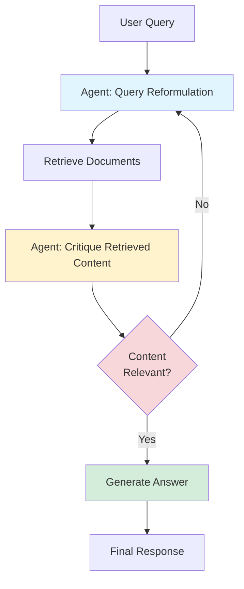

## Agentic RAG Cookbook: Improving RAG with Agent Systems

*Curiosity:* What if RAG systems could think more like humans—questioning their own retrievals, reformulating queries, and iterating until they find the right answer? What happens when we give RAG the ability to retrieve, critique, and retrieve again?

**A new cookbook** demonstrates how to easily improve RAG with an agent system using Transformers Agents. This approach addresses key limitations of vanilla RAG by making systems more intelligent and self-correcting.

### Vanilla RAG Limitations

*Retrieve:* Vanilla RAG systems have fundamental limitations that impact performance.

**Key Limitations**:

| Limitation | Description | Impact |
|:-----------|:------------|:-------|
| **Single Retrieval** | Retrieves documents only once | ⚠️ Poor quality if initial retrieval fails |
| **Suboptimal Similarity** | Uses user query as reference | ⚠️ Questions vs. statements mismatch |
| **No Self-Correction** | Cannot refine or re-retrieve | ❌ No improvement mechanism |

**Problem Details**:
- User queries are typically questions
- Relevant documents use affirmative statements
- Similarity scores are downgraded
- No opportunity for improvement

### Vanilla RAG vs. Agentic RAG

| Aspect | Vanilla RAG | Agentic RAG |
|:-------|:------------|:-------------|
| **Retrieval Strategy** | Single retrieval pass | Iterative retrieval with critique |
| **Query Handling** | Direct user query | Query reformulation & optimization |
| **Self-Correction** | ❌ No | ✅ Yes - can re-retrieve if needed |
| **Performance** | Baseline (70.0%) | Improved (+8.5% = 78.5%) |
| **Latency** | Lower (1 LLM call) | Higher (multiple LLM calls) |
| **Quality** | ⚠️ Limited | ⬆️ Better |

### Agentic RAG Solution

*Innovate:* Making a RAG agent—simply, an agent armed with a retriever tool—alleviates both problems!

**Key Capabilities**:
- ✅ **Query Reformulation**: Agent formulates optimized queries
- ✅ **Self-Query**: Agent critiques content and re-retrieves if needed

**Architecture**:


```mermaid
graph TD
    A[User Query] --> B[Agent: Query Reformulation]
    B --> C[Retrieve Documents]
    C --> D[Agent: Critique Retrieved Content]
    D --> E{Content<br/>Relevant?}
    E -->|No| B
    E -->|Yes| F[Generate Answer]
    F --> G[Final Response]
    
    style B fill:#e1f5ff
    style D fill:#fff3cd
    style F fill:#d4edda
    style E fill:#f8d7da
```

### Performance Comparison

*Retrieve:* Evaluation with LLM-as-a-judge (Llama-3-70B) shows significant improvement.

| Metric | Vanilla RAG | Agentic RAG | Improvement |
|:-------|:------------|:-------------|:------------|
| **Accuracy Score** | 70.0% | 78.5% | **+8.5%** 💪 |
| **LLM Calls** | 1 | 3-5 | Higher latency |
| **Self-Correction** | ❌ | ✅ | Better quality |
| **Query Optimization** | ❌ | ✅ | Better retrieval |

**Trade-offs**:
- ⬆️ Better quality (+8.5%)
- ⚠️ Higher latency (multiple LLM calls)
- ⚖️ Balance quality vs. speed needed

### Sample Agentic RAG Implementation

```python
from transformers import pipeline
from langchain.agents import create_react_agent
from langchain.tools import Tool

# Create retrieval tool
retrieval_tool = Tool(
    name="retrieve_documents",
    func=vector_store.similarity_search,
    description="Retrieves relevant documents for a query"
)

# Create agent with retrieval tool
agent = create_react_agent(
    llm=llm,
    tools=[retrieval_tool],
    prompt=agent_prompt
)

# Agent workflow
def agentic_rag(query):
    # Step 1: Query reformulation
    reformulated_query = agent.run(
        f"Reformulate this query for better retrieval: {query}"
    )
    
    # Step 2: Retrieve documents
    docs = retrieval_tool.run(reformulated_query)
    
    # Step 3: Critique and potentially re-retrieve
    critique = agent.run(
        f"Critique these documents for relevance to: {query}\n{docs}"
    )
    
    if "not relevant" in critique.lower():
        # Re-retrieve with different strategy
        docs = retrieval_tool.run(query, k=10)  # Get more docs
    
    # Step 4: Generate answer
    answer = llm.generate(
        context=docs,
        question=query
    )
    
    return answer
```

𝗗𝗶𝘀𝗰𝗼𝘃𝗲𝗿 𝘁𝗵𝗲 𝗰𝗼𝗼𝗸𝗯𝗼𝗼𝗸 👇
- <https://huggingface.co/learn/cookbook/agent_rag>


## 𝗔𝗴𝗲𝗻𝘁𝗶𝗰 𝗗𝗮𝘁𝗮 𝗮𝗻𝗮𝗹𝘆𝘀𝘁: 𝗱𝗿𝗼𝗽 𝘆𝗼𝘂𝗿 𝗱𝗮𝘁𝗮 𝗳𝗶𝗹𝗲, 𝗹𝗲𝘁 𝘁𝗵𝗲 𝗟𝗟𝗠 𝗱𝗼 𝘁𝗵𝗲 𝗮𝗻𝗮𝗹𝘆𝘀𝗶𝘀 📊⚙️

Need to make quick exploratory data analysis? ➡️ Get help from an agent.

I was impressed by Llama-3.1's capacity to derive insights from data. Given a csv file, it makes quick work of exploratory data analysis and can derive interesting insights.

On the data from the Kaggle titanic challenge, that records which passengers survived the Titanic wreckage, it was able by itself to derive interesting trends like "passengers that paid higher fares were more likely to survive" or "survival rate was much higher for women than men".

The cookbook even lets the agent built its own submission to the challenge, and it ranks under 3,000 out of 17,000 submissions: 👏 not bad at all!

> - Try it for yourself in this Space demo 👉 https://lnkd.in/gzaqQ3rT
> - Read the cookbook to dive deeper 👉 https://lnkd.in/gXx3-AyH
{: .prompt-info}


<details markdown="1">
<summary style= "font-size:24px; line-height:24px; font-weight:bold; cursor:pointer;" > Translate to Korean </summary>

* * * 

## A new cookbook has just been published showing how to easily improve RAG (Retrieval Augmented Generation) with an agentic system using Transformers Agents.

Vanilla RAG has the following limitations.
- ➤ It retrieves source documents only once: if the retrieved documents are not sufficiently relevant, the generation will be poor.
- ➤ Semantic similarity is computed using the user query as reference, which is often suboptimal: for example, user queries are mostly questions while documents containing the actual answers are in affirmative voice, so similarity scores risk downgrading relevant documents compared to less relevant ones in question form, leading to poor document selection.

Creating a RAG agent (very simply, an agent armed with a retriever tool) can mitigate both of these problems!
- ✅ Formulates the query itself (query reformulation).
- ✅ Critique the content to re-retrieve if needed (self-query)

How much does this agentic setup improve results? An evaluation section using LLM-as-a-judge with Llama-3-70B has been added to the cookbook. Switching from vanilla to agentic RAG increases the score by 8.5%! 💪
(from 70.0% to 78.5%)

However, one important drawback is that the runtime of the RAG system also increases because the system makes multiple LLM calls rather than just one. The right trade-off needs to be found!

</details>
