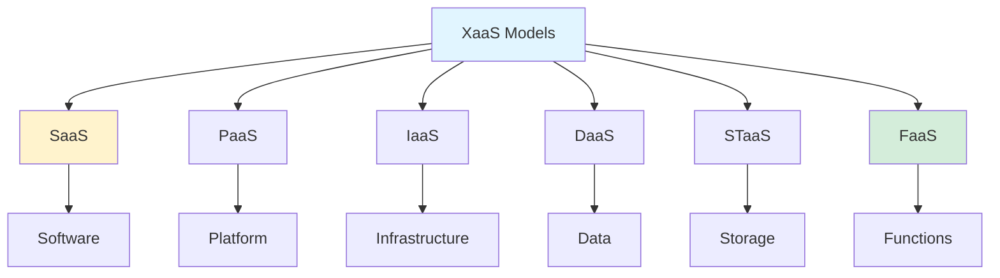

{: .light .shadow .rounded-10 w='1212' h='668' }

## Top 6 "Anything as a Service" Models in 2024

*Curiosity:* How are XaaS models revolutionizing business operations? What cloud-based services offer the best efficiency, scalability, and cost savings?

**In today's rapidly evolving tech landscape**, XaaS (Anything as a Service) models are revolutionizing how businesses operate. These cloud-based solutions offer on-demand access to various services, driving efficiency, scalability, and cost savings.

### XaaS Models Overview

*Retrieve:* Understanding the XaaS ecosystem.

### Top 6 XaaS Models

*Innovate:* Comprehensive breakdown of XaaS offerings.

| # | Model | Description | Use Case | Examples |
|:--|:------|:------------|:---------|:----------|
| **1** | **SaaS** | Software over internet, subscription | ⬆️ Business applications | Salesforce, Office 365, Zendesk |
| **2** | **PaaS** | Platform for app development/deployment | ⬆️ Custom applications | AWS Beanstalk, App Engine, Azure |
| **3** | **IaaS** | IT building blocks (servers, storage) | ⬆️ Infrastructure control | AWS, Azure, GCP |
| **4** | **DaaS** | On-demand cloud data access | ⬆️ Large datasets, backups | S3, Azure Blob, GCS |
| **5** | **STaaS** | On-demand cloud storage | ⬆️ Data storage, backups | S3, Azure Blob, GCS |
| **6** | **FaaS** | Serverless function execution | ⬆️ Microservices, serverless | Lambda, Cloud Functions, Azure Functions |

### Detailed Breakdown

*Retrieve:* Key characteristics of each XaaS model.

#### 1. SaaS (Software as a Service)

**Characteristics**:
- Most common XaaS model
- Subscription-based access
- No installation required
- Automatic updates

**Benefits**: Easy access, low maintenance, scalable

#### 2. PaaS (Platform as a Service)

**Characteristics**:
- Development platform
- No infrastructure investment
- Built-in tools and services
- Deployment automation

**Benefits**: Faster development, reduced complexity, focus on code

#### 3. IaaS (Infrastructure as a Service)

**Characteristics**:
- Virtualized infrastructure
- Full control over resources
- Pay-as-you-go pricing
- Scalable resources

**Benefits**: Flexibility, control, cost-effective scaling

#### 4. DaaS (Data as a Service)

**Characteristics**:
- On-demand data access
- Managed data services
- API-based access
- Data processing capabilities

**Benefits**: Easy data access, managed services, integration

#### 5. STaaS (Storage as a Service)

**Characteristics**:
- Cloud storage solutions
- Scalable capacity
- Backup and recovery
- Data redundancy

**Benefits**: Unlimited storage, reliability, cost-effective

#### 6. FaaS (Functions as a Service)

**Characteristics**:
- Serverless execution
- Event-driven
- Auto-scaling
- Pay-per-execution

**Benefits**: No server management, cost-efficient, scalable

### Comparison Matrix

*Innovate:* Choosing the right XaaS model.

| Model | Control Level | Management | Best For |
|:------|:--------------|:-----------|:---------|
| **SaaS** | Low | Provider | End-user applications |
| **PaaS** | Medium | Shared | Application development |
| **IaaS** | High | User | Infrastructure control |
| **DaaS** | Medium | Provider | Data access |
| **STaaS** | Low | Provider | Storage needs |
| **FaaS** | Low | Provider | Event-driven tasks |

### Key Takeaways

*Retrieve:* XaaS models offer on-demand access to software, platforms, infrastructure, data, storage, and functions, driving efficiency, scalability, and cost savings.

*Innovate:* By understanding different XaaS models—from SaaS for software access to FaaS for serverless functions—you can choose the right service model for your business needs, optimizing costs and capabilities.

*Curiosity → Retrieve → Innovation:* Start with curiosity about cloud service models, retrieve insights from XaaS offerings, and innovate by implementing the right combination of services that transform your business operations.

**Next Steps**:
- Assess your business needs
- Choose appropriate XaaS models
- Implement cloud services
- Optimize costs and performance

 Translate to Korean 

* * * 

## 오늘날 빠르게 진화하는 기술 환경에서 XaaS(Anything as a Service) 모델은 비즈니스 운영 방식을 혁신하고 있습니다. 

이러한 클라우드 기반 솔루션은 다양한 서비스에 대한 온디맨드 액세스를 제공하여 효율성, 확장성 및 비용 절감을 촉진합니다.

비즈니스를 혁신할 수 있는 상위 6개 XaaS 모델을 살펴보겠습니다.

### 1️⃣ SaaS(서비스형 소프트웨어)
 - • 가장 일반적인 XaaS 모델
 - • 인터넷을 통해 구독 방식으로 소프트웨어 사용
 - • 예: Salesforce, Microsoft Office 365, Zendesk

### 2️⃣ PaaS(서비스형 플랫폼)
 - • 인프라에 투자하지 않고 응용 프로그램을 개발, 배포 및 관리합니다.
 - • 맞춤형 앱 구축에 적합
 - • 예: AWS Elastic Beanstalk, Google App Engine, Microsoft Azure

### 3️⃣ IaaS(서비스형 인프라)
 - • 기본 IT 구성 요소에 액세스: 서버, 스토리지, 네트워킹
 - • 필요에 따라 IT 리소스 확장
 - • 예: AWS(Amazon Web Services), Microsoft Azure, Google Cloud Platform

### 4️⃣ DaaS(서비스형 데이터)
 - • 클라우드 스토리지에 대한 온디맨드 액세스
 - • 대규모 데이터 세트 또는 보안 백업에 이상적
 - • 예: Amazon S3, Microsoft Azure Blob Storage, Google Cloud Storage

### 5️⃣ STaaS (서비스형 스토리지)
 - • 온디맨드 클라우드 스토리지 솔루션
 - • 대용량 데이터 저장 또는 보안 백업에 적합
 - • 예: Amazon S3, Microsoft Azure Blob Storage, Google Cloud Storage

### 6️⃣ FaaS (서비스형 기능)
 - • 인프라 관리 없이 코드 개발 및 배포
 - • 마이크로서비스 또는 서버리스 애플리케이션에 적합
 - • 예: AWS Lambda, Google Cloud Functions, Microsoft Azure Functions

프로젝트에 가장 큰 영향을 미친 XaaS 모델은 무엇입니까? 

