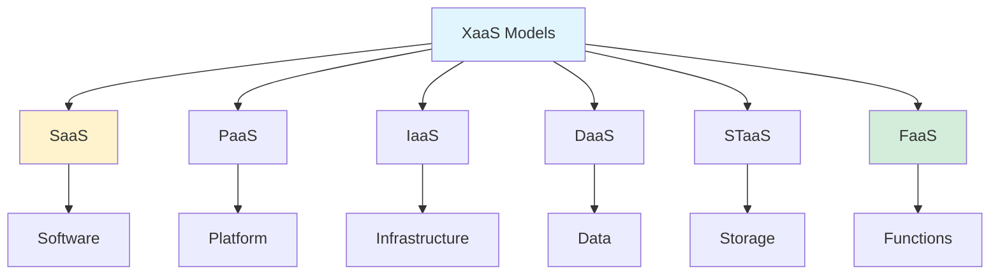

{: .light .shadow .rounded-10 w='1212' h='668' }

## Top 6 "Anything as a Service" Models in 2024

*Curiosity:* How are XaaS models revolutionizing business operations? What cloud-based services offer the best efficiency, scalability, and cost savings?

**In today's rapidly evolving tech landscape**, XaaS (Anything as a Service) models are revolutionizing how businesses operate. These cloud-based solutions offer on-demand access to various services, driving efficiency, scalability, and cost savings.

### XaaS Models Overview

*Retrieve:* Understanding the XaaS ecosystem.

```mermaid
graph TB
    A[XaaS Models] --> B[SaaS]
    A --> C[PaaS]
    A --> D[IaaS]
    A --> E[DaaS]
    A --> F[STaaS]
    A --> G[FaaS]
    
    B --> B1[Software]
    C --> C1[Platform]
    D --> D1[Infrastructure]
    E --> E1[Data]
    F --> F1[Storage]
    G --> G1[Functions]
    
    style A fill:#e1f5ff
    style B fill:#fff3cd
    style G fill:#d4edda
```

### Top 6 XaaS Models

*Innovate:* Comprehensive breakdown of XaaS offerings.

| # | Model | Description | Use Case | Examples |
|:--|:------|:------------|:---------|:----------|
| **1** | **SaaS** | Software over internet, subscription | ⬆️ Business applications | Salesforce, Office 365, Zendesk |
| **2** | **PaaS** | Platform for app development/deployment | ⬆️ Custom applications | AWS Beanstalk, App Engine, Azure |
| **3** | **IaaS** | IT building blocks (servers, storage) | ⬆️ Infrastructure control | AWS, Azure, GCP |
| **4** | **DaaS** | On-demand cloud data access | ⬆️ Large datasets, backups | S3, Azure Blob, GCS |
| **5** | **STaaS** | On-demand cloud storage | ⬆️ Data storage, backups | S3, Azure Blob, GCS |
| **6** | **FaaS** | Serverless function execution | ⬆️ Microservices, serverless | Lambda, Cloud Functions, Azure Functions |

### Detailed Breakdown

*Retrieve:* Key characteristics of each XaaS model.

#### 1. SaaS (Software as a Service)

**Characteristics**:
- Most common XaaS model
- Subscription-based access
- No installation required
- Automatic updates

**Benefits**: Easy access, low maintenance, scalable

#### 2. PaaS (Platform as a Service)

**Characteristics**:
- Development platform
- No infrastructure investment
- Built-in tools and services
- Deployment automation

**Benefits**: Faster development, reduced complexity, focus on code

#### 3. IaaS (Infrastructure as a Service)

**Characteristics**:
- Virtualized infrastructure
- Full control over resources
- Pay-as-you-go pricing
- Scalable resources

**Benefits**: Flexibility, control, cost-effective scaling

#### 4. DaaS (Data as a Service)

**Characteristics**:
- On-demand data access
- Managed data services
- API-based access
- Data processing capabilities

**Benefits**: Easy data access, managed services, integration

#### 5. STaaS (Storage as a Service)

**Characteristics**:
- Cloud storage solutions
- Scalable capacity
- Backup and recovery
- Data redundancy

**Benefits**: Unlimited storage, reliability, cost-effective

#### 6. FaaS (Functions as a Service)

**Characteristics**:
- Serverless execution
- Event-driven
- Auto-scaling
- Pay-per-execution

**Benefits**: No server management, cost-efficient, scalable

### Comparison Matrix

*Innovate:* Choosing the right XaaS model.

| Model | Control Level | Management | Best For |
|:------|:--------------|:-----------|:---------|
| **SaaS** | Low | Provider | End-user applications |
| **PaaS** | Medium | Shared | Application development |
| **IaaS** | High | User | Infrastructure control |
| **DaaS** | Medium | Provider | Data access |
| **STaaS** | Low | Provider | Storage needs |
| **FaaS** | Low | Provider | Event-driven tasks |

### Key Takeaways

*Retrieve:* XaaS models offer on-demand access to software, platforms, infrastructure, data, storage, and functions, driving efficiency, scalability, and cost savings.

*Innovate:* By understanding different XaaS models—from SaaS for software access to FaaS for serverless functions—you can choose the right service model for your business needs, optimizing costs and capabilities.

*Curiosity → Retrieve → Innovation:* Start with curiosity about cloud service models, retrieve insights from XaaS offerings, and innovate by implementing the right combination of services that transform your business operations.

**Next Steps**:
- Assess your business needs
- Choose appropriate XaaS models
- Implement cloud services
- Optimize costs and performance

 Translate to Korean 

* * * 

## In today's rapidly evolving tech landscape, XaaS (Anything as a Service) models are revolutionizing how businesses operate. 

These cloud-based solutions provide on-demand access to various services, driving efficiency, scalability, and cost savings.

Let's explore the top 6 XaaS models that can transform your business.

### 1️⃣ SaaS (Software as a Service)
 - • The most common XaaS model
 - • Software access via subscription over the internet
 - • Examples: Salesforce, Microsoft Office 365, Zendesk

### 2️⃣ PaaS (Platform as a Service)
 - • Develop, deploy, and manage applications without investing in infrastructure.
 - • Ideal for building custom applications
 - • Examples: AWS Elastic Beanstalk, Google App Engine, Microsoft Azure

### 3️⃣ IaaS (Infrastructure as a Service)
 - • Access to basic IT building blocks: servers, storage, networking
 - • Scale IT resources as needed
 - • Examples: AWS (Amazon Web Services), Microsoft Azure, Google Cloud Platform

### 4️⃣ DaaS (Data as a Service)
 - • On-demand access to cloud storage
 - • Ideal for large datasets or secure backups
 - • Examples: Amazon S3, Microsoft Azure Blob Storage, Google Cloud Storage

### 5️⃣ STaaS (Storage as a Service)
 - • On-demand cloud storage solutions
 - • Suitable for large-scale data storage or secure backups
 - • Examples: Amazon S3, Microsoft Azure Blob Storage, Google Cloud Storage

### 6️⃣ FaaS (Functions as a Service)
 - • Develop and deploy code without infrastructure management
 - • Suitable for microservices or serverless applications
 - • Examples: AWS Lambda, Google Cloud Functions, Microsoft Azure Functions

Which XaaS model has had the biggest impact on your projects? 

